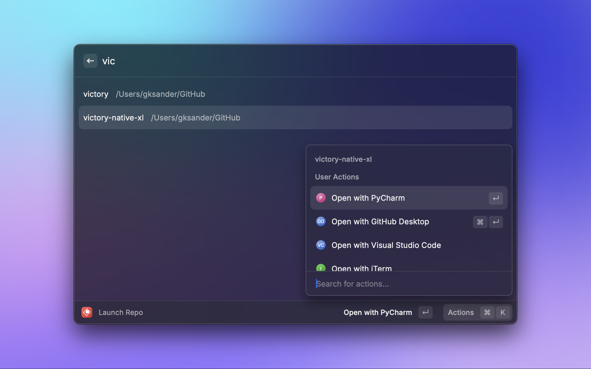
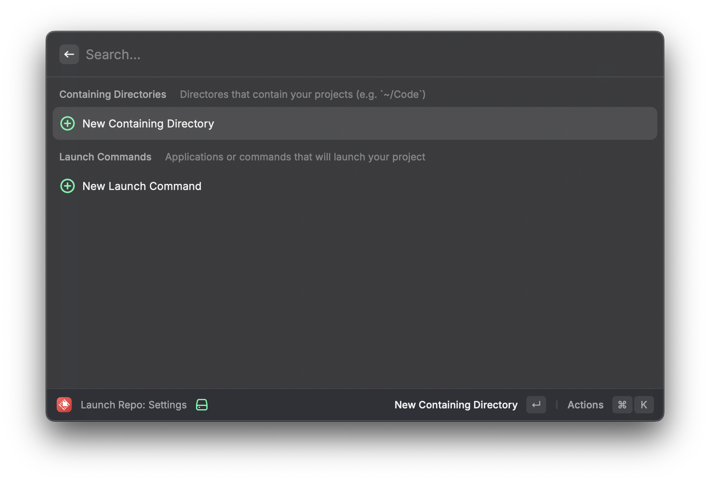
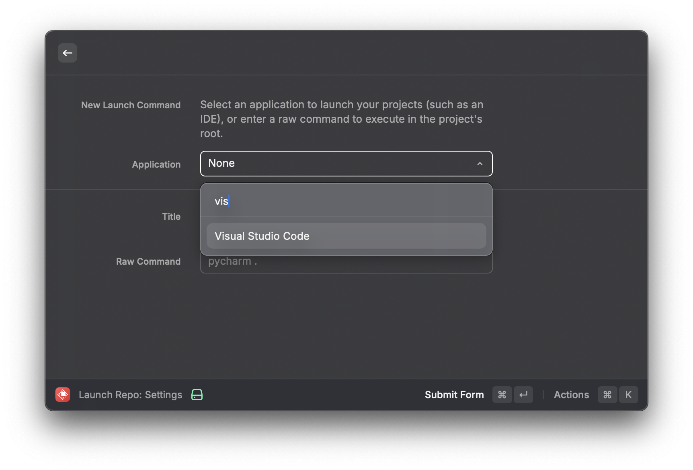
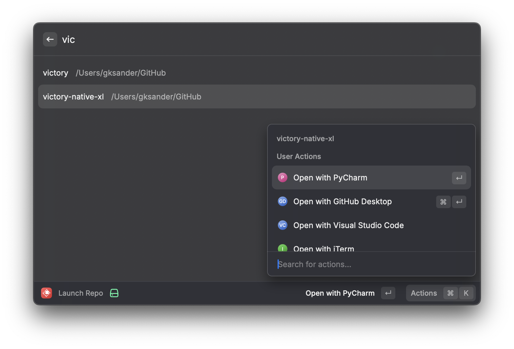
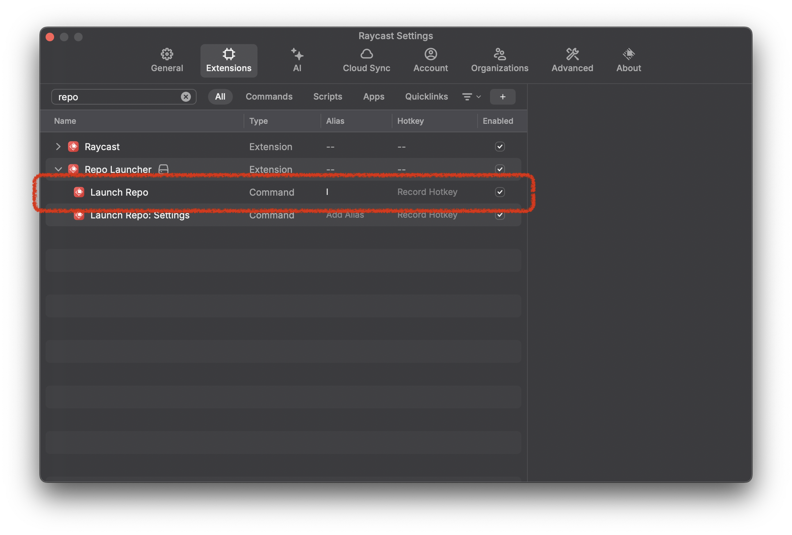

# Repo Launcher

If you're a developer, there's a chance you work with multiple code repositories on a daily basis, opening them in your favorite code editor, your terminal, and on github.com. You might even spin up sample projects just to experiment.

This Raycast extension allows you to quickly search and launch your code repositories/projects in your favorite applications and on GitHub.com.

## Setup

### Step 1: Install the extension

Install the Repo Launcher extension from the Raycast store. If you're reading this, you've probably already done this.

### Step 2: Configure your containing directories

Once the extension is installed, run the `Launch Repo: Settings` command to open up the settings view.

Select the `New Containing Directory` option, select a folder that *contains* your code repositories (like a `~/Projects` or `~/Code` folder), and submit the form.

Add as many as you need. You might have a core `~/Code` directory that your "real" projects live in and a `~/Playground` directory for experiments.

### Step 3: Configure your applications

From the `Launch Repo: Settings` view, select the `New Launch Application` option, select an application, and submit the form. For most applications, this should Just Work.

If you have an application that requires a custom command to launch a project, you forego selecting the application and instead enter a Raw Command which will be executed from the root of the project directory you're attempting to launch.

For example, with JetBrains IDEs you might install a command line launcher command (like `pycharm`) in `/usr/local/bin` and then use the raw command `pycharm .` to launch the project in PyCharm IDE.

### Step 4: Launch your projects

From the Raycast command bar, run the `Launch Repo` command. You'll be presented with a list of all projects that live within the containing directories you selected. You can search this list to narrow it down.

Once you've found the project you want to launch, press `Enter` to launch it in the first application in your "Launch Commands" list from the settings view. Or press `Cmd + K` to select a different application to launch it in.

### Bonus: Add a Command Alias or Shortkey for the `Launch Repo` command

For quick access to the `Launch Repo` command, you can add a command alias or hotkey to it. 

