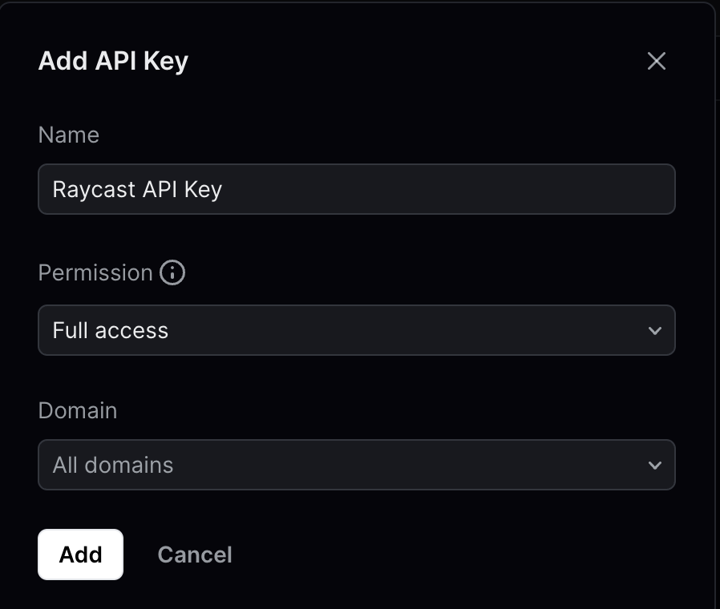
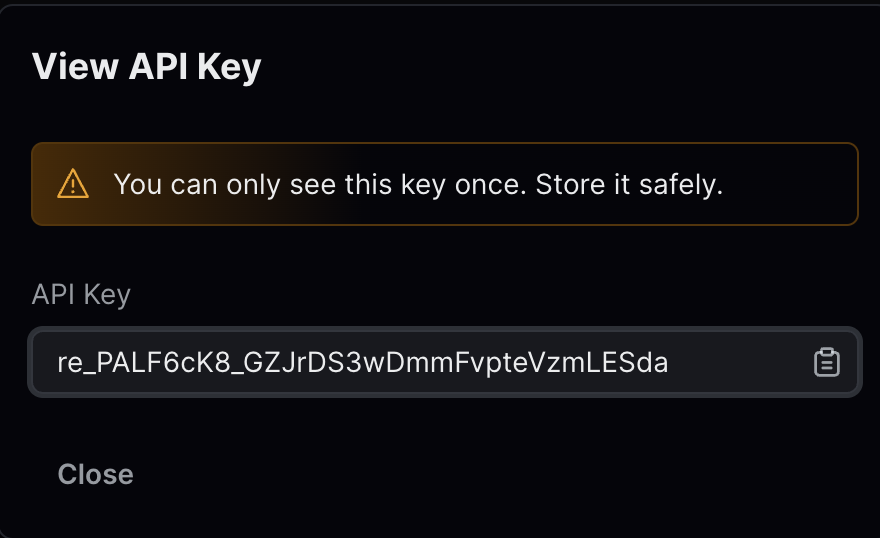

#  Resend Raycast Extension

This is a Raycast extension for [Resend](https://resend.com/). With this extension, you can Manage API Keys and Domains, and Send Emails using Resend.

## 🚀 Getting Started

1. **Install extension**: Click the `Install Extension` button in the top right of [this page](https://www.raycast.com/xmok/resend)

2. **Get your API Key**: The first time you use the extension, you'll need to enter your Resend API key:

   a. `Sign in to your Resend Dashboard` at [this link](https://resend.com/login) OR `Create an account` at [this link](https://resend.com/signup)

   b. `Navigate` to [API Keys](https://resend.com/api-keys)

   c. `Create API Key` with **Permission** as "_Full access_""
   

   d. `Copy` the once shown **API Key**
   

   d. Enter `API Key` in Preferences OR at first prompt

## 🗒️ Notes

- Currently, Resend API does not allow you to fetch ALL sent emails. As a workaround, when you send a new email using the extension, it is **logged** locally for your convenience. You can choose to keep or delete logged emails from log (they can still be viewed in your Resend Dashboard at [this link](https://resend.com/emails))

## 🔧 Commands

This extension provides the following commands:

- API Keys
  - View API Keys
  - Create API Key
- Emails
  - View Logged Emails
  - Send New Email
- Domains
  - View Domains
  - Add New Domain
- Contacts
  - View Contacts
  - Create, Update And Delete Contacts

Additionally, this extension supports ✨[AI tools](https://youtu.be/sHIlFKKaq0A)✨, so you can use it with natural language by mentioning `@resend`.

---
 
