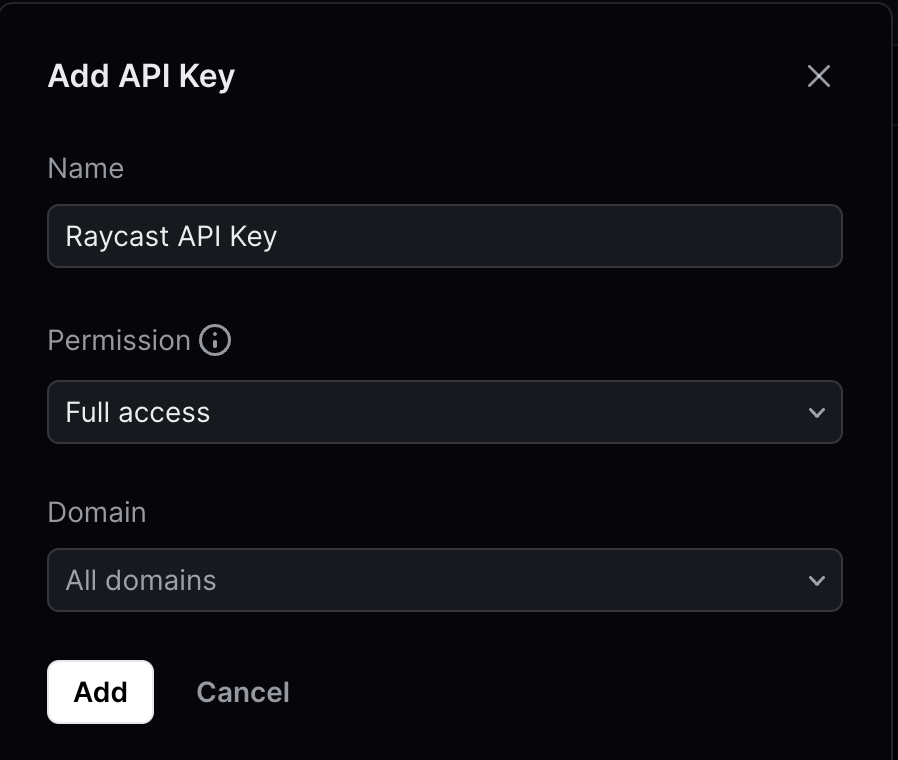
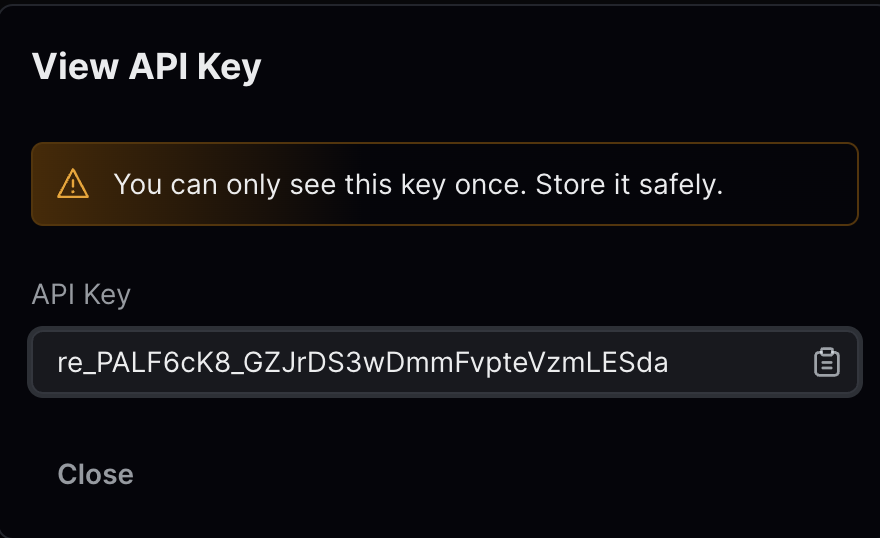

  

#  Resend Raycast Extension

This is a Raycast extension for [Resend](https://resend.com/) - _Email for developers_. Use it to send and receive email, manage contacts and segments, inspect domains, and work with Resend developer resources without leaving Raycast.

## 🚀 Getting Started

1. **Install extension**: Click the `Install Extension` button in the top right of [this page](https://www.raycast.com/xmok/resend)

2. **Authenticate**: The first time you use the extension, you'll need to log in to link your Resend account:

   a. `Run` any command

   b. `Log In`

   c. `Enjoy`!

3. (OPTIONALLY) **Use your API Key**:

   a. `Sign in` to your Resend Dashboard at [this link](https://resend.com/login) OR `Create an account` at [this link](https://resend.com/signup)

   b. `Navigate` to [API Keys](https://resend.com/api-keys)

   c. `Create` API Key with **Permission** as "_Full access_""
   

   d. `Copy` the once shown **API Key**
   

   e. `Enter` API Key in Preferences

## 🔧 Commands

This extension provides the following commands:

- API Keys
  - View API Keys
  - Create API Key
- Contacts
  - Browse contacts by segment
  - Create and update contacts
  - Remove contacts from a segment
  - Permanently delete contacts from the account with a separate Delete Contact action
- Domains
  - View Domains
  - Add New Domain
- Emails
  - View Sent Emails
  - Send New Email
  - Create expiring share links from the list or email details
  - Cancel scheduled email from the list or email details
- Received Emails
  - Read inbound email
  - Open received attachments

## ✨ AI Tools

Mention `@resend` to work with Resend using natural language. In addition to sending and scheduling email, the extension can:

- Read sent and received email, create temporary share links, inspect attachments, reschedule delivery, and report delivery or engagement metrics
- Discover domains and DNS records, then verify a domain with confirmation
- Inspect templates, broadcasts, segments, topics, and webhooks
- Debug failed API calls with request logs
- Create and manage contacts and API keys, with confirmation before sensitive or destructive actions

The tool coverage follows the resource model in Resend's [official MCP server](https://resend.com/docs/mcp-server#mcp-server-tools). Read-only tools discover IDs before actions, and the extension never sends, reschedules, cancels, deletes, creates credentials, or verifies a domain without showing a confirmation.

---

 

