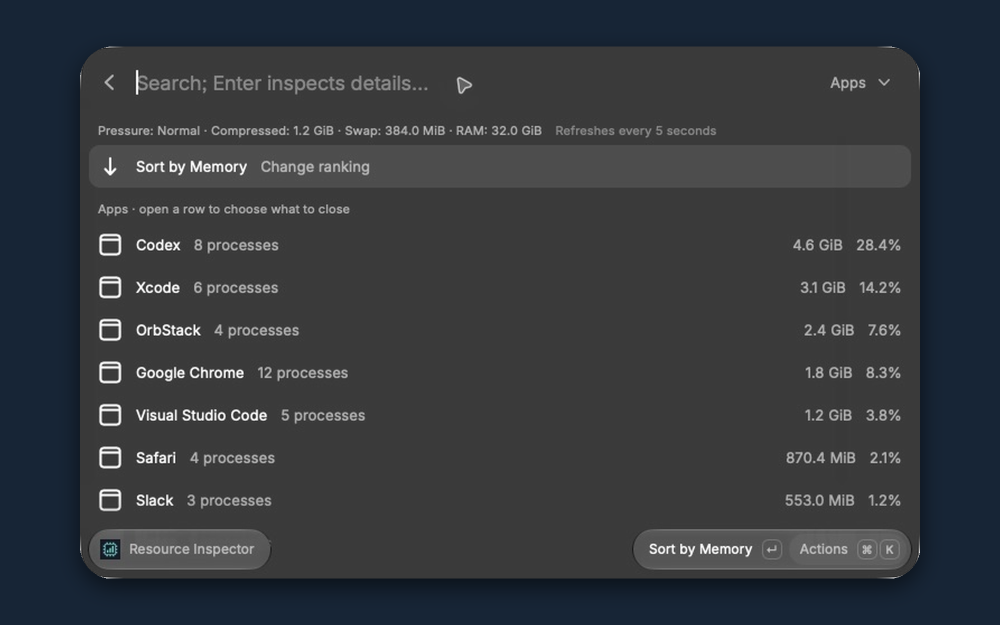
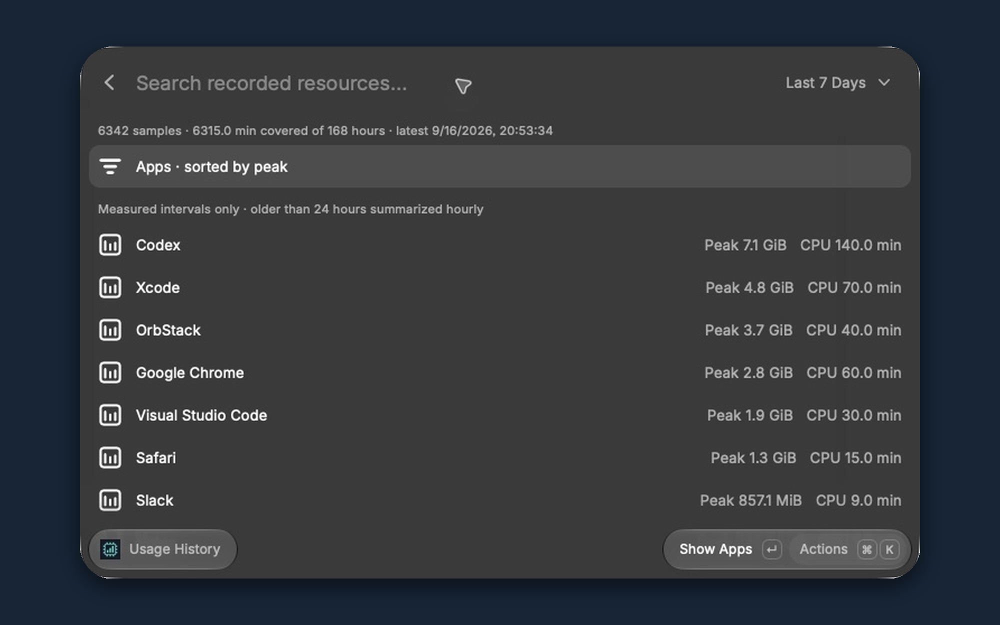
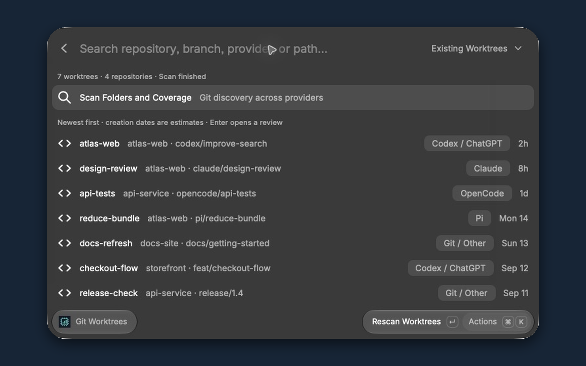

# Resource Inspector

A local-first Raycast extension for macOS. It shows live memory, CPU, and disk activity; keeps seven days of local history; lets you close one deliberately selected app, process, or OrbStack container; and manages individual Git worktrees across providers.

## Screenshots

These captures use demonstration data; no personal usage history or private project names are published.





## Use it

1. Open Raycast and search **Inspect Resources**.
2. Choose **Apps**, **Processes**, or **Containers** from the dropdown. Use the first row to change the ranking.
3. Open a result to inspect its measurements. Opening a result does not close anything.
4. Open **Actions** (⌘K), then choose **Quit App**, **Stop Process**, or **Stop Container**. Confirm the named target.
5. If it remains open, check for a save prompt. **Force Quit/Force Stop** is a separate confirmed action and can lose unsaved work.

An app's process view lets you inspect individual helpers. Quitting an app does not recursively kill its process tree. Surviving processes remain individually selectable. macOS infrastructure, other users' processes, Raycast, and the inspector itself are read-only.

**Usage History** compares the last 24 hours, three days, or seven days. The first row changes resource type and ranking. Historical entries open current measurements before offering a close action.

**Recent Diagnostics** reads available macOS reports from the last seven days. These are dated events, not a complete history and not proof that an app caused a slowdown.

**Resource Inspector Settings** pauses/resumes collection and clears history. Clearing history also pauses collection. Diagnostic reports are never deleted. If a history database is damaged, the extension reports the error rather than silently replacing your data.

## Manage Git worktrees

1. Search Raycast for **Manage Git Worktrees**. It scans on opening; there is no background worktree scan.
2. Search by repository, branch, provider hint, or folder path. The dropdown switches between **Existing Worktrees**, **Missing Folders**, **Main Checkouts**, and **Everything**.
3. Press Enter on a worktree to review its branch, commit, estimated creation date, full path, and local changes. Enter on the list never deletes a worktree.
4. Open **Actions** (⌘K), choose **Delete This Worktree…**, and confirm the named folder. Close agents or terminals using it first. The extension cannot prove a worktree is idle.
5. If tracked or untracked files have changes, the separate **Delete Including Local Changes…** action requires typing the folder name and confirming permanent deletion. Ignored files are counted and included in the deletion warning too.

The scan uses Git's worktree registry, so discovery works for Pi, Claude, ChatGPT/Codex, OpenCode, and other tools without needing a provider integration. Recognized storage paths supply a **provider hint**; Git itself does not record the creating app. Unrecognized paths show **Git / Other**. Standalone clones and folders no longer registered with Git are not presented as linked worktrees.

Git does not reliably record a worktree's original creation date. **Created (estimate)** uses the filesystem creation time of its Git registration folder, falling back to the checkout folder. Copying, restoring, or repairing folders can change this date. The review shows its source explicitly.

The default discovery covers visible projects beneath your home folder and known hidden provider stores. Once a repository is found, Git reveals its registered worktrees even outside the scanned folders. Dependencies, build output, caches, media folders, Library, and symbolic-link traversal are skipped during broad discovery. Use **Scan Folders and Coverage → Add Scan Folders** for external drives, hidden projects, or skipped locations. Additional folders are searched first. Scans stop after 45 seconds or 30,000 visited directories and report limits and unreadable locations; they do not claim to search every disk. A single in-progress Git query may finish after the scan's time limit.

Deletion uses Git's single-worktree removal operation. It permanently removes that checkout, not its branch. There is no bulk delete, automatic prune, branch deletion, or unlocking. Main checkouts, bare repositories, locked worktrees, unverified identities, and a checkout containing another registered worktree in the same repository are protected. Git can refuse special layouts such as submodules; the extension displays the error and never retries with stronger deletion automatically.

Before deletion, the extension rereads the registry, folder identity, branch/commit, and list of changed paths. A changed review is rejected. This is not an activity lock or a backup of file contents, so stop ongoing work in the selected folder first. Uncommitted and ignored files cannot be recovered by this extension. When deleting a detached worktree, its current commit is preserved under `refs/resource-inspector/deleted-worktrees/…`; list these with `git for-each-ref refs/resource-inspector/deleted-worktrees/`, then use `git branch recovered-work <ref>` if needed. Previous detached commits that are not ancestors of the current commit are not separately backed up.

**Missing Folders** shows stale registrations separately. Removing one registration keeps its branch and does not free space for a folder that is already absent. It does not prune other entries. Never remove a registration for an external drive merely because the drive is temporarily disconnected; Git-locked entries remain protected.

## Background recording

Run **Record Resource Usage** once to activate Raycast's Background Refresh. Raycast samples approximately once per minute while it is running; macOS can delay background runs. Inspect Resources starts an initial sample but does not itself enable Raycast's scheduling switch.

Collection and Raycast's Background Refresh are separate switches. If the latest sample stops updating, run Record Resource Usage and check its command preferences. Pause in Resource Inspector Settings makes subsequent background runs do no collection. Live views still refresh every five seconds while open.

History starts when recording starts. Sleeping, paused, unavailable, and unsampled periods are not reconstructed. The history view shows coverage and the latest sample time. Detailed samples are kept for approximately 24 hours (up to one extra hour while completing an hourly bucket); hourly summaries are retained for seven days. Cleanup occurs on the next successful recording run.

## Understanding the numbers

- Memory is the native physical footprint, which accounts for compressed memory differently from plain resident memory. Values can differ from `ps` and from other tools' grouping.
- CPU uses **100% per logical core**, so a busy app can exceed 100%. Live CPU and disk activity need two comparable samples. An app's CPU/disk totals include available process counters; **≥** marks partial totals. Processes that exit between samples may be missed.
- History CPU and disk values are observed totals, not guaranteed complete totals. Container CPU history is estimated from sampled percentages.
- App totals already include their associated processes. Container memory is inside OrbStack's host allocation; never add container usage to the OrbStack total.
- A process's start time and boot session are checked again immediately before stopping it. Containers are checked using full ID and start time. If the target changes, select it again.
- A graceful container stop uses `--timeout=-1`. After ten seconds, the client can return “shutdown requested” while the Docker daemon continues waiting; it does not automatically force-stop the container. A container configured to use SIGKILL as its stop signal requires the separate force action.
- Free RAM alone is not a performance score. Check memory pressure, compressed memory, swap, CPU, and disk activity together. No memory purging or cache deletion is performed.

## Privacy and local files

There is no upload, analytics, remote account, API key, administrator helper, or separate background service. The native helper runs briefly for each request. The recorder stores process names, executable paths, app IDs, usage counters, and local container names/IDs. It does not collect process arguments, document contents, browser URLs, environment variables, or container secrets.

Data is kept in Raycast's extension support folder, shown in Resource Inspector Settings. SQLite transactions protect interrupted writes. Diagnostic reports are read on demand and not copied into the history database.

Worktree discovery reads local folder and Git metadata. A review asks Git for local status, including names of changed and ignored paths; none of this is uploaded or written to resource history. Additional scan folder preferences are saved locally in Raycast. Removal creates a recovery reference only for a detached commit and invokes Git for the selected checkout.

## Installation and rebuilding

The extension can be installed locally from source. It is not yet listed in the Raycast Store; see [Publishing](PUBLISHING.md) for the submission process. A `.rayext` bundle is a compiled archive, not a guaranteed double-click installer.

Requirements: Raycast on macOS, Node.js 22 or newer, Xcode Command Line Tools for rebuilding the helper, and Git for worktree discovery. OrbStack and its Docker CLI are optional and needed only for container measurements and actions. The helper includes Apple Silicon and Intel slices targeting macOS 13 or newer; runtime testing so far was on Apple Silicon with macOS 27. Older systems and Intel have not been runtime-tested.

To rebuild and register the extension locally:

```sh
npm ci
npm run build
npm run dev
```

The native executable is compiled from [Inspector.swift](native/Inspector.swift) by [build-native.sh](scripts/build-native.sh), combined into a universal binary, locally signed, and bundled in `assets/inspector`. No binary is fetched from a remote server. It is not recompiled during monitoring. `npm run dev` registers the local commands and watches source changes; the commands remain installed when the development watcher exits. Alternatively, Raycast's **Import Extension** command accepts the source folder, followed by a build.

```sh
npm test
npm run lint
npx ray bundle -o ../resource-inspector.rayext
```

Store submission requires a real Raycast author handle and an authenticated publishing session. The author is configured as `juhas96`, matching the maintainer's Raycast profile. Local builds and installation do not require Store publication or a Raycast CLI login.

For the optional destructive integration test, `tests/safety.integration.ts` creates and removes only its own disposable sleep process and Docker container. It requires the existing local `redis:7-alpine` image and access to OrbStack. Do not substitute production targets.

## Validation performed

- Native compilation, Raycast build/bundle, TypeScript and formatting checks.
- Automated tests for grouping, units, missing metrics, new helpers, reused PIDs, sleep/reboot gaps, diagnostics, transactions, hourly compaction, seven-day retention, pause/clear, and corrupted-database errors.
- A disposable process test confirmed stale identities are rejected, inspector processes are protected, and ordinary termination does not force escalation.
- A disposable container ignored SIGTERM and remained running past the client timeout. Only a separate Force Stop terminated it; the test container was removed.
- A disposable macOS app displayed its simulated save prompt. Cancel left it running. A separate native Force Quit then closed only that fixture.
- Raycast displayed live resource usage and recorded history; Background Refresh was activated.
- Worktree tests use only disposable repositories. They cover provider-independent discovery, unusual path names, main/locked protection, clean and explicit dirty removal, stale confirmations, retained branches, detached-commit recovery, single missing-registration removal, replaced directories/symlinks, nested worktrees, bare repositories, and relative registrations.
- The automated suite passed on the development Mac. The installed Raycast command was checked for search, branch/date details, ignored-path warnings, and the separate removal action; destructive validation used only disposable fixtures.
- One native snapshot took about 0.09 seconds, approximately 0.04 seconds of CPU time, and a 6.4 MB peak physical footprint (13.8 MB maximum resident size). This is a single native-helper measurement, not a claim about total Raycast or Docker CLI overhead.

References: [Raycast background refresh](https://developers.raycast.com/information/lifecycle/background-refresh), [Apple memory measurements](https://support.apple.com/guide/activity-monitor/view-memory-usage-actmntr1004/mac), [Docker stop semantics](https://docs.docker.com/reference/cli/docker/container/stop/), [Git worktree behavior](https://git-scm.com/docs/git-worktree).
