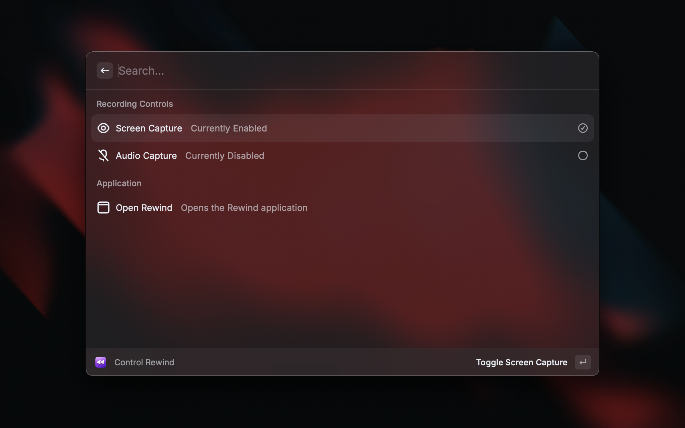

# Rewind AI Control

A Raycast extension to control the Rewind AI application directly from Raycast.

## Features

- Toggle screen capture recording on/off
- Toggle audio capture recording on/off
- Open the Rewind application

## Requirements

- [Rewind AI](https://www.rewind.ai/) must be installed on your Mac
- macOS 12 or later

## Usage

This extension provides three commands:

1. **Toggle Screen Capture** - Quickly enable or disable screen recording in Rewind
2. **Toggle Audio Capture** - Quickly enable or disable audio recording in Rewind
3. **Control Rewind** - A comprehensive interface to manage all Rewind features

## How It Works

The extension uses macOS defaults commands to toggle Rewind's settings and automatically restarts the application to apply changes. All actions provide immediate feedback through Raycast's HUD notifications.

## Privacy

This extension only modifies local settings for the Rewind application and does not send any data to external servers.
