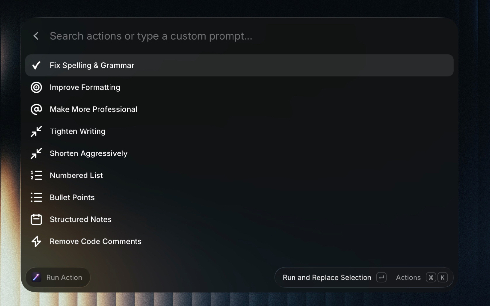
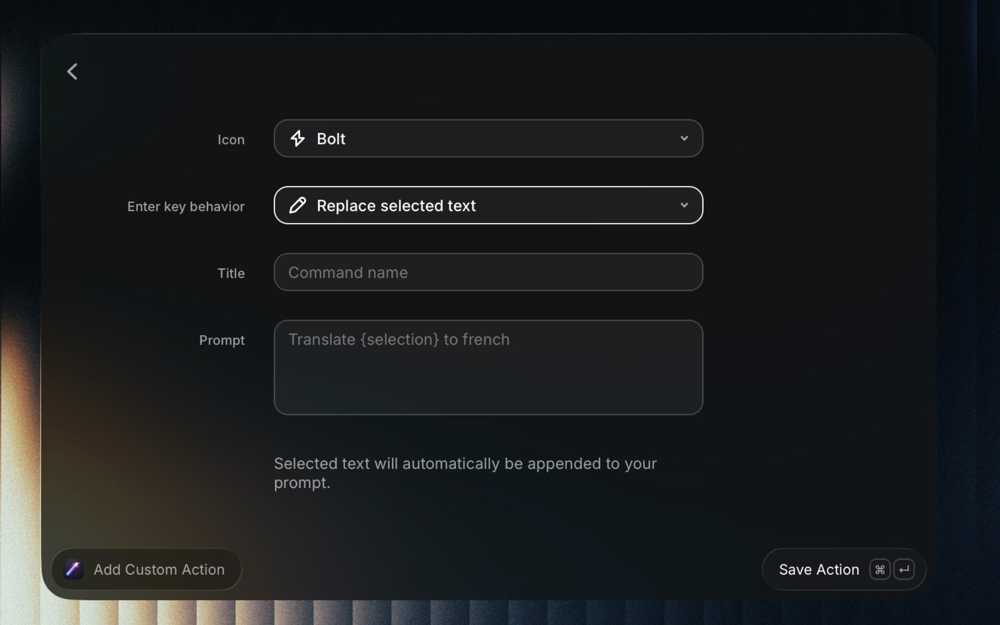

# Rewrite

Select any text in any app and transform it in-place using your own custom AI actions — no copy-paste needed.

## Screenshots

## How It Works

1. **Create actions** — define a name, prompt, and icon for any text transformation you want.
2. **Select text** in any app.
3. **Run an action** — the AI processes your text and either replaces it inline or shows the result in Raycast.

## Commands

### Run Action

Browse and run your saved actions. Each action can either:

- **Replace selected text** — the AI result is pasted directly over your selection (great for hotkeys)
- **Show result in Raycast** — the result is displayed in a Detail view so you can review before using it

You can also type a one-off prompt directly in the search bar to run it on the fly without saving it.

### Add Custom Action

Create a new action with:

- **Icon** — pick from any Raycast icon
- **Title** — the name shown in your action list
- **Prompt** — instructions for the AI (your selected text is automatically appended)
- **Default mode** — whether Enter replaces text inline or shows the result

You can reorder actions with `Cmd+Shift+Up/Down`, edit with `Cmd+E`, and delete with `Cmd+Delete`.

### Configure AI Model

Fetch and select from available models for your AI provider.
