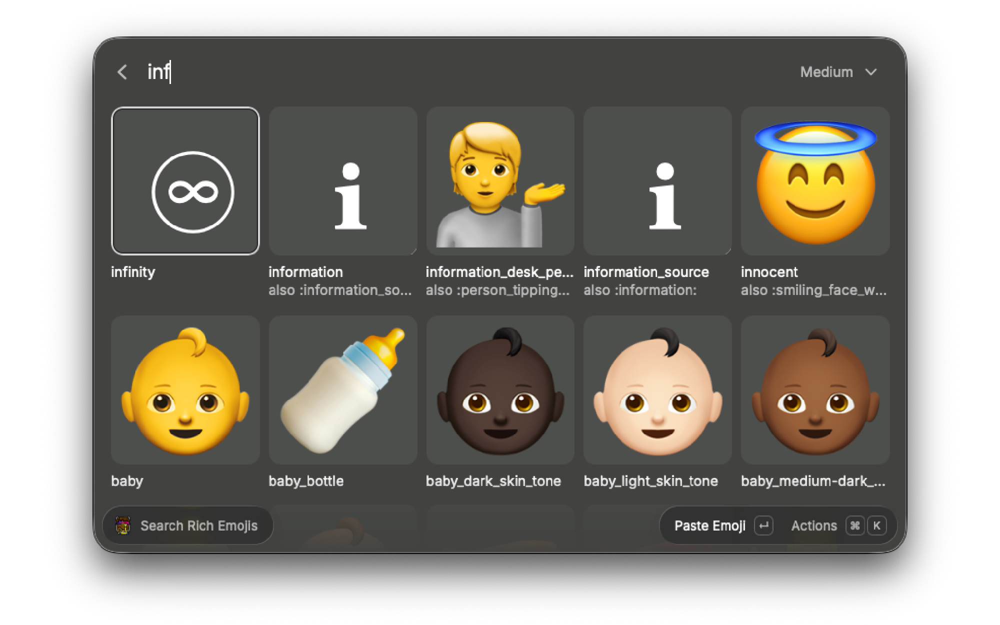
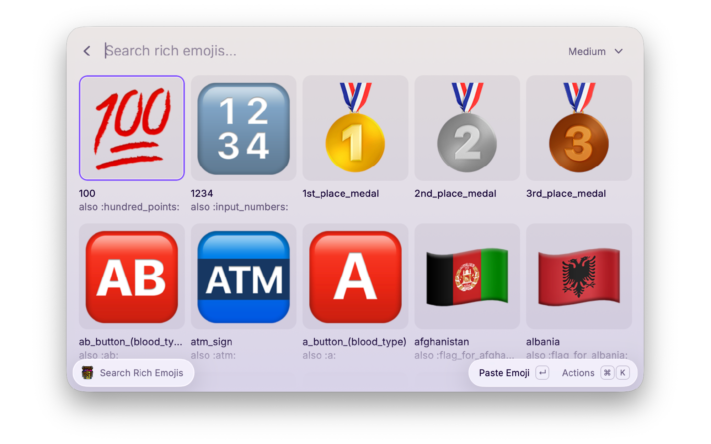

# Rich Emoji Search



Fuzzy-search the 3,608 emojis that [textualize/rich](https://github.com/Textualize/rich)
exposes, then paste or copy either the emoji itself or its `:name:` console markup.

## Why not the built-in emoji picker?

rich's table is keyed by _rich's_ names, which are not always the system ones, and
several names map to the same character (`:thumbs_down:`, `:-1:`, `:__1:` are all 👎).
When you're writing a rich `Console.print(":tada:")` call, the name is the thing you
need — so every name is listed separately and `Paste Rich Markup` gives you the exact
string rich understands.



## Actions

Searching `tada` and running each action gives:

| Action            | Shortcut                       | Result   |
| ----------------- | ------------------------------ | -------- |
| Paste Emoji       | `↵`                            | 🎉       |
| Copy Emoji        | `⌘ ↵`                          | 🎉       |
| Paste Rich Markup | `⌘ ⇧ ↵`                        | `:tada:` |
| Copy Rich Markup  | Raycast's standard "copy"      | `:tada:` |
| Copy Name         | Raycast's standard "copy name" | `tada`   |

The last two use `Keyboard.Shortcut.Common`, so they follow whatever bindings Raycast
uses everywhere else — check the action panel for the current keys.

### Text-presentation emoji

rich stores 170 of its characters as a bare codepoint with no U+FE0F: `information` is
just `U+2139`, `airplane` just `U+2708`. Those codepoints default to _text_
presentation, so pasting them raw gives a thin serif glyph (ℹ) rather than the emoji you
picked (ℹ️). Those 170 characters cover 254 of the 3,608 rich names.

Handed a bare character, Raycast draws it with the colour emoji font regardless — so
such an entry looks like an emoji on screen while behaving as text on the clipboard.
Two things follow:

- `Paste Emoji` and `Copy Emoji` append U+FE0F to request the emoji form, and those 254
  items gain a fourth action, **Paste Exact Character** (`⌥ ↵`), pasting rich's bytes
  unchanged for when you need to match rich's table exactly.
- Their grid tiles are drawn from a generated SVG rather than handed to Raycast as a
  character, since only that puts the glyph back under font control (U+FE0E plus a
  monospace stack). The tile then previews what rich prints in a terminal.

The other 2,640 characters are already emoji-default and are passed through untouched.

## Searching

Each name is split on `_`, `-`, `&` and parentheses, and every word is registered as a
search keyword alongside the full name, so any word in a name is searchable rather than
just its leading word.

rich's names on their own are too literal to search well — `flag_for_united_states`
contains no "US", `grinning_face` no "happy" — so each emoji also carries generated
synonyms from [`src/keywords.json`](src/keywords.json):

| rich name                 | Keywords it also carries       | Source                     |
| ------------------------- | ------------------------------ | -------------------------- |
| `flag_for_united_states`  | `us`, `usa`, `america`         | ISO code in the codepoints |
| `flag_for_united_kingdom` | `uk`, `britain`, `british`     | curated nickname           |
| `grinning_face`           | `happy`, `smile`, `laugh`      | CLDR                       |
| `tada`                    | `celebrate`, `hooray`, `party` | CLDR                       |
| `thumbs_down`             | `dislike`, `no`, `nope`        | CLDR                       |

A flag emoji encodes its ISO 3166 alpha-2 code in its own codepoints — 🇺🇸 is literally
`U+1F1FA U+1F1F8`, "U" and "S" — so country codes are decoded rather than guessed. `uk`
is one of the few that has to be curated by hand, since the UK's actual code is `GB`.

Matching itself is Raycast's built-in fuzzy search; these keywords only widen what there
is to match against, they don't control ranking.

## Updating the data

Both JSON files under `src/` are generated — don't hand-edit them:

| File                | Generated by                | From                                    |
| ------------------- | --------------------------- | --------------------------------------- |
| `src/emoji.json`    | `scripts/update-emoji.py`   | rich's `_emoji_codes.py` on `main`      |
| `src/keywords.json` | `scripts/build-keywords.py` | Unicode CLDR annotations + `emoji.json` |

To refresh both against upstream and reformat them:

```sh
npm run update-data
```

`build-keywords.py` needs `emoji.json` to already exist, which is why the npm script
runs them in that order. The one thing in there that isn't derived from data is
`COUNTRY_NICKNAMES` — a short hand-maintained table for names no source implies, like
`uk` for `GB`. Add to it when a country you search for doesn't come up.

## Development

```sh
npm install
npm run dev
```
