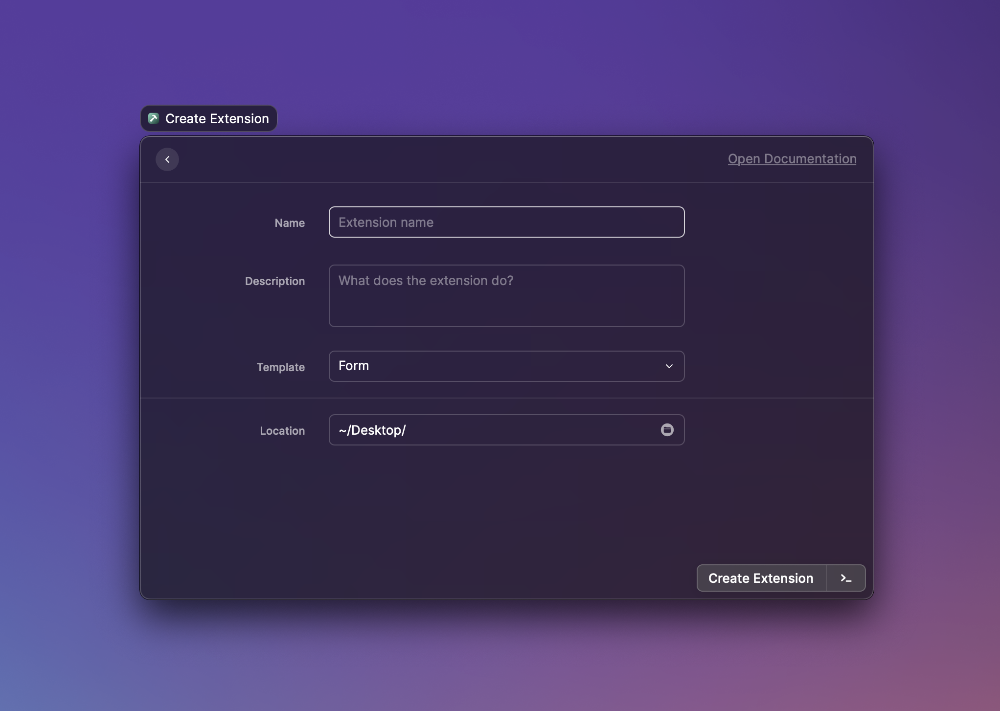

# Introduction

Welcome, developers! Our docs cover guides, examples, references and more to help you build extensions and share them with our community.

The Raycast Platform consists of two parts:

* **API:** This allows developers to build rich extensions with React, Node.js and TypeScript. The docs explain how to use the API to build top-notch experiences.
* **Store:** This lets developers share their extensions with all Raycast users. You'll learn how to [publish your extension](basics/publish-an-extension.md).


The Raycast platform is currently in public beta. We've stabilised it during a private alpha with our community. We'll continue to work together to nail the developer experience. Join us in our [Slack workspace](https://raycast.com/community).


## Key features

Here are a few points that make our ecosystem special:

* **Powerful and familiar tooling:** Extensions are built with TypeScript, React and Node. Leverage npm's ecosystem to quickly build what you imagine.
* **No-brainer to build UI:** You concentrate on the logic, we push the pixels. Use our built-in UI components to be consistent with all our extensions. 
* **Collaborate with our community:** Build your extension, share it with our community and get inspired by others. 
* **Developer experience front and foremost:** A strongly typed API, hot-reloading and modern tooling that make it a blast to work with.
* **Easy to start, flexible to scale:** Start with a simple script, add a static UI or use React to go wilde. Anything goes.

## Overview

A quick overview about where to find what in our docs:

* [**Basics:**](basics/getting-started.md) Go over this section to learn how to build extensions in our step-by-step guides.
* [**Examples:**](examples/todo-list.md) Kickstart your extension by using an open source example and learn as you go.
* [**Information:**](information/cli.md) Get the background knowledge to master your understanding of our platform.
* [**API Reference:**](api-reference/clipboard.md) Go into details wit hthe API reference that includes code snippets.

Now, let's build 💪

