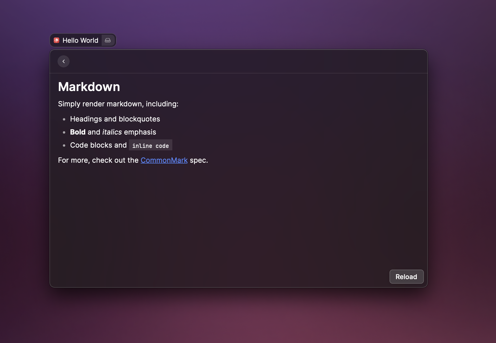

# Create your first extension

### Create a new extension

Open the Create Extension command, name your extension "Hello World" and select the Markdown template. Pick a parent folder in the Location field and press `⌘` `↵` to continue.

Next, you'll need to follow the on-screen instructions to build the extension.

### Build the extension

Open your terminal, navigate to your extension directory and run `npm install && npm run dev`. Open Raycast and you'll notice your extension at the top of the root search. Press `↵` to open it.

### Develop your extension

To make changes to your extension, open the `./src/index.tsx` file in your extension directory, change the `markdown` text and save it. Then, open your command in Raycast again and see your changes. 


`npm run dev` starts the extension in development mode with hot reloading, error reporting and [more](../information/cli.md#development).


### Use your extension

Now, you can press `⌃` `C` in your terminal to stop `npm run dev`. The extension stays in Raycast and you can find it's commands in the root when searching for "Hello World". 

🎉 Congratulations! You built your first extension. 


Don't forget to run [`npm run dev`](../information/cli.md#development) again when you want to change something in your extension.


