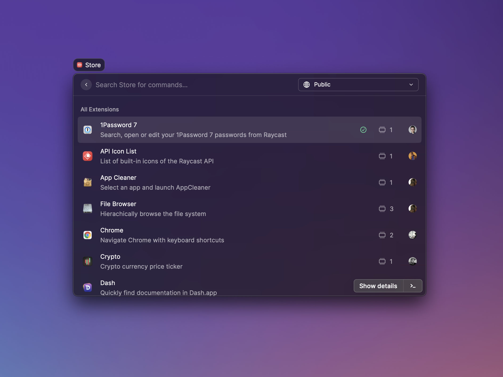
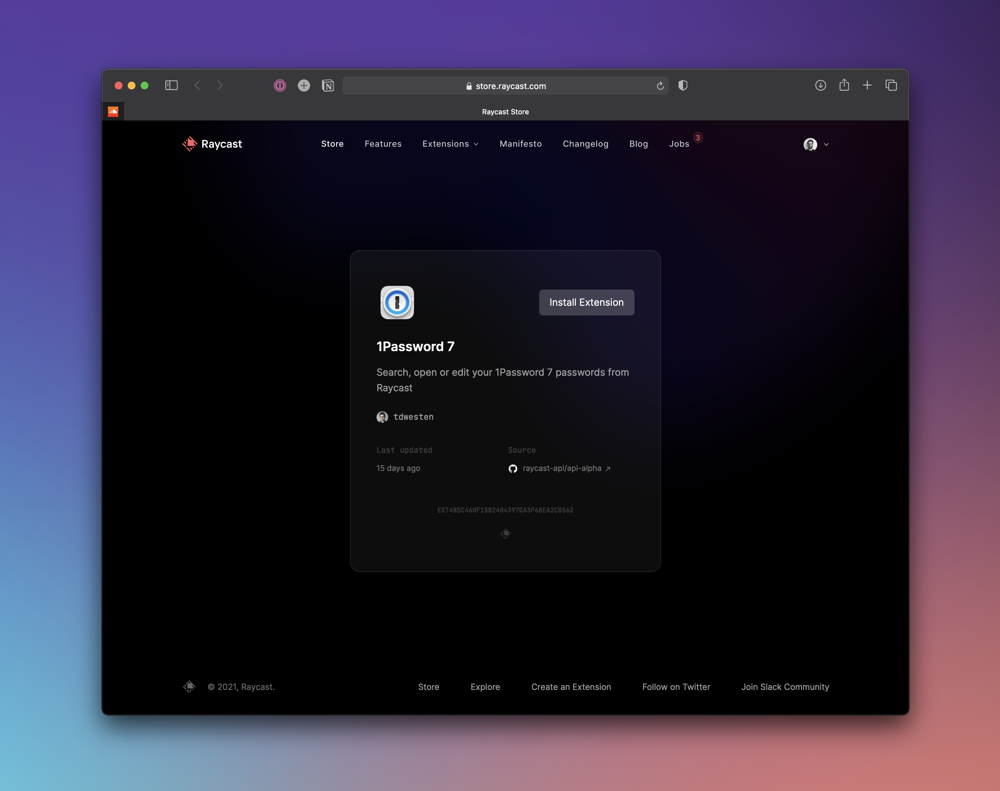

# Install an extension

All published extensions are discoverable in the Raycast Store. Use the [web interface](https://raycast.com/store) or the Store command to find what you're looking for.

### In-app Store

The easiest way to discover extensions is the in-app store. Open the Store command in Raycast and search for an extension. Press `⌘` `↵` to install the selected extension or press `↵` to see more details about it.

### Web Store

Alternatively, you can use our [web store](https://raycast.com/store). Press `⌘` `K` to open the command palette, search for an extension and open it. 

Then press the Install Extension button in the top right corner and follow the steps in Raycast.

### Use installed extensions

After an extension is installed, you can search for it's commands in the root search. The extension can be further configured in the Extensions preferences tab.

