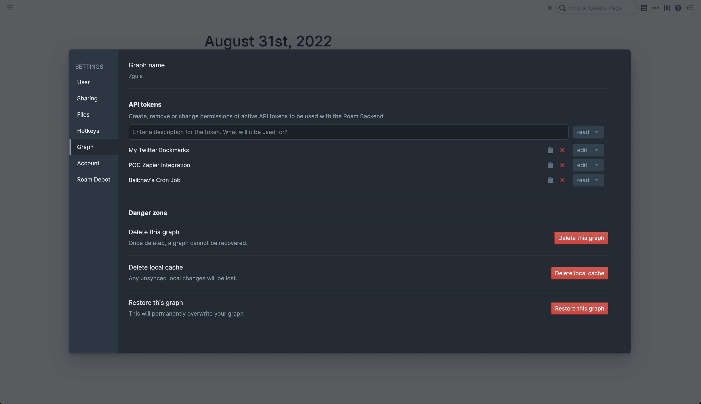

# Roam Research

Your Roam graphs at your fingertips! Quickly search, capture and navigate your Roam graphs.

Please report any issues to support@roamresearch.com

## Supported Functionality
1. Search across all your installed graphs or only in a particular graph
2. Quick capture notes to your Roam graph without leaving your keyboard
3. View a random block from your roam graph.
4. Easily create Raycast quicklinks to open Roam graphs or specific pages in the graph

**DEMO VIDEO**: https://www.loom.com/share/3fa11c532cb44822a047caecc638e47f

## Getting Started / Setting up a graph

To get started with this extension, you need to set up a Roam Research graph via the "Add Graph" Raycast command. 

You can follow the steps listed below or follow along with the following video: https://www.loom.com/share/31ada35f7c8b4f44a2ba537b15237854

1. First of all, you need to get an API token for the graph. To get it, open the graph from https://roamresearch.com/#/app 
2. Then go to ... > Settings > "Graph" tab > "API Tokens" section and click on the "+ New API Token" button. 
    - If you do not see the "API Tokens" section, there are a few possibilities:
        - You might be on an older version of Roam. Please refresh/restart the tab/desktop app and click on ... > check for updates.
        - You might not be the owner of the graph (Only graph owners can create API Tokens)
        - The graph may be an encrypted graph. Roam's backend does not work with encrypted graphs, due to them being end-to-end encrypted and Roam not storing your passwords. If/when Roam backend supports append/quick capture for encrypted graphs, this extension will be updated to handle that as well
3. Add a description making it clear that this will be used by Raycast extension. Also, in most cases, you want to change the "Access Scope" of the token from "read" to "edit". 
    - If the token you're using only has read permissions, you will not be able to do "Quick Capture", for example
4. In the "New Token Generated!" dialog, copy the API Token using the copy to clipboard button
5. Then trigger the "Add Graph" Raycast command and add the graph name and copied token to the form. Submit pressing the button or using Cmd+Enter

#### Screenshot of API Tokens Settings Section
This is how the "API Tokens" section in Graph Settings looks like

