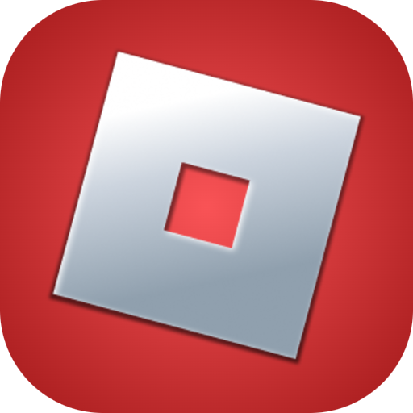

    

<h1>
        Roblox
</h1>

Raycast Extension for finding games, users & more on Roblox

    
    
    
    </a>

## Information

This extension does not directly interact with Roblox Client/Studio, so they are not needed for basic functionality of the extension!

## Features

### Games

- Get Currently Playing Game, Session Time, Server Location & Server Type
- Favourite Games and find them easily
- Search for Games
- View Games with ID
- Launch Games in Roblox Client & Studio

### Users

- View User Info With ID or Username
- View Your Own User Profile

### Extra

- View an Image from Roblox with its Image ID.
- View a Favourite Game's Player Count on the Menu Bar
