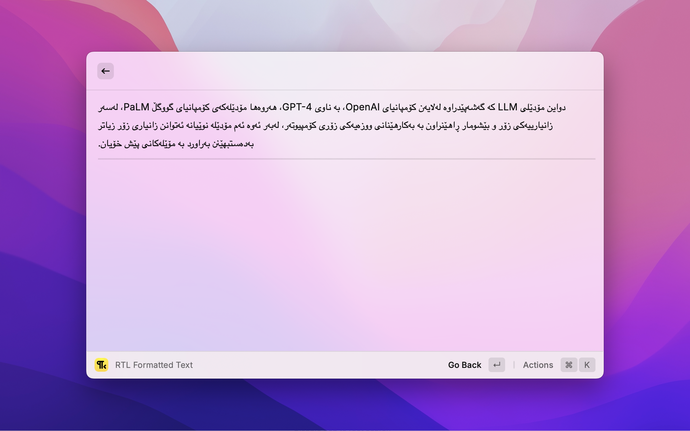

# RTL Reader

This raycast extension fixes formatting issues in texts that mix Right-to-Left (RTL) and Left-to-Right (LTR) languages, like Kurdish and English.

Instead of opening a separate app just to read a piece of text, you can paste it here to instantly display it correctly. It's perfect for quick reads without needing to edit or save.

