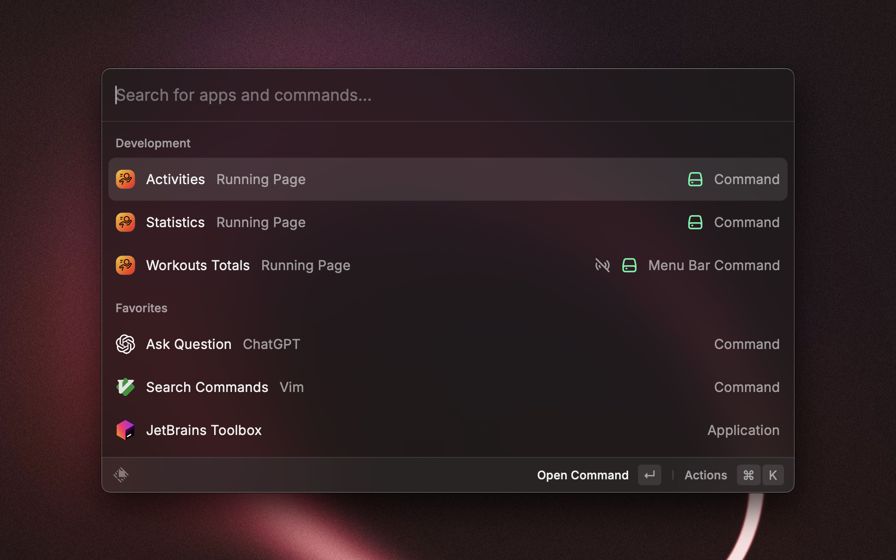
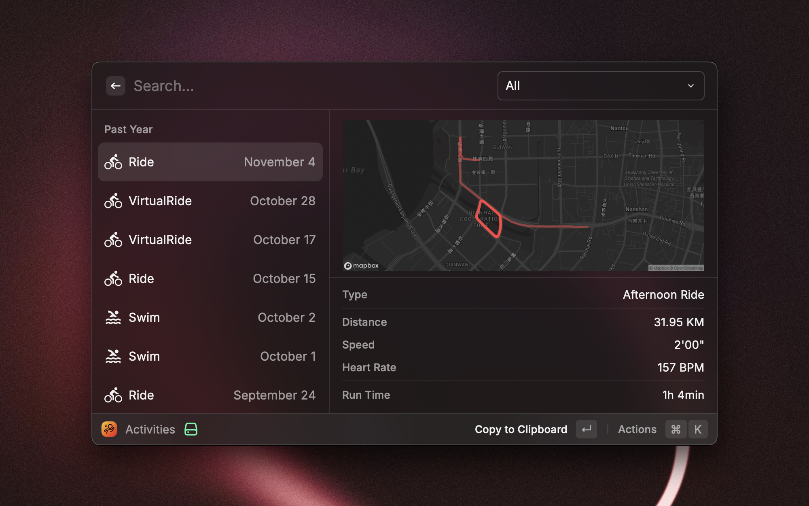
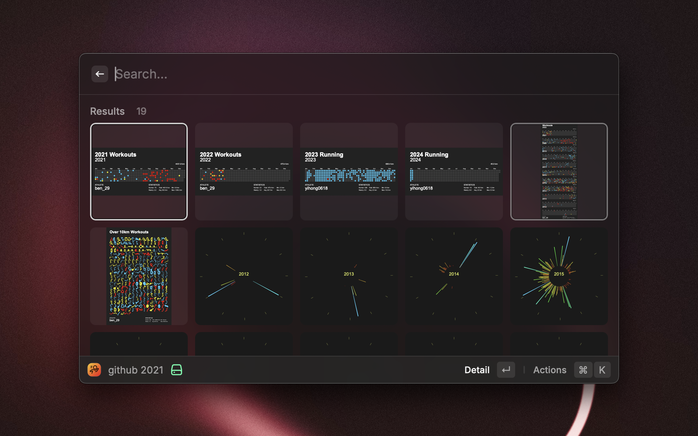

 
 

<h1 align="center">Running Page</h1>

Display data generate by <a href="https://github.com/yihong0618/running_page">running_page</a>, inspired
by <a href="https://www.raycast.com/samuelkraft/workouts">Workouts</a>

## How to use

1. fork the project [running_page](https://github.com/yihong0618/running_page)
2. set up the project action, be sure generated `activities.json` file in the `src/static` folder
3. authorise extension to access your repo, if you not set the mapbox access token, the map will not display

### Config

| Name                  | Description                                                       | Example                      |
|-----------------------|-------------------------------------------------------------------|------------------------------|
| `GitHub repository`   | Required, The repository that contains the `activities.json` file | `ben-29/workouts_page`       |
| `Data Path`           | Required, The path to the `activities.json` file                  | `src/static/activities.json` |
| `Mapbox Access Token` | Optional, The access token for the mapbox API[^1]                 | `pk.xxxx`                    |

[^1]:  https://account.mapbox.com/access-tokens/create
