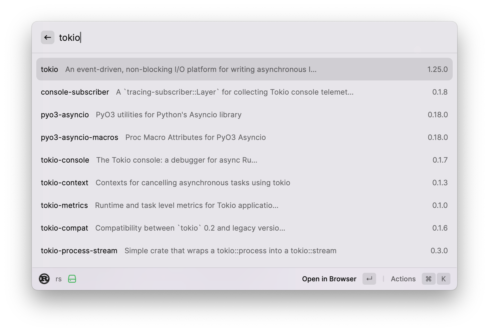
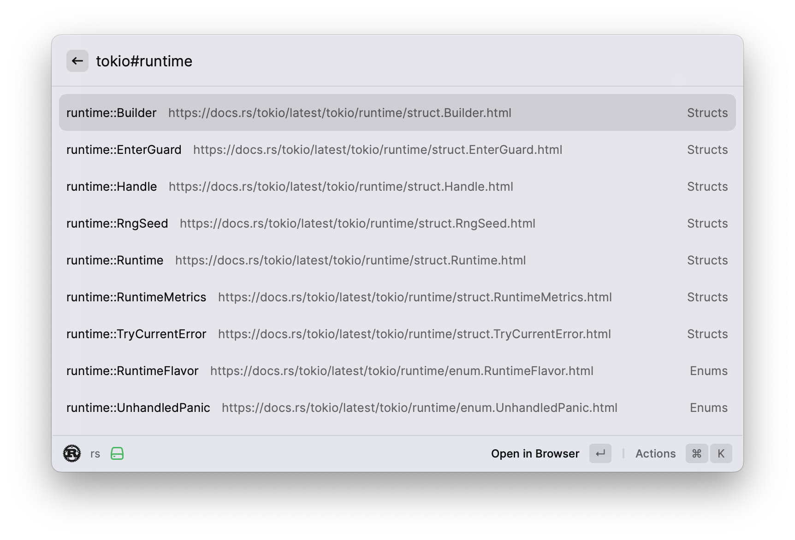

# Rust Document

Search Rust document quickly. A raycast extension.

|         Search crate         |         Search symbol         |
| :--------------------------: | :---------------------------: |
|  |  |

# Usage

- 📦 Type : Just type the crate name you want to search, and press enter to open the crate in docs.rs.
- ⚙️ Symbol : Type `#` after the crate name, and type the symbol name to search. Press enter to open the symbol in docs.rs.

# Author

This extension is by [waynexia](https://github.com/waynexia). Feed back & contribution are welcome at [waynexia/raycast-rust-document](https://github.com/waynexia/raycast-rust-document) ❤️.
