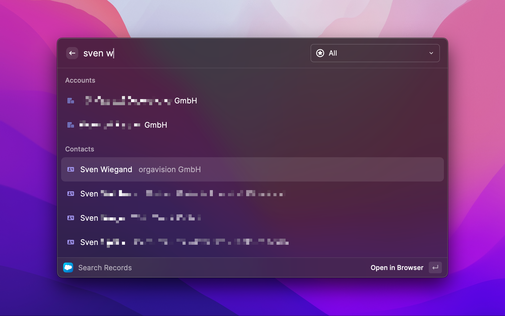

# Salesforce Search
This extension allows you to search for accounts, contacts, opportunities, dashboards and reports and optionally additional (custom) objects in Salesforce and open them in the browser. 



The extension provides these features:

- Search for salesforce records of type Account, Contact and Opportunity
- Search for additional custom record types (see configuration below)
- Search for dashboards and reports
- Filter search results by type
- For record types object names, icon and color are pulled from Salesforce
- Simple authentication via interactive OAuth

## Configuration of the Extension
**Important:** Before you can use the extension, your Salesforce admin has to configure the app in Salesforce (see end of this page).

### Initial setup
When you call the extension for the first time you need to provide two values:


- **Domain:** The name of your Salesforce "my-domain". In `https://acme.my.salesforce.com/` the text `acme` is the "my-domain".
- **Consumer Key:** You will receive this value from your Salesforce admin, who got it after creating the connected app.

### Login
**Note:** After your admin configured the app in Salesforce it may take up to 10 minutes, until the extension will be able to login.

After you've submitted the configuration fields, the OAuth authentication process will start. Confirm the request of the browser to open the Raycast app.


### Custom Record Types
**Disclaimer:** This is some kind of a pro feature. You need to understand the data model in your Salesforce instance including relations. If you use the wrong syntax or specify non-existing stuff, the extension will inform you and ignore the custom fields.

**Disclaimer:** The extension uses [Salesforce's UI API](https://developer.salesforce.com/docs/atlas.en-us.uiapi.meta/uiapi) to get the labels, icon and icon color of custom objects. Unfortunately this API does not support all objects – you can only use supported objects.

That being said: The extension allows you to configure further record types to search for. Follow these steps:

1. Bring up raycast
2. Execute the **Extensions** command
3. Select the **Salesforce Search** extension in the list
4. Specify your **additional object types** using the syntax described below


#### Custom Object Type Syntax
This is the syntax for specifying custom objects:

```
<ObjectName>[(<NameField>[; <SubtitleField>])][, …]
```

- **`ObjectName`:** The API-name of the salesforce object. Example: `CustomObject__c`
- **`FieldName`:** Optional name/path of the object's field, which will be used as the name of the record in the search results. If not specified, the field name `Name` will be used. Example: `Title`.
- **`SubtitleField`:** Optional name/path of the object's field, which will be used as the subtitle of the record in the search results. The subtitle is the gray text behind the name. If not specified, no subtitle will be used.

This is the field syntax:
```
<FieldName>|<RelationName>.<FieldName>
```

- **`FieldName`:** Name of a field of the object. Example: `Title`
- **`RelationName`:** If you do not want to show a field of the found record, but a field of a related record instead, then you can use the path syntax to reference it. 
  
  **Note:** You need to use the correct name of the relation, which ends with `__r` for custom objects.

  Example: `AccountId__r.Name` might show the name of the account related to a found record if it has such a relation.

You can specify multiple types separated by semicolon.

#### Example 1
```
CustomObject__c
```
The extension will additionally search records of type `CustomObject__c` and will take the record's name from the record's `Name` field.

#### Example 2
```
CustomObject__c(Title)
```
Same like before, but will take the record's name from the record's `Title` field.

#### Example 3
```
CustomObject__c; OtherObject__c(Title)
```
Combination of both examples: The extension will additionally search records of types `CustomObject__c` and `OtherObject__c`, using the `Name` field for the first type and the `Title` field for the second one. 

#### Example 4
```
CustomObject__c(Name,AccountId__r.Name)
```
The extension will additionally search records of type `CustomObject__c` and will take the record's name from the record's `Name` field and the subtitle from the `Name` field of the `AccountId__r` relation (in this case the linked Account's name).

## Configuration for Salesforce Admins
This one is to you Salesforce-admin!

To enable your users to use the Salesforce Raycast extension, you need to create a connected app in the admin console. The process is straightforward and only requires three minutes of your time:

1. Click the **gear icon** at the top and click **Setup**.
2. In the left navigation bar navigate to **Platform Tools** › **Apps** › **App Manager**.
3. Click **New Connected App** in the top right to create a new app.
4. Adjust the following fields:
   - **Connected App Name**: for example `Raycast`
   - **API Name**: for example `Raycast`
   - **Contact Email**: Well, up to you!
   - Check the **Enable OAuth Settings** checkbox
   - Set the **Callback URL** to `https://raycast.com/redirect?packageName=Extension`
   - Select the **OAuth Scopes** `Manage user data via APIs (api)` and `Perform requests at any time (refresh_token, offline_access)`
   - Uncheck the two options **Require Secret for Web Server Flow** and **Require Secret for Refresh Token Flow**
   - Leave the rest unchanged
5. **Save** the new app
6. Copy the **Consumer Key** shown after the app has been created and provide it to your users, who want to use the salesforce raycast extension. This key is _not_ confidential – you can distribute it to your users without worries.


