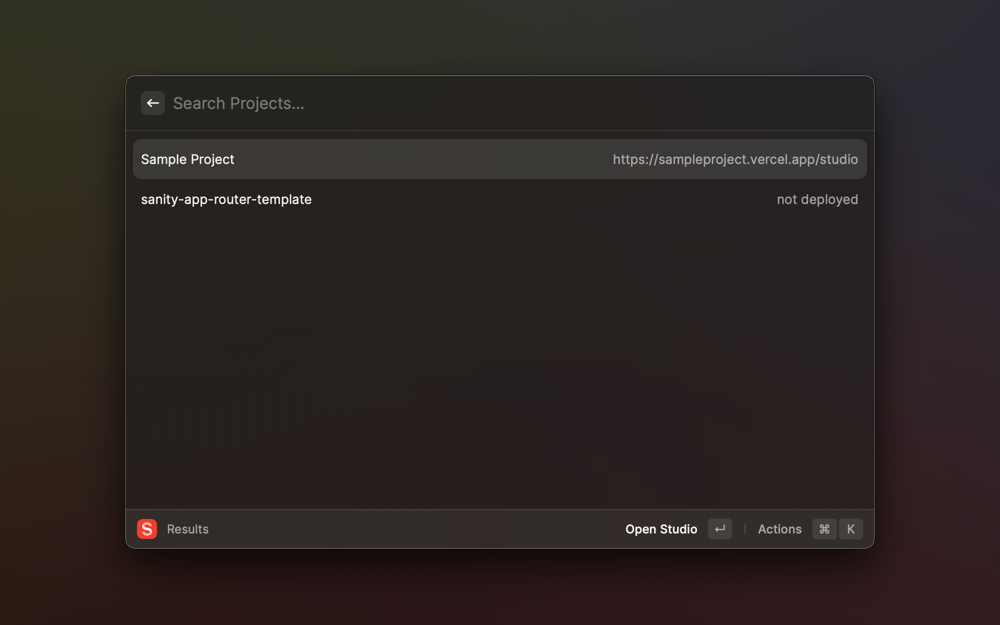

# Sanity

Quickly search for Sanity projects you have access to.

Not affiliated with Sanity.

## Setup:

This extension leverages the same authentication as your [Sanity CLI](https://www.sanity.io/docs/cli-reference). To log in on your computer, run the following in your command line interface (requires you to have [Node.js installed](https://nodejs.org/en)):

```sh
npx sanity login
```

## Features:

- View and search your Sanity projects, and quickly open the Studio or the sanity.io management interface.

## Roadmap

- Ability to filter projects by organization
- Create and edit projects
- Manage datasets
- Manage CORS settings
- Basically anything else you can do with the [Projects API](https://www.sanity.io/docs/projects-api)

Contributions are welcome!

## Screenshots:


