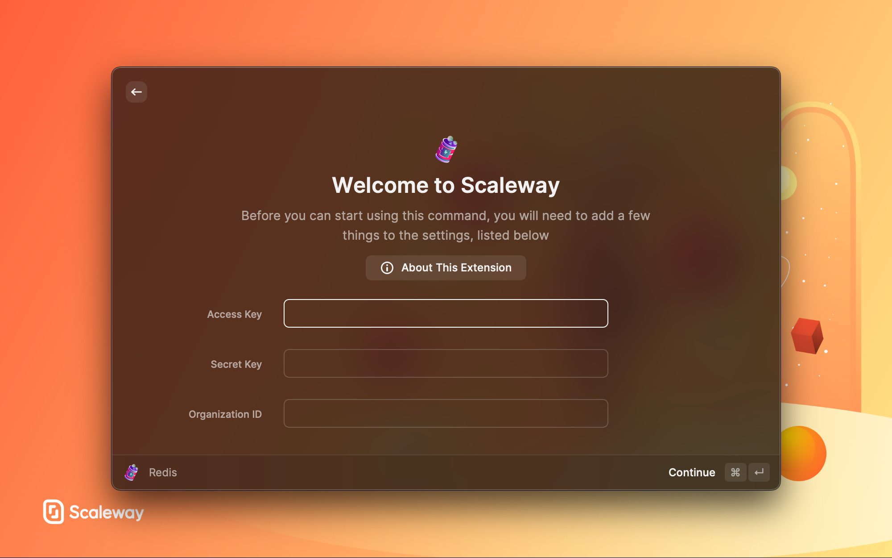

  

  <h1>Scaleway</h1>

Raycast extension to search containers, database, instances or Redis clusters, to perform actions, and more to come.

  

    
    
  

## Features

- Quick access to your serverless containers
- Deploy a container
- Get the last logs of a container
- Quick access to your instances
- Start, reboot and shutdown an instance
- Quick access to your databases
- Quick access to your Redis clusters

## Getting started

- Go to the [Scaleway console](https://console.scaleway.com)
- Click on your organisation at the top right, and go to `Credentials`
- Generate a new API key with a purpose e.g. `raycast`, and copy your `Access Key` and `Secret Key`
- Open a Scaleway command in Raycast and enter your `Access Key` and `Secret Key`

That's it! You're ready to use the extension! 🚀

## Showcases

### Containers

### Logs of Container

### Instances

### Databases

### Redis Clusters

