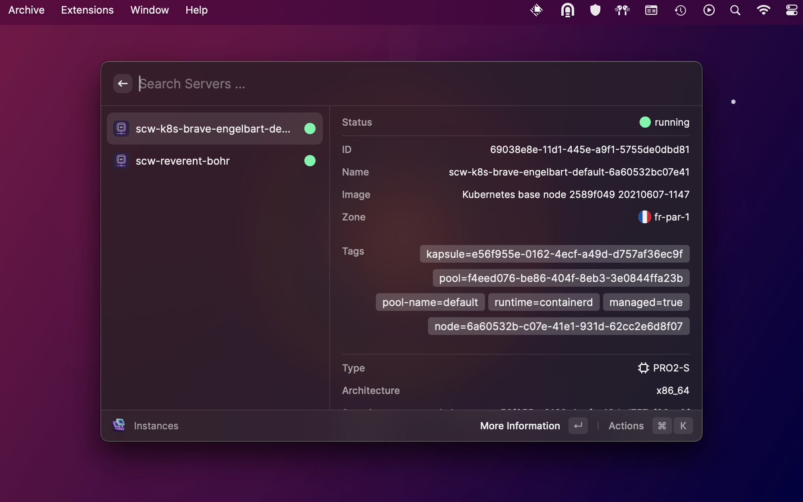

# Scaleway

 <body>

  

  <h1>Scaleway</h1>

Raycast extension to search containers, database, instances or Redis clusters, to perform actions, and more to come.

  

    
    
  

</body>

## Getting started

- Go to the [Scaleway console](https://console.scaleway.com)
- Click on your organisation at the top right, and go to `Credentials`
- Generate a new API key with a purpose e.g. `raycast`, and copy your `Access Key` and `Secret Key`
- Open a Scaleway command in Raycast and enter your `Access Key` and `Secret Key`
- if you are using [CLI](https://github.com/scaleway/scaleway-cli), you can use `profileName` to set up you your configuration, if you have only one profile, the name of the profile is `default`. This will not use your raycast configuration but instead use your profile settings.
if you don't used the cli, you can easily install it and run `scw init` will generate your config file

That's it! You're ready to use the extension! 🚀

## Products

The list of products availables

Compute:

- Instances
- AppleSilicon
- Elastic Metal
- Dedibox 🤞🏻 ( soon )

Containers:

- Kubernetes
- Registry

Networks:

- VPC 🤞🏻 ( soon )
- Private Networks
- Public Gateways
- Load Balancers
- Domains

Serverless:

- Functions
- Containers
- Databases 🤞🏻 ( soon )
- Messaging & Queing

Storage:

- Object Storage ( ❌ not planed )

Databases:

- Redis
- PostgreSQL and MySQL

Managed Services:

- Transactional Email
- Web Hosting 🤞🏻 ( soon )
- IoT

Security & Identity:

- IAM Identity and Access Management
- Secrets  🤞🏻 ( soon )

## Showcases

### Apple Silicon

### Elastic Metal

### Redis Clusters

### Instances

