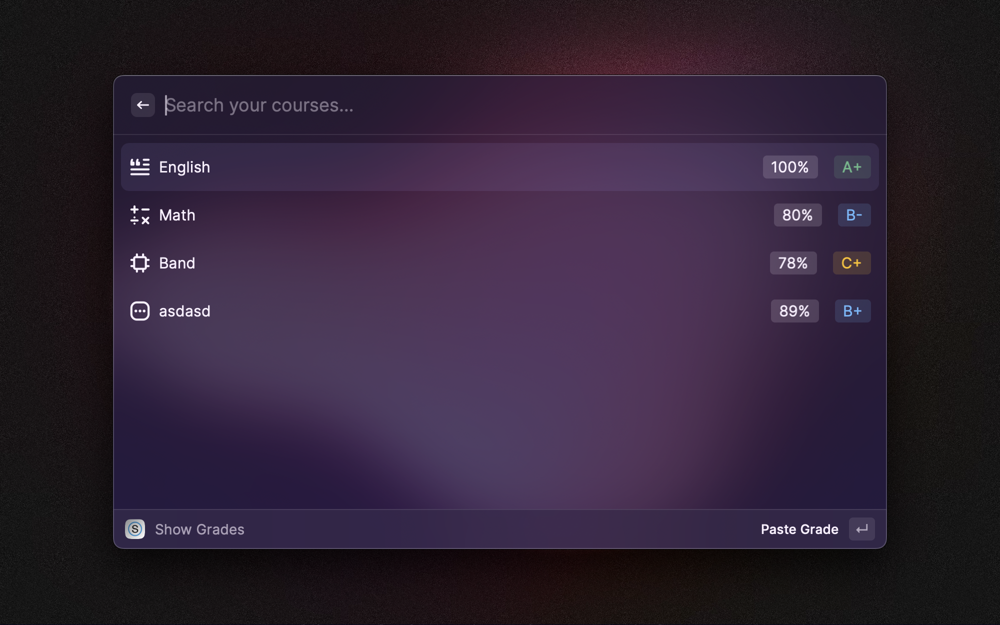

# Schoology Extension for Raycast

This extension will help you view your grades quickly using Raycast.
Here's an image with some example courses (I used a schoology dev account to test it which is why there are weird icons and titles):

- This extension will only show a course in the `Show Grades` command if it has received at least one grade.
- As of right now, the only thing you can do is view your grades
    - Feel free to reach out if you want to suggest features or even just contribute to the extension yourself!
## How to obtain Schoology Key and secret
- Head to https://[district].schoology.com/api
    - Replace [district] with your district. For example, if I were in District ABCD, then my URL would be abcd.schoology.com/api.
        - Another way to think about this is to head to the URL that you use to log in to Schoology and append `/api` at the end.
    - Next, verify that you are a human being (unless you aren't 🤖).
    - You should now have access to both your `key` and `secret`, which you can use to provide the Schoology extension with access to your grades.
        - You can do this by heading to the extension preferences `⌘ + shift + ,` and entering the credentials
- Enjoy!
