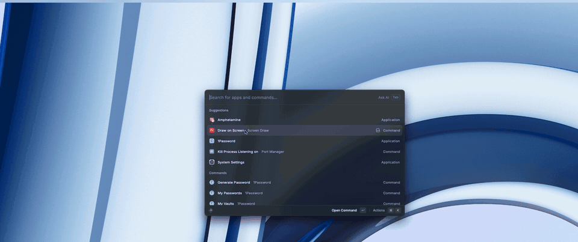
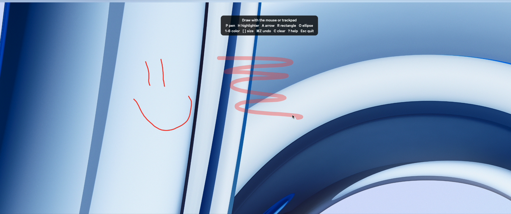
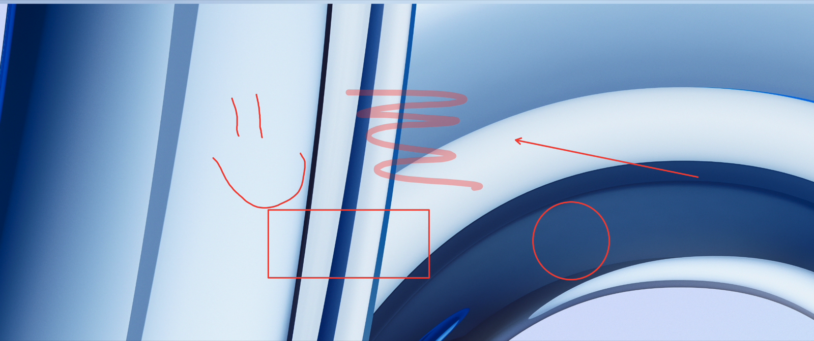

# Screen Draw

Draw, highlight and point at things directly on your screen - handy for demos, screen sharing and recordings.

Run **Draw on Screen** to open a transparent overlay on every display. Run it again (or press `Esc`) to close it. Assign a hotkey to toggle it instantly.

| Help on launch | Every tool |
| --- | --- |
|  |  |

## Controls

| Key | Action |
| --- | --- |
| `P` / `H` / `A` / `R` / `O` | Pen, highlighter, arrow, rectangle, ellipse |
| `1`-`6` | Red, yellow, green, blue, white, black |
| `[` `]` | Thinner / thicker stroke |
| `⌘Z` | Undo |
| `C` or `Delete` | Clear everything |
| `?` | Show controls |
| `Esc` | Close the overlay |

## Requirements

The overlay is a small native helper written in Swift. It is compiled from the bundled source on first run, which needs the Xcode Command Line Tools (`xcode-select --install`).
