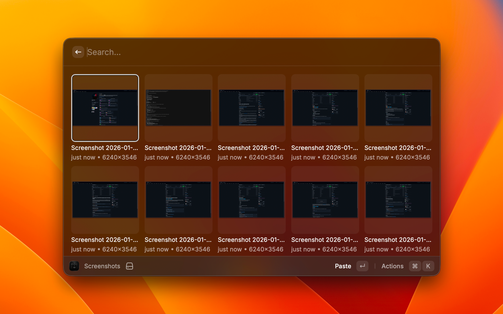

# Screenshots

Browse and paste macOS screenshots with a paste-first workflow, perfect for Claude Code and other AI tools.

## Features

- Grid view with thumbnail previews
- Sorted by newest first
- Shows relative timestamps and dimensions
- Auto-refreshes when new screenshots are taken
- Infinite scroll for large collections

## Actions

| Action | Shortcut | Description |
|--------|----------|-------------|
| Paste | Enter | Copy to clipboard and paste into frontmost app |
| Copy to Clipboard | | Copy image data |
| Quick Look | Cmd+Y | Preview with macOS Quick Look |
| Open in Preview | | Open with Preview.app |
| Reveal in Finder | | Show in Finder |
| Delete | Cmd+Backspace | Move to Trash |

## Configuration

The extension automatically detects your screenshot directory:

1. Extension preference (if set)
2. macOS system screenshot location (`defaults read com.apple.screencapture location`)
3. Desktop (fallback)

To use a custom directory, set it in the extension preferences.

## License

This extension is released under the [MIT License](./LICENSE).

## About

This extension was written by [Elliot Jackson](https://elliotekj.com).

- Blog: [https://elliotekj.com](https://elliotekj.com)
- Email: elliot@elliotekj.com
