

  <h1 align="center">Script Commands Store</h1>
  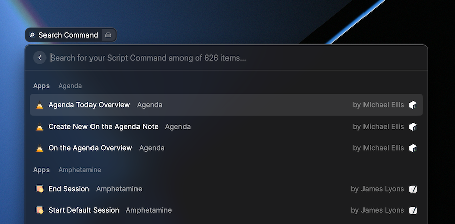
    

The Script Commands Store extension was built to help users to manage their Script Commands without the need to download one by one the source code, assets and stuff related.

### Getting started

On the first open, you will have to:
- Define a folder to store the Script Commands
- Setup the path you defined for the Script Commands in Raycast Preferences window.

### Setup step by step

 
Instructions

  At the first time you open Script Commands Store, you will need to define the folder which will be used to store the Script Commands downloaded.

  This is the setup screen. We strongly suggest you define a new folder for it.  
  Example: `~/raycast/script-commands`

  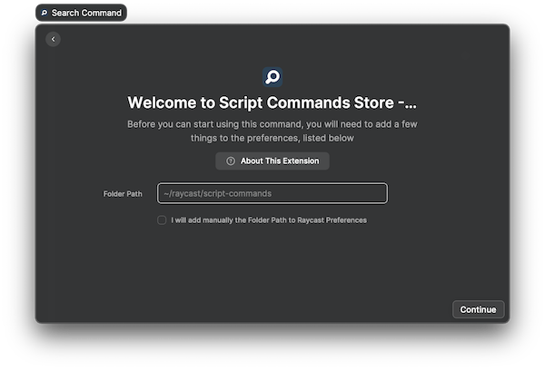

  After finishing the first step, the Script Commands Store will be loaded for you, however, this doesn't mean it is fully configured for you, yet.

  In the next step, we will need to inform Raycast which folder it needs to watch. Let's take as example the suggestion above.

  First, open Raycast and press `⌘ Command + ,` and the following window will be presented:

  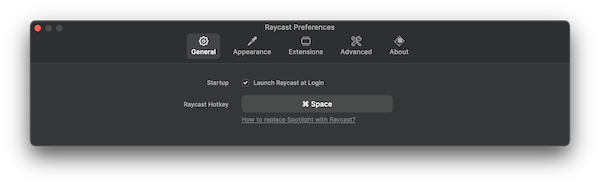

  Now, click on `Extensions` (1) ➔ `Scripts` (2) ➔ `Script Commands` (3) ➔ `Add Directories` (4)

  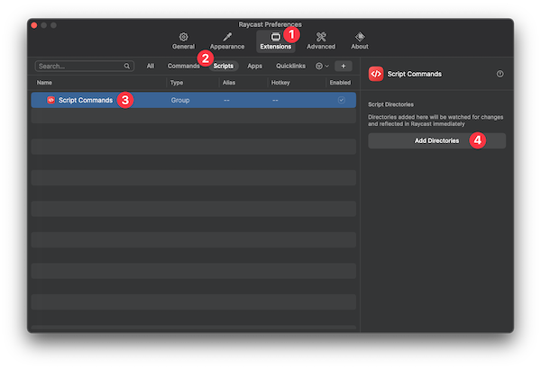

  After adding the directory, the right panel should be similar to this

  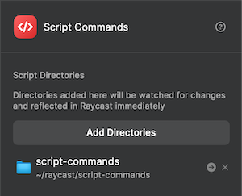

  Voilà, we are ready to install the first Script Command using our Store!

  💡 Tip: Watch the screencast to see the extension in action.

### Screencast

https://cln.sh/weZwo2

### Features

 
List Script Commands

 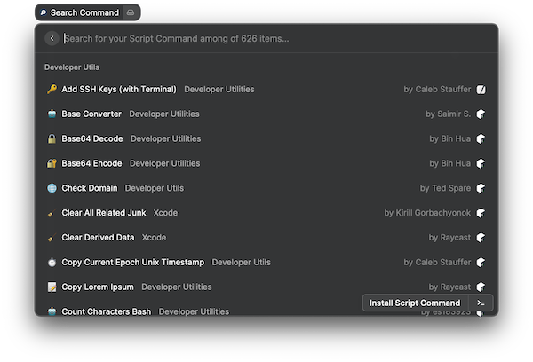

 
Install

 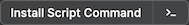

 
Uninstall

 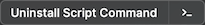

 
Configure and confirm setup

 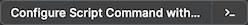  
 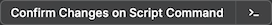

 
Search by indexed keys

 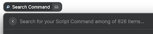
 - *Categories*: `communication`, `web searches`...
 - *Subcategories*: `github`, `brew`...
 - *Author name*: `things`
 - *Type*: `installed`, `template`, `setup`
 - *Programming language*: `bash`, `swift`, `python`... 

 
Filters

 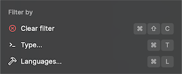
 - Type  
 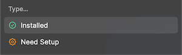
 - Languages  
 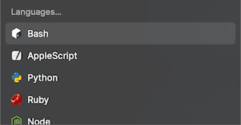

 
Show README (if available)

 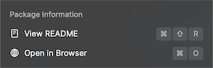

 
Show Source Code

 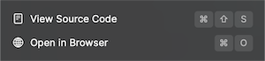

 
Show List of authors

 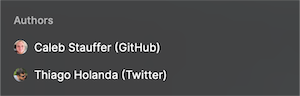

### Iconography

-  Need to be edited by the user before it is ready to be used. i.e: add token, set a username, etc...
-  Script Command was changed and the Store detected. A user's confirmation is required to activate the Script Command to be used.
-  Indicates the Script Command is installed. In case it needs extra setup, this will indicate the user made the change, confirmed, and now it is ready to use.
- If you are not seeing any of the icons above, this indicates the Script Command is not installed and you are seeing the programming language used to write it.  
  Example: 

### Data

The data consumed by this extension is automatically generated by [Raycast Toolkit](https://github.com/raycast/script-commands/tree/master/Tools/Toolkit).
 
### Thanks

- Special thanks to my personal friend [Diego Ventura](https://github.com/diegoventura), who dedicated some hours to teach me some concepts about React and TypeScript. Appreciated it, bro!

- [Raycast Team](https://github.com/orgs/raycast/people), for the creation of this amazing API.

### Author

[Thiago Holanda](https://unnamedd.codes) is an iOS Software Engineer, from Rio de Janeiro 🇧🇷 living in Berlin 🇩🇪.

If you want to get in touch, use the [Raycast Slack Community](https://raycast.com/community).  
User: [@tholanda](https://raycastcommunity.slack.com/team/U01BYRUJZ3J)