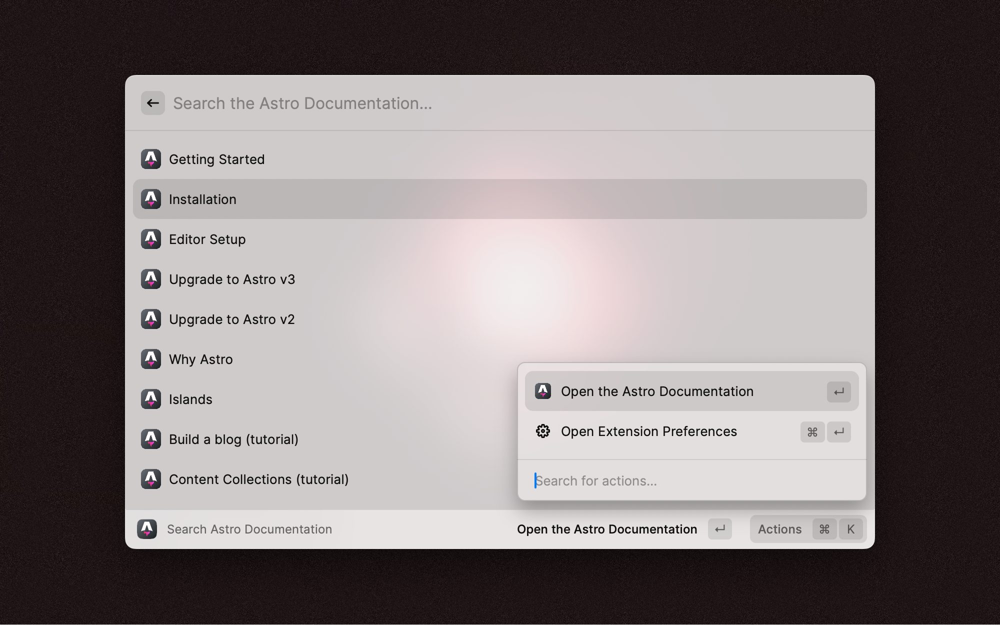

# Search Astro Documentation



## What is this extension

Reach and search the Astro Documentation in an instant right from Raycast without any hassle.

- ✅ Supports all languages that Astro Documentation supports
- ✅ Has all sidebar links that Astro Documentation has
- ✅ Fallback to [a.stro.cc](https://a.stro.cc) to fullfill any search in Astro Documentation

## How to add to the extension

### Bugs and suggestions

Suggestions are always welcome and can be added [via Github Issues](https://github.com/raycast/extensions/issues/new?title=%5BSearch+Astro+Documentation%5D+...&template=extension_feature_request.yml&labels=extension%2Cfeature%2Brequest&extension-url=https%3A%2F%2Fwww.raycast.com%2FElianCodes%2Fsearch-astro-docs&body=%0A%3C%21--%0APlease+update+the+title+above+to+consisely+describe+the+issue%0A--%3E%0A%0A%23%23%23+Extension%0A%0A%23%7Brepository_url%28extension.latest_version%29%7D%0A%0A%23%23%23+Description%0A%0A%3C%21--%0ADescribe+the+feature+and+the+current+behavior%2Fstate.%0A--%3E%0A%0A%23%23%23+Who+will+benefit+from+this+feature%3F%0A%0A%23%23%23+Anything+else%3F%0A%0A%3C%21--%0ALinks%3F+References%3F+Anything+that+will+give+us+more+context%21%0ATip%3A+You+can+attach+images+or+log+files+by+clicking+this+area+to+highlight+it+and+then+dragging+files+in.%0A--%3E%0A%0A), [bugs can also be issued via Github Issues](https://github.com/raycast/extensions/issues/new?title=%5BSearch+Astro+Documentation%5D+...&template=extension_bug_report.yml&labels=extension,bug&extension-url=https://www.raycast.com/ElianCodes/search-astro-docs&body=%0A%3C!--%0APlease+update+the+title+above+to+consisely+describe+the+issue%0A--%3E%0A%0A%23%23%23+Extension%0A%0Ahttps://raycast.com/%23%7Bextension_path(extension)%7D%0A%0A%23%23%23+Description%0A%0A%3C!--%0APlease+provide+a+clear+and+concise+description+of+what+the+bug+is.+Include+screenshots+if+needed.+Please+test+using+the+latest+version+of+the+extension,+Raycast+and+API.%0A--%3E%0A%0A%23%23%23+Steps+To+Reproduce%0A%0A%3C!--%0AYour+bug+will+get+fixed+much+faster+if+the+extension+author+can+easily+reproduce+it.+Issues+without+reproduction+steps+may+be+immediately+closed+as+not+actionable.%0A--%3E%0A%0A1.+In+this+environment...%0A2.+With+this+config...%0A3.+Run+'...'%0A4.+See+error...%0A%0A%23%23%23+Current+Behavior%0A%0A%23%23%23+Expected+Behavior%0A%0A)

### Development

```bash
# To install dependencies
npm i

# To start the local development server
npm run dev
```

All documentation items are defined in `src/data/docs.ts`. You can add new items there, types and IntelliSense supported. Each documentation item can have it's own display`title`, `url`, `icon` and `keywords`. Only the title is required.

```bash
# To lint and fix
npm run fix-lint

# To locally build the extension
npm run build
```
