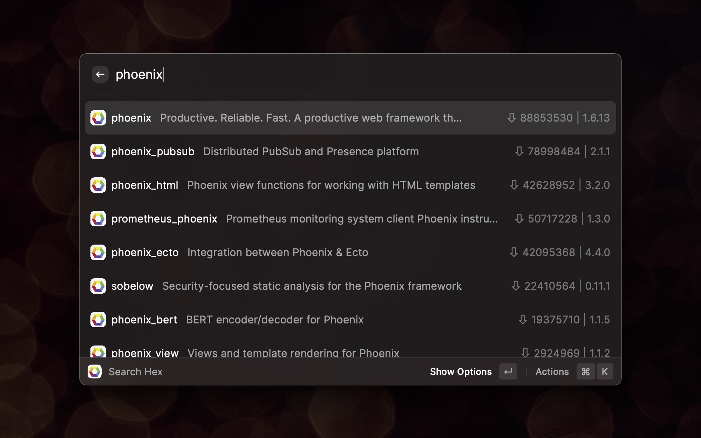
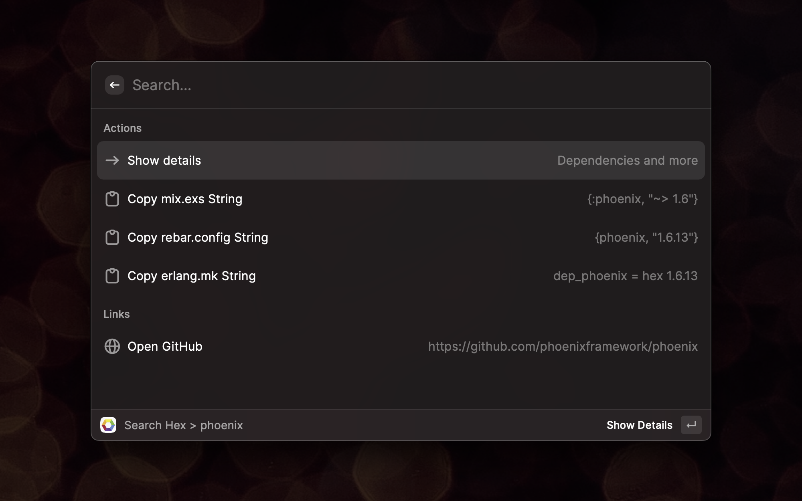
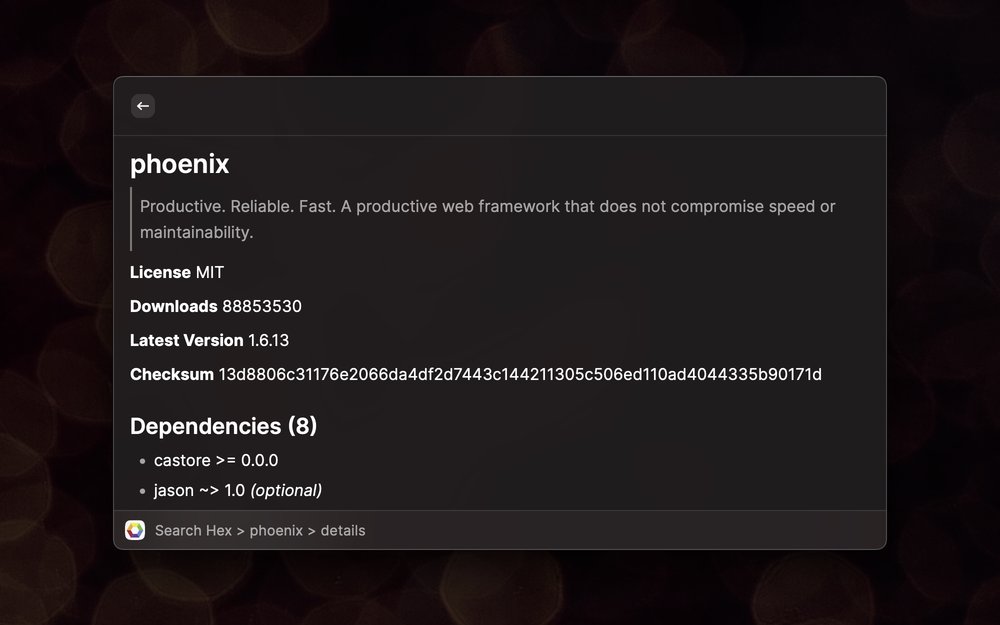
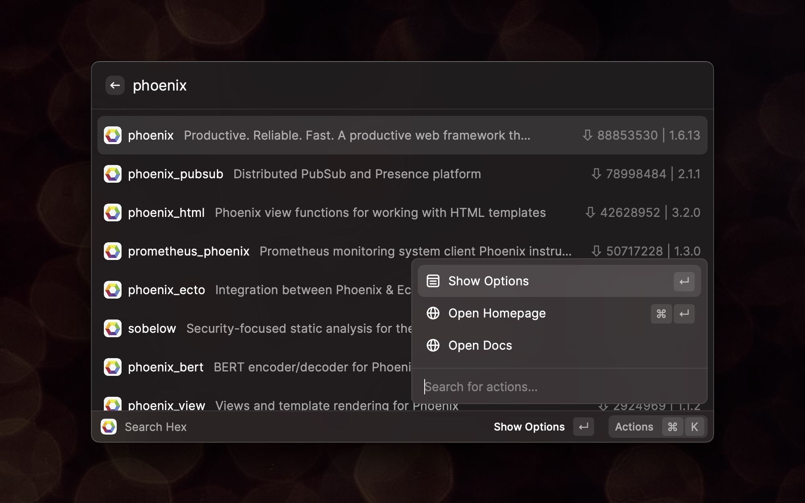

  <h1 align="center">Search Hex</h1>
  <h3 align="center">A Raycast extension for Elixir and Erlang programmers</h3>
  
  
  
  

This is a [Raycast](https://raycast.com/) extension that enables you to quickly
look up package information from [Hex](https://hex.pm).

### Author info

- [Extension author](https://github.com/jordelver)
- [Raycast Store profile](https://www.raycast.com/jordelver)

### Thanks!

- Big thanks to [Aleks](https://github.com/aleks) for his [Search Rubygems
  extension](https://github.com/raycast/extensions/tree/main/extensions/search-rubygems),
  on which this extension is _heavily_ based.
