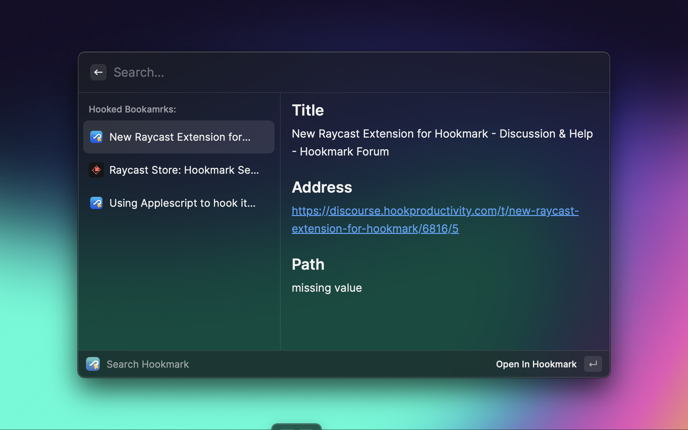

# Hookmark Search

This Hookmark extension aims to provide a bookmarks search UI in Raycast. It is similar to the
[Free Alfred Workflows for Hookmark – Hookmark](https://hookproductivity.com/help/automation/alfred-workflows/) workflow in Alfred.
You can retrieve all your Hook bookmarks in Raycast.

## Search your hookmarks

Open Raycast window and call "Search Hookmark".
The bookmarks is grouped into Files and URLs.

