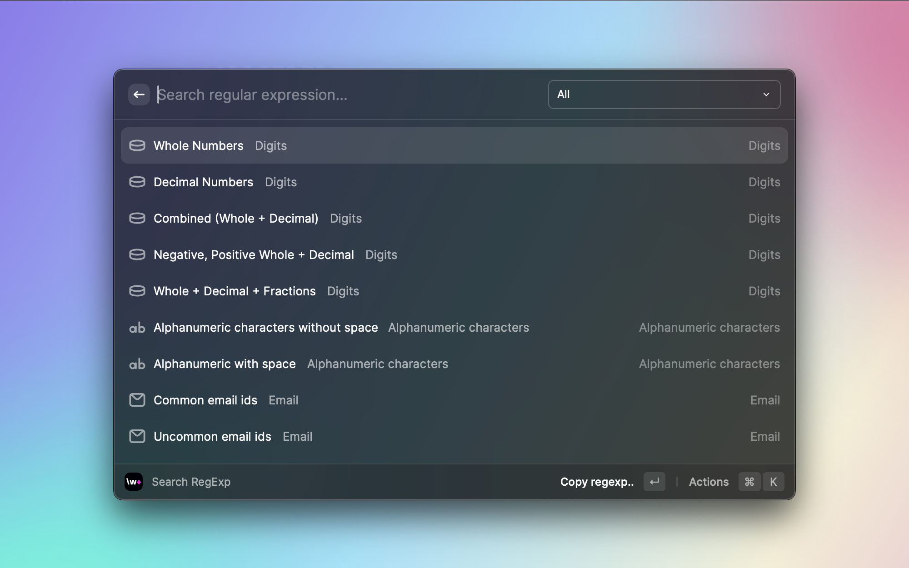
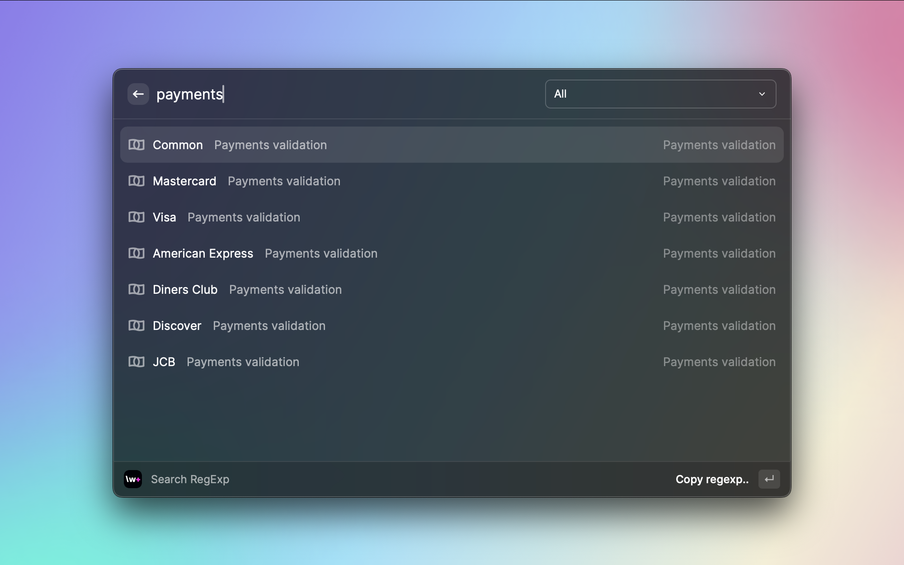
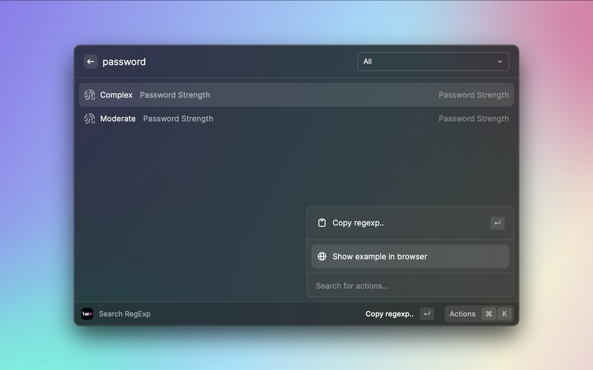
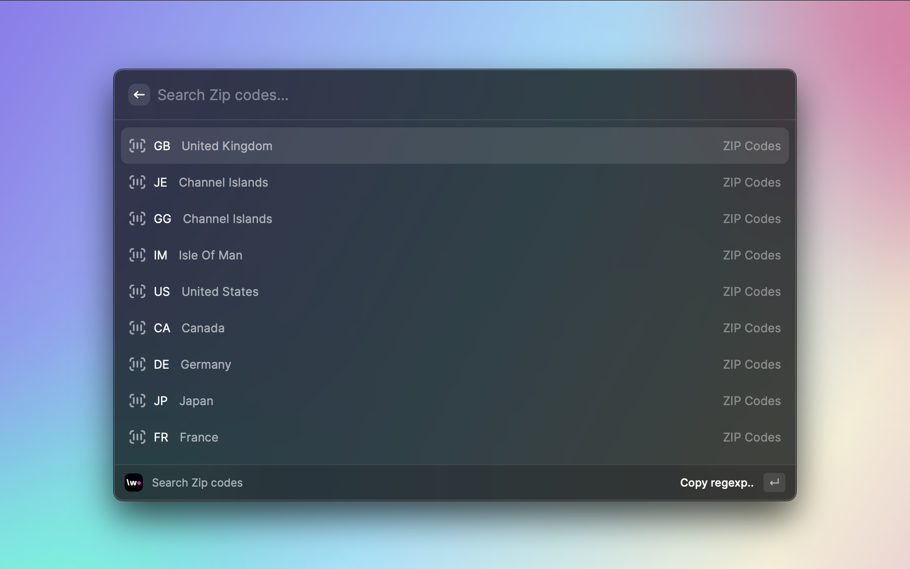

# Search RegExp

## Description

This extension allows you to quckly find the most common JS regular expressions.

<h1 align="center">Search RegExp Extension for Raycast</h1>

Search most common regular JS expressions including payments validation, password strenght, dates, time, ZIP codes etc.

## Screencast






## Supported Commands

1. Search regular expressions
2. Copy to clipboard
3. Open in browser

## How to use

1. Search regular expressions by name or category.
2. Filter items by category using dropdown near the search field (Cmd+P).
3. If you need to find a regular expression for certain ZIP code, find `Zip Codes` in list and go to zip codes list.

## Development

Open the project in your IDE of choice and install the dependencies via:

```bash
$ npm install
```

To run and test the extension locally:

```bash
$ npm run dev
```

## Checklist

- [x] I read the [extension guidelines](https://developers.raycast.com/basics/prepare-an-extension-for-store)
- [x] I read the [documentation about publishing](https://developers.raycast.com/basics/publish-an-extension)
- [x] I ran `npm run build` and [tested this distribution build in Raycast](https://developers.raycast.com/basics/prepare-an-extension-for-store#metadata-and-configuration)
- [x] I checked that files in the `assets` folder are used by the extension itself
- [x] I checked that assets used by the `README` are placed outside of the `metadata` folder
