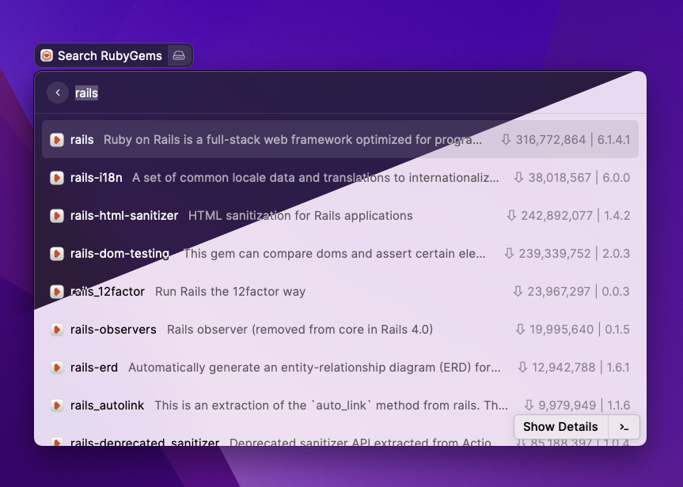
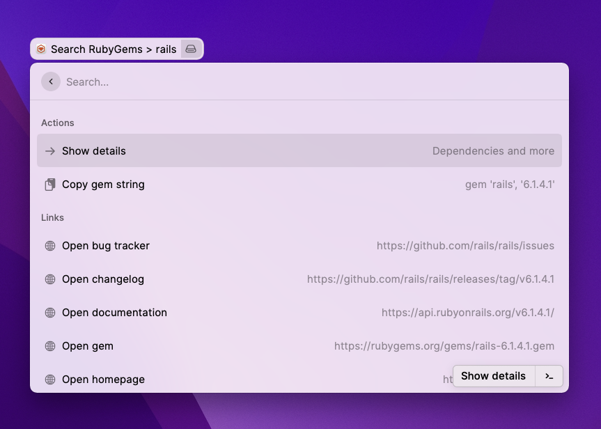
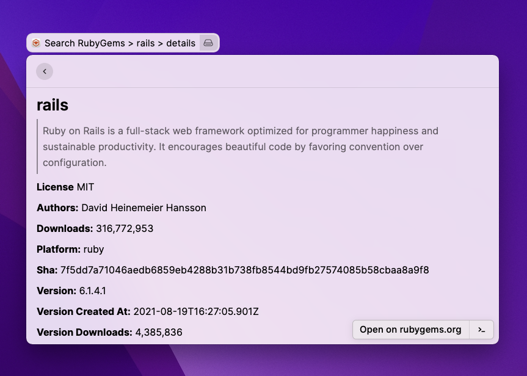

  <h1 align="center">Search RubyGems</h1>
  <h3 align="center">A Raycast extension for Rubyists</h3>
  

This is a [Raycast](https://raycast.com/) extension that enables you to quickly look up gem information from [RubyGems.org](https://rubygems.org).

- Use **Search RubyGems** to quickly find gems you're looking for
- Use the **Copy gem string** command to copy Gemfile compatible strings (i.e. `gem 'rails', '6.1.4.1'`)
- Gain quick access to gem specific links like **documentation**, **bug trackers** and **source code**
- See gem **dependencies** directly in Raycast

  
  

### Author info

- [Extension author](https://github.com/aleks)
- [raycast-search-ruby on github](https://github.com/aleks/raycast-search-rubygems)
- [Raycast Store profile](https://www.raycast.com/aleks)
