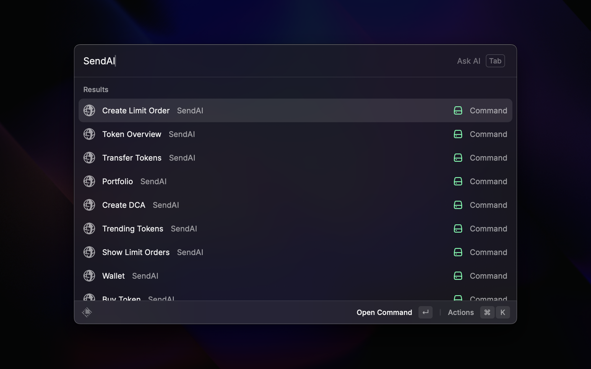

  

<h2 align="center">
Your shortcut to everything Solana. At your command bar.
</h2>

# Overview

SendAI Raycast is a Raycast extension that comes with an in-built wallet (protected by [Privy](https://privy.io)) to help you interact with the Solana blockchain using natural language prompts and commands. Manage your wallet, trade tokens, check portfolios, and perform various DeFi operations directly from Raycast.

It has two major mode:
1. Command Mode [Reommended for Quick Trading Actions]
2. Agentic Mode [Recommended for Advanced Agentic and Reasoning Actions]

# 1. Command Mode, powered by Raycast Commands

## Trading & Wallet Management powered by [Jupiter](https://jup.ag/) and [Privy](https://privy.io)

- **Buy Token** - Purchase tokens using SOL
- **Sell Token** - Sell your tokens for SOL
- **Transfer SPL** - Transfer SPL tokens to another wallet address
- **Get Wallet** - View your SendAI wallet information
- **Get Portfolio** - View your complete token portfolio

## Token Information powered by [Birdeye](https://birdeye.so)

- **Token Overview** - Get detailed information about any token
- **Trending Tokens** - View the current trending tokens on Solana

## Advanced Trading powered by [Jupiter](https://jup.ag/)

- **Create DCA** - Set up Dollar Cost Averaging orders
- **Create Limit Order** - Create limit orders for trading
- **Show Limit Orders** - View all your active limit orders
- **Show DCA Orders** - View all your active DCA orders

# 2. Agentic Mode, powered by Raycast AI

The extension includes powerful AI actions that you can trigger with natural language, powered by SendAI MCP:

## Balance & Portfolio

- **Balance** - Check your SOL balance
- **Get SOL Balance** - Get your SOL balance specifically
- **Get Token Balance** - Check balances of all your tokens
- **Get Portfolio** - View your complete portfolio with USD values

## Trading Operations

- **Buy Token** - Buy tokens using SOL with natural language
- **Sell Token** - Sell tokens for SOL
- **Fetch Price** - Get current token prices in USDC
- **Get Price History** - View token price charts and history

## Transfers

- **Transfer** - Send SOL to another wallet address
- **Transfer SPL** - Transfer SPL tokens to another address
- **Get Wallet Address** - Get your wallet's public key

## Token Information

- **Get Token** - Get comprehensive token information
- **Get Token Data by Ticker** - Look up tokens by their symbol/ticker
- **Get Trending Tokens** - Fetch currently trending tokens
- **Rugcheck** - Do a security analysis of tokens

## DeFi & Advanced Features

- **Bridge** - Generate cross-chain bridge URLs
- **Onramp** - Create MoonPay URLs to buy SOL with fiat
- **Get Top LST** - View top Liquid Staking Tokens
- **Lulo Get APY** - Check Lending APY rates
- **Lulo Lend** - Lend tokens like USDC through Lulo protocol
- **Get LST APY** - Get SOL LST APY rates for 1000+ LSTs like JitoSOL, mSOL, hSOL, and more

## Token Creation

- **Launch Pump Fun Token** - Create and launch new tokens on [Pump.fun](https://pump.fun/)

# Usage Examples

Simply type natural language commands to interact with your Solana wallet:

- "Buy 10 SEND tokens"
- "What's my SOL balance?"
- "Show me trending tokens"
- "Transfer 5 USDC to [wallet-address]"
- "What's the price history of SOL?"
- "Check if this token is safe"

# Setup

Just install the extension, login with Google and start using the it. 
Load with SOL to start taking executing transactions.

---

> **Disclaimer:**  
> SendAI Raycast is just a visual interface on Raycast as an extension. All non-custodial, transfer, and trading services are powered by third-party providers such as [Jupiter](https://jup.ag) ↗, [Birdeye](https://birdeye.so) ↗, [Privy](https://privy.io) ↗, and others.

Made by the SendAI Inc. team

