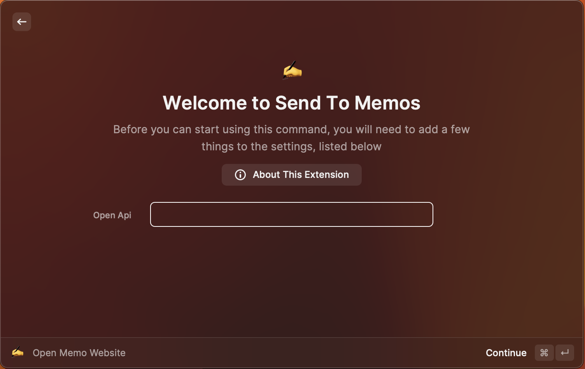
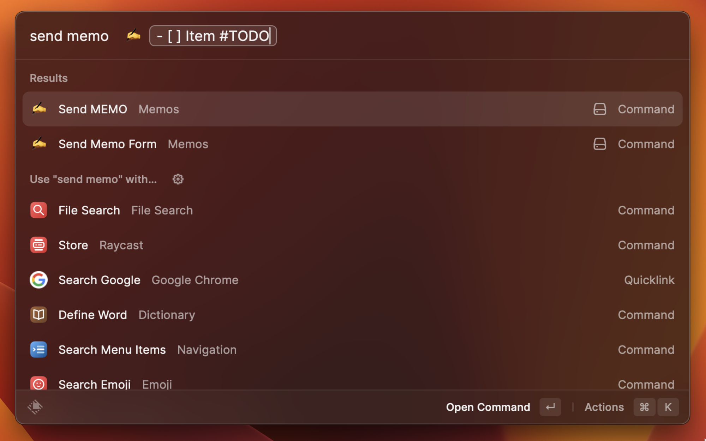
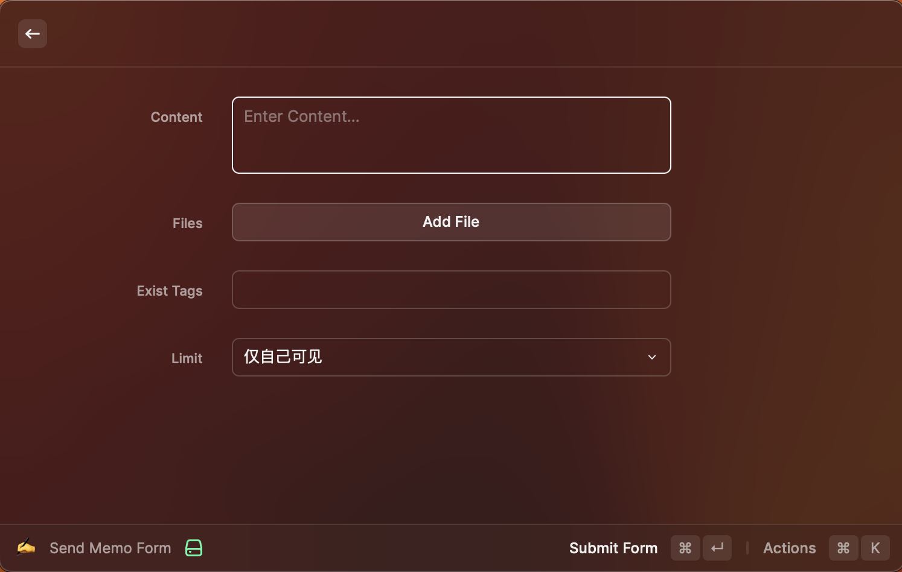
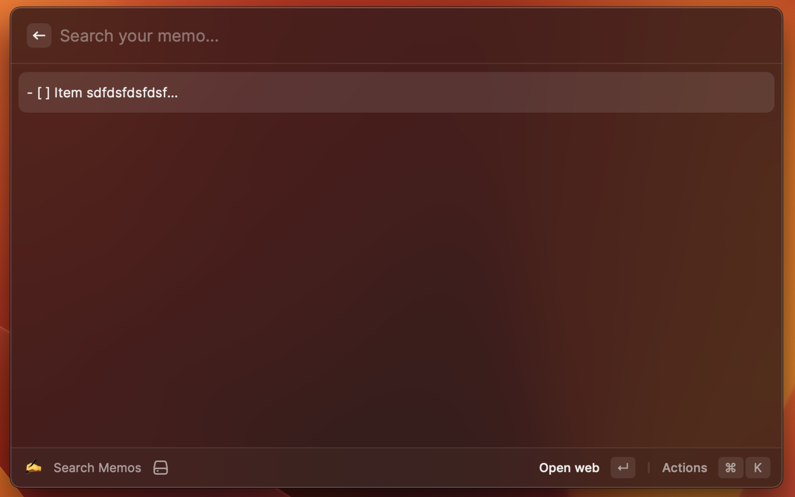

# Send To Memos

Raycast extension for [usememos/memos](https://github.com/usememos/memos).

# Setup Extension

1. Copy your memos Openapi.

# Create

## Create a memo quickly.

## Create a memo with a template.

# Search

