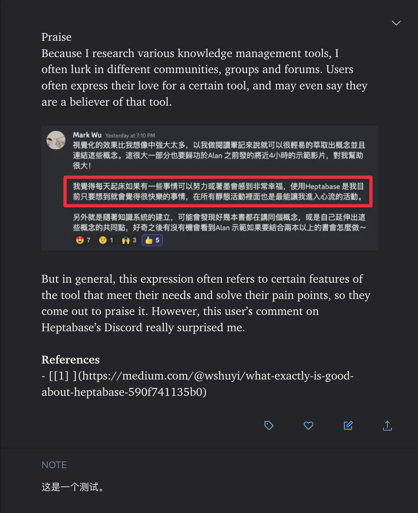

# Send to Readwise highlight

🔥 Input note to readwise directly.

🔥 You just need to configure your API at https://readwise.io/access_token to use it.

- (Required) Highlight -> Represents the main content of your notes, where you record your highlighted notes.
- (Optional) Reference -> Represents your web reference links; separate multiple references with a line break. The backend will automatically process this into markdown format.
- (Optional) Comment -> Represents your evaluation or comments on the note content.

# Q&A

🤔️ Q: What if I want to upload image?

✨ A: Currently, only online image URLs are supported. Markdown-formatted images will be directly rendered as images in apps like Readwise, Heptabase, etc. So, all you need to do is paste the image URL at any position in the highlight notes.

🙌🏻 Tips: You can download the markdown plugin from: https://chrome.google.com/webstore/detail/markdownload-markdown-web/pcmpcfapbekmbjjkdalcgopdkipoggdi. This will allow you to directly copy the markdown format link of an image in the Arc / Chrome browser using the right-click of the mouse.

<video width="640" height="240" controls>
  <source src="/Users/lysonober/build_world/Raycast_personal/send-to-readwise/assets/demo-video.mp4" type="video/mp4">
</video>

👇 Results with markdown format image link

<table>
  <tr>
    <td></td>
    <td></td>
  </tr>
</table>
