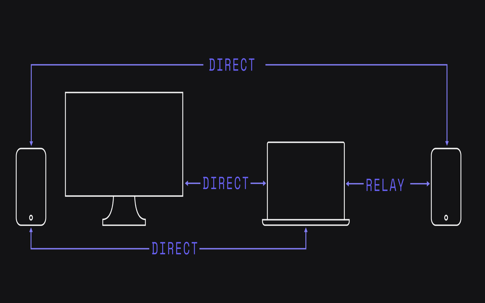
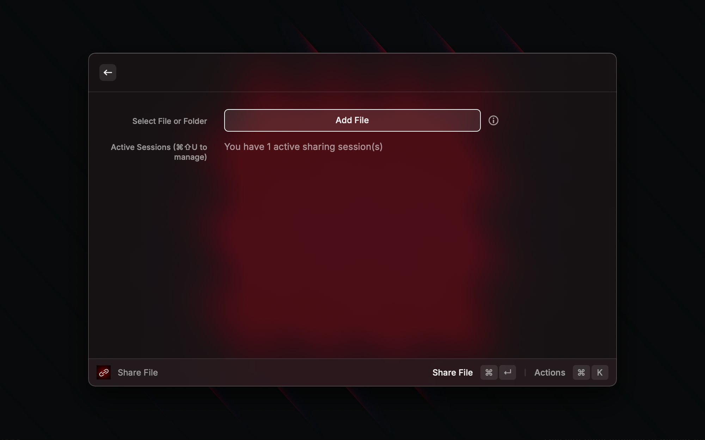
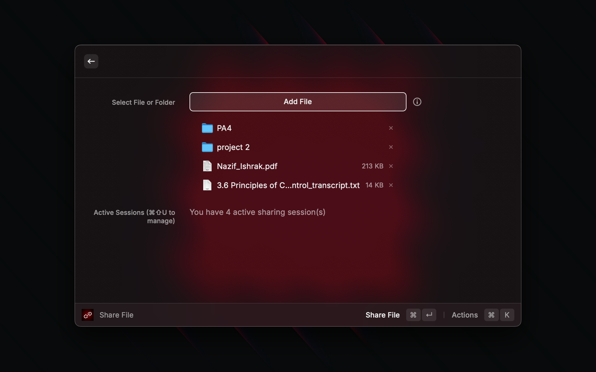
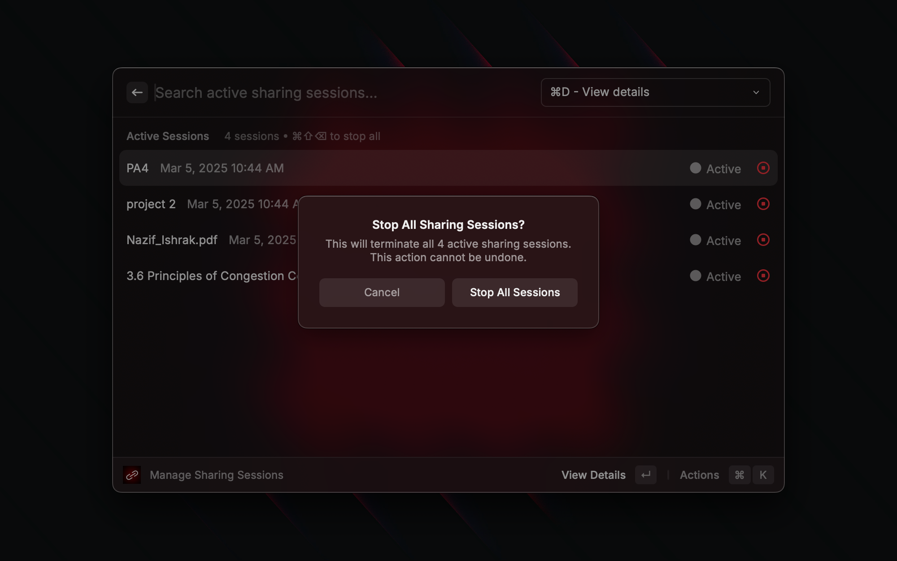
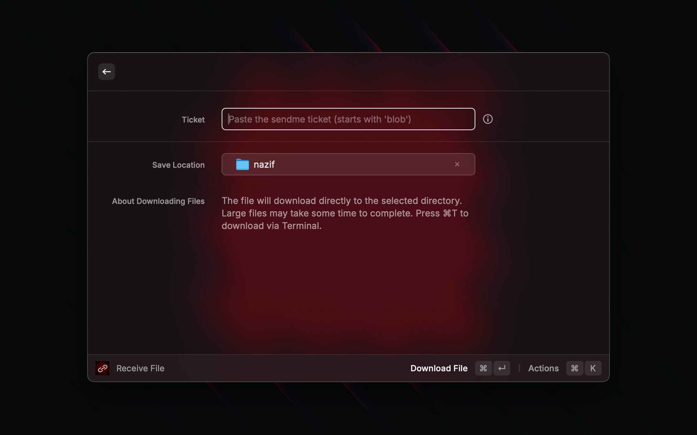

# Share files free instantly from Raycast


## The Easiest Way to Share Files Directly from Raycast

**Sendme** brings effortless file sharing to your Raycast environment, allowing you to share files peer-to-peer without any servers, accounts, or configuration.

## Why Sendme for Raycast is Revolutionary

### 🚀 True P2P File Sharing

Share files directly between devices with no intermediary servers. Your data never leaves the direct connection between sender and receiver.






### 🔒 Secure by Design

Built on Iroh's robust encryption technology, ensuring your transfers are secure and private end-to-end.

### 🌐 No IP Addresses or Network Configuration

Forget about port forwarding, IP addresses, or network settings. Sendme handles all the connection complexity behind the scenes.

### ⚡️ Lightning Fast

Direct peer connections mean maximum transfer speeds limited only by your network.

### 💻 Seamless Raycast Integration

Access powerful file sharing right from your productivity command center 

## How It Works

1. **Share Files**: Select any file or folder to share
2. **Get a Ticket**: A unique ticket is generated and copied to your clipboard
3. **Send the Ticket**: Share the ticket with the recipient via any messaging app
4. **Recipient Downloads**: They paste the ticket and receive the file directly from your machine

## Features

- **Share Files & Folders**: Share single files or entire directories
- **Active Session Management**: View and manage all your ongoing sharing sessions
- **Terminal Fallback**: For complex scenarios, option to run in Terminal
- **Progress Tracking**: Monitor downloads in real-time
- **Simple Recovery**: Automatically recovers sessions after restarts
- **Clipboard Integration**: Automatically detects tickets in your clipboard

## No Servers, No Limits

Unlike traditional file sharing services:
- P2P
- No accounts or logins required
- No third-party servers involved


### Troubleshooting
The extension looks for homebrew to install sendme. If homebrew isn't found, it tries to install in another way. But if you get an error saying sendme isn't installed, please run these commands:

```bash
curl -fsSL https://iroh.computer/sendme.sh -o ~/sendme
chmod +x ~/sendme
```

Now try Raycast again.

## Privacy & Security

Because Sendme uses direct P2P connections powered by Iroh's technology:

- Your files never pass through any servers
- All connections are encrypted end-to-end
- No data is stored in the cloud
- No metadata about your transfers is collected

---

Built by Nazif with ❤️ for the Raycast community