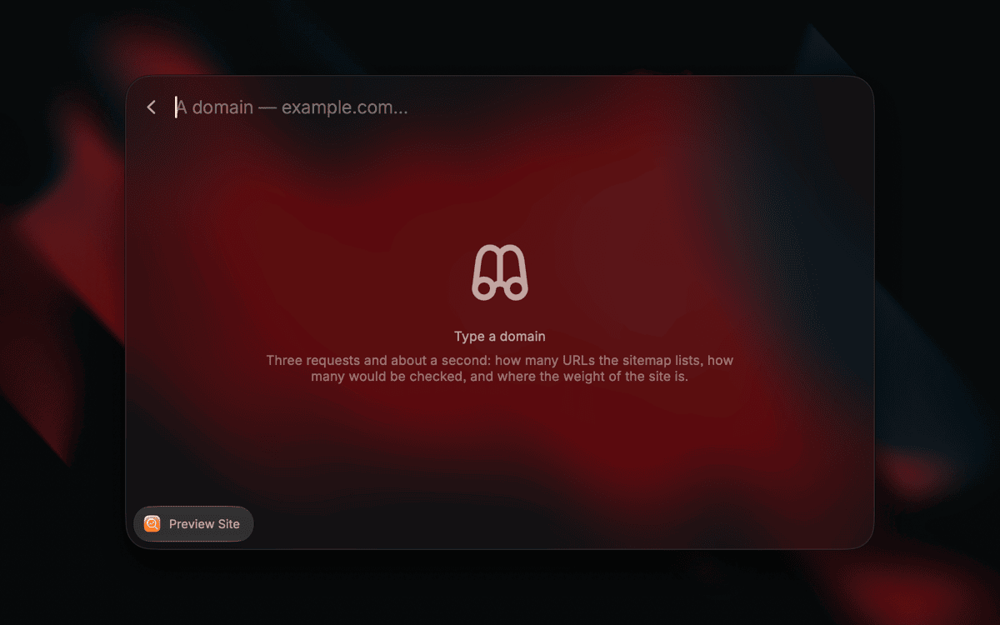
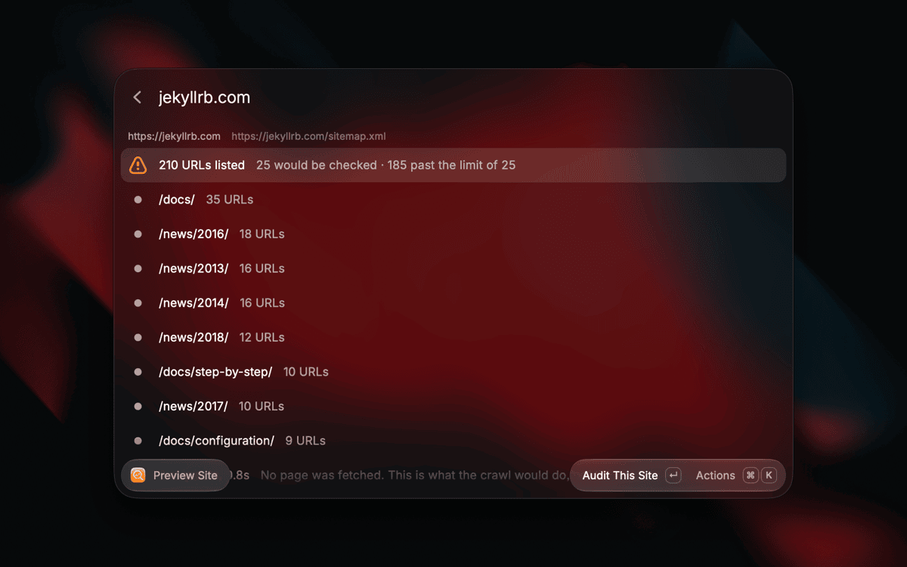
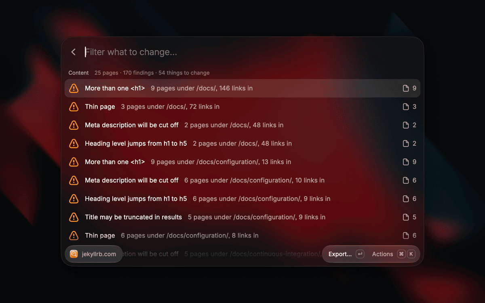
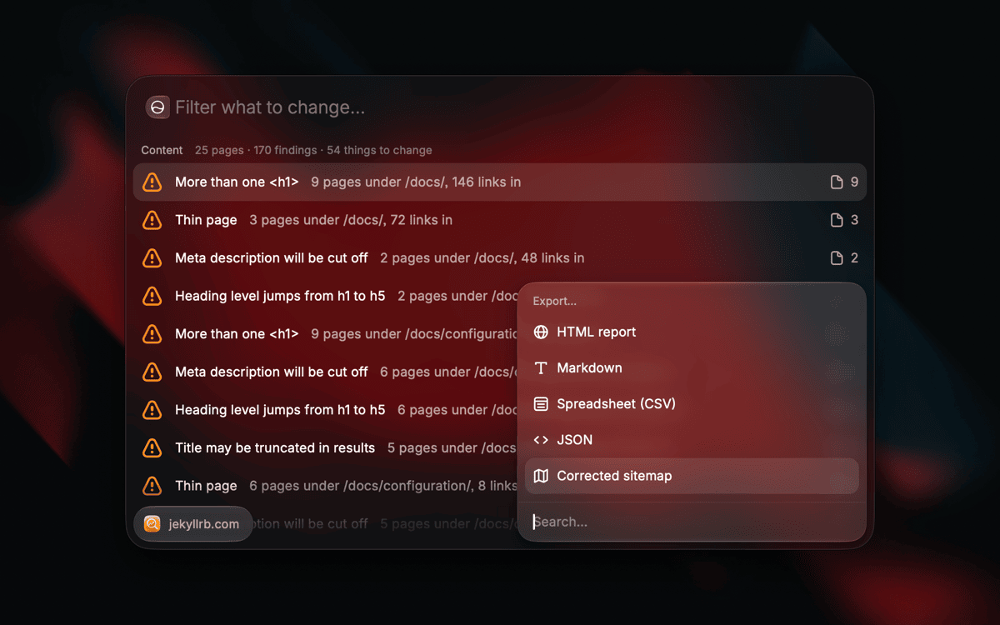
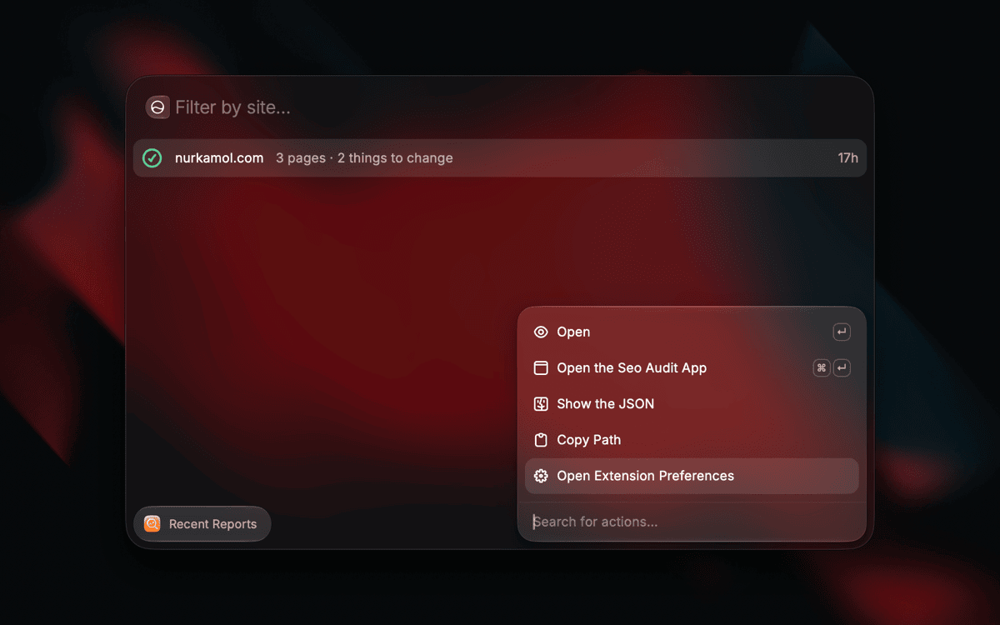

# SEO Audit

Most SEO tools grade one URL. This crawls the whole sitemap and checks every
page, because the problems that cost you traffic are rarely on the home page.

It was written after three commercial graders all called a client's site healthy
while the language switcher on every translated article linked to a 404 — a bug
none of them could see, because it was only wrong on pages they never opened.



## Three commands

| | |
|---|---|
| **Preview Site** | How big is this, and is it the right one — about a second, three requests, no page fetched |
| **Audit Site** | Crawl it and list what to change, worst first |
| **Recent Reports** | Every run the macOS app has already finished |

### Preview comes first on purpose

A full crawl takes minutes and a launcher is built for the second you spend in
it. Running a seven-minute job behind a keystroke is the obvious idea and the
wrong one — you close the window and it is gone.

So `Preview` answers the question you actually have *before* spending those
minutes. It settles the host, reads robots.txt and the sitemap, and stops.

```
210 URLs listed     25 would be checked · 185 past the limit of 25
/docs/              35 URLs
/news/2016/         18 URLs
3 requests, 1.4s    No page was fetched.
```

You find out you pointed at the wrong host, or that the sitemap is stale, or
that this is a thousand-page site that belongs in the terminal — in a second,
not in seven minutes.

## What it checks

Around ninety checks, grouped into what to change rather than listed as
individual complaints. One broken template on forty pages is **one** row saying
forty, not forty rows.

- **Indexability** — `noindex`, robots.txt, canonicals that point somewhere
  else, pages in the sitemap that the site will not serve
- **Links** — internal 404s, redirect chains, and outbound links that have
  died, across every page rather than one
- **Metadata** — titles and descriptions that are missing, duplicated,
  truncated, or contradict the page
- **Structured data** — JSON-LD that parses, validates, and still does nothing
  because it is not the type Google reads for that page
- **Social** — Open Graph and Twitter cards, including whether `og:image`
  actually loads
- **Site & security** — HTTPS, certificate expiry, redirect behaviour, `www`
  and non-`www` disagreeing, sitemap and robots.txt sanity
- **Content** — thin pages, near-duplicate pages found by fingerprint rather
  than by URL, heading structure, images with no alt text
- **Performance** — never estimated. `--psi` asks Google for Google's own
  field measurement, or the number is not shown at all



## Export

`⌘E` on any result writes **HTML**, **Markdown**, **CSV**, **JSON** or a
**corrected sitemap** to `~/Downloads`.

The corrected sitemap is the one worth knowing about: it lists what the site
should actually be advertising, with the dead and redirected and non-indexable
URLs taken out. When the crawl did not see the whole site, it refuses and says
why — a sitemap built from a partial crawl would quietly delete real pages from
somebody's index.

## Settings

`⌘,` reaches every flag that shapes a run:

| | |
|---|---|
| Pages per run | How far to crawl, capped — a launcher is a poor place to wait out a thousand pages |
| Speed | Gentle, Normal or Fast |
| Outbound links | Check that external links still resolve |
| Sitemap | Point at one directly when discovery finds the wrong one |
| Exclude | Skip paths by glob, one per line or comma separated |
| Only what changed | Crawl only pages whose `lastmod` is newer than a date |
| Identify as | Which browser and system to send, or your own user agent |
| Performance | Which pages to measure, how many, mobile or desktop |
| Silenced checks | Ids to ignore — copy one off any finding with `⌘.` |

Anything left at its default is not sent, so the defaults stay written down in
one place: the engine.



## It shares a library with the macOS app

Both read `~/Library/Application Support/seo-audit`, so a crawl you ran in the
app window is in **Recent Reports** a second later, with nothing synchronised or
copied. A seven-minute crawl should only ever happen once.

Reading only, deliberately: deleting somebody's seven minutes behind a single
Return is not a trade worth offering. That stays in the app, where the
confirmation and the undo live.



## Nothing leaves your machine

The crawl runs locally and talks to the site you named and nothing else. There
is no account, no telemetry, no server in the middle. The one exception is
opt-in and named: turning on the performance setting asks Google's PageSpeed
Insights about the URLs you chose, because a `fetch` loop cannot see rendering
and a plausible wrong number is worse than no number.

## The same engine as everything else

```ts
import { preview } from "@nurkamol/seo-audit";
```

That one line is the whole architecture. The command line, the GitHub Action,
the hosted Worker, the macOS app and this extension all import the same
`@nurkamol/seo-audit` package — none of them reimplements a check. A report from Raycast
and one from `seo-audit --json` are the same report, which is the rule that lets
this project have five front ends without them drifting apart.

Raycast runs Node, so unlike the hosted Worker this gets `node:tls` and the
certificate checks work here.

**Two things are duplicated**, and both have tests that fail if either drifts:
the three named speeds, which exist in Swift and JavaScript and must mean the
same crawl in both windows; and the browser and system menus, because a dropdown
in a static manifest cannot read the engine's list at runtime.



## Not here, and why

`--baseline` and `--against` want two runs picked and compared, which is a
screen rather than a preference. `--compare-as` fetches a sample twice.
`--settle` waits out a deploy. `--redirects` and `--config` are files a
repository commits. `--fail-on` needs an exit code a launcher does not have.
`--search-console` needs an OAuth client and has never run against the live API.

All of them are in the command line: `npx @nurkamol/seo-audit example.com`.

## Working on it

```bash
npm install
npm run dev      # ray develop — opens Raycast against this folder
npm run lint
```

It depends on `@nurkamol/seo-audit` as an ordinary published package, so this
folder stands on its own — which is the point, since a Store submission is this
folder and nothing above it.

The half that is not React lives in `lib/present.mjs` — plain ESM with no
`@raycast/api` import anywhere in it, so a plain `node --test` can run it. The
components are thin over it on purpose: what goes wrong quietly is a preference
that parses to `NaN` pages, a library row pointing at a file that is gone, or a
refusal drawn as a result, and all three are in the tested half.

`lib/engine.ts` is the one place that says what the engine returns, and
`lib/engine-package.d.ts` is why it has to: the engine ships plain ESM with no
type declarations and stays that way, because the command line's premise is
that it runs under `npx` with nothing installed and emitting types would mean a
build step.

The tests themselves live with the engine, in the
[source repository](https://github.com/nurkamol/seo-audit) — including the ones
that fail if this folder ever imports something above itself, if a preference
this manifest declares stops being read, or if this README links a picture that
is not there.

MIT. Source and the other four front ends:
[github.com/nurkamol/seo-audit](https://github.com/nurkamol/seo-audit).
