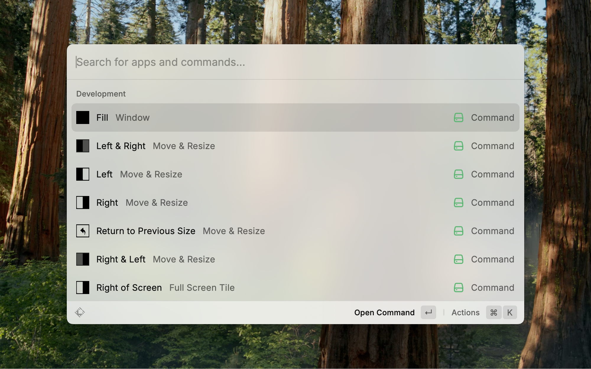

# Sequoia Window Tiling

Map macOS 15+ Sequoia tiling commands to Raycast with intuitive keyboard shortcuts.

## Features

* One-key shortcuts for fill, center, halves, quarters and three-window layouts
* Extra shortcuts for all Sequoia tiling actions—ideal for keyboards without an Fn key
* Custom menu labels per command

## Screenshots

## Requirements

* macOS 15+ (Sequoia)

## Setup

1. Run any tiling command in Raycast.
2. When prompted, open System Settings → Privacy & Security → Accessibility.
3. Enable Raycast under Accessibility.

## Recommended Shortcuts

| Action                | Shortcut | Notes                                |
| --------------------- | -------- | ------------------------------------ |
| Fill                  | ⌃ ⌥ F    | Expand the window to fill the screen |
| Center                | ⌃ ⌥ C    | Center the window on the desktop     |
| Left Half             | ⌃ ⌥ ←    | Move the window to the left half     |
| Right Half            | ⌃ ⌥ →    | Move the window to the right half    |
| Top Half              | ⌃ ⌥ ↑    | Move the window to the top half      |
| Bottom Half           | ⌃ ⌥ ↓    | Move the window to the bottom half   |
| Top-Left Quarter      | ⌃ ⌥ ⇧ ←  | Top-left quarter tiling              |
| Top-Right Quarter     | ⌃ ⌥ ⇧ ↑  | Top-right quarter tiling             |
| Bottom-Left Quarter   | ⌃ ⌥ ⇧ ↓  | Bottom-left quarter tiling           |
| Bottom-Right Quarter  | ⌃ ⌥ ⇧ →  | Bottom-right quarter tiling          |
| Restore Previous Size | ⌃ ⌥ R    | Revert to the window’s previous size |
| Left & Right          | ⌃ ⇧ ←    | Active → left, next → right          |
| Right & Left          | ⌃ ⇧ →    | Active → right, next → left          |
| Top & Bottom          | ⌃ ⇧ ↑    | Active → top, next → bottom          |
| Bottom & Top          | ⌃ ⇧ ↓    | Active → bottom, next → top          |

Find a cascading windows shortcut for macOS [here](https://routinehub.co/shortcut/22714/).

## Contributing

Pull requests and issues are welcome!

## License

MIT