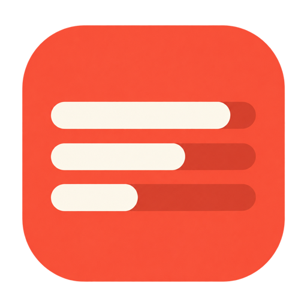
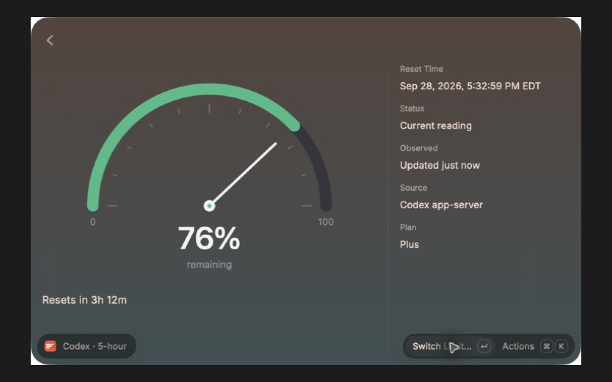

# session limits

see how much codex and claude code you have left, right in raycast.

## get started

open **show session limits**. hit **enter** for quota details or **⌘r** to refresh. for a quick glance, run **session limits menu bar**.

## connect

- **codex:** sign in to the codex cli and you're set.
- **claude code:** choose **connect claude code**, then use claude to update your limits. you'll need claude code 2.1.251+ and pro or max.
- **other providers:** add a [custom quota snapshot](docs/providers.md).

[website](https://vkalipat.github.io/raycast-session-limits/) · [contributing](CONTRIBUTING.md) · [mit license](LICENSE)
