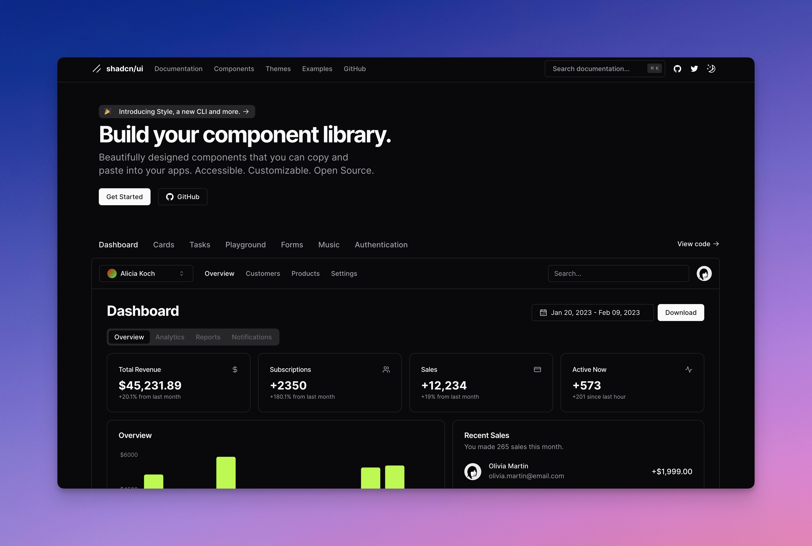

  

  <h1>
    shadcn/ui
  </h1>

Raycast extension to Browse [shadcn/ui](https://ui.shadcn.com/) documentation, components and examples

  

    
    
    
    
  

## About shadcn/ui
Build your component library.
Beautifully designed components that you can copy and paste into your apps. Accessible. Customizable. Open Source.

## How it works

## Support

If somethings wrong or just want to reach out you can find me [here](https://www.luisfilipept.com/) 😎

## FAQ

### Is this extension official

No. I just really like [shadcn](https://twitter.com/shadcn) work and use Raycast a lot, so it just made sense for me to have this extension. Hope he doesn't mind 😃
