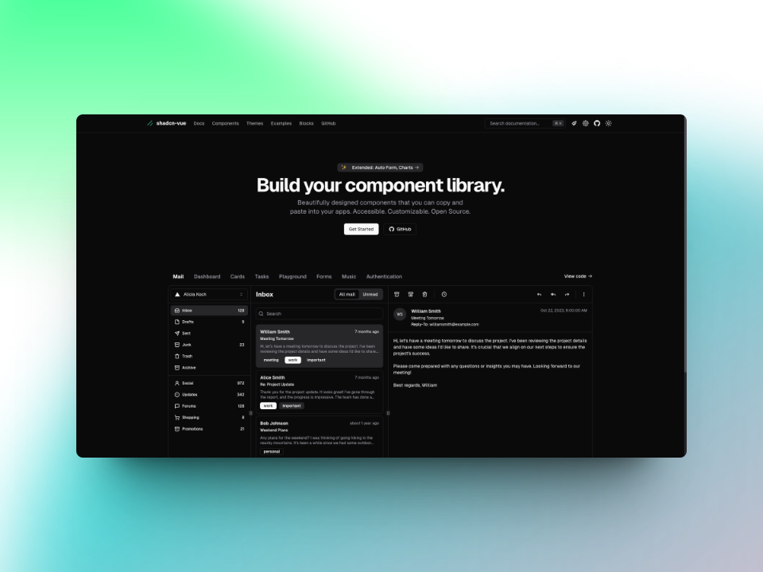

  

  <h1>
    shadcn/vue
  </h1>

Raycast extension to browse [shadcn/vue](https://www.shadcn-vue.com/) documentation, components, and commands.

  

    
    
    
    
  

## About shadcn/vue

- Build your component library.

- Beautifully designed components that you can copy and paste into your apps. Accessible. Customizable. Open Source.

## How to contribute?

Contributions are welcome and encouraged! If you have any ideas or suggestions for new features, or if you encounter any bugs or issues, please open an issue or submit a pull request on the GitHub repository.

## FAQ

### Is this extension official

No. I really like using Shadcn Vue when building applications with Vue and Nuxt. I am also the creator of the [Shadcn Vue](https://marketplace.visualstudio.com/items?itemName=Selemondev.shadcn-vue) VSCode extension. I saw [@_luisFilipePT](https://twitter.com/intent/user?screen_name=_luisFilipePT)'s work ( He is the creator of [Shadcn UI Raycast extension]((https://www.raycast.com/luisFilipePT/shadcn-ui))) when looking for an idea of what to build using the Raycast API because I really love using Raycast and wanted to understand how Raycast extensions are built.