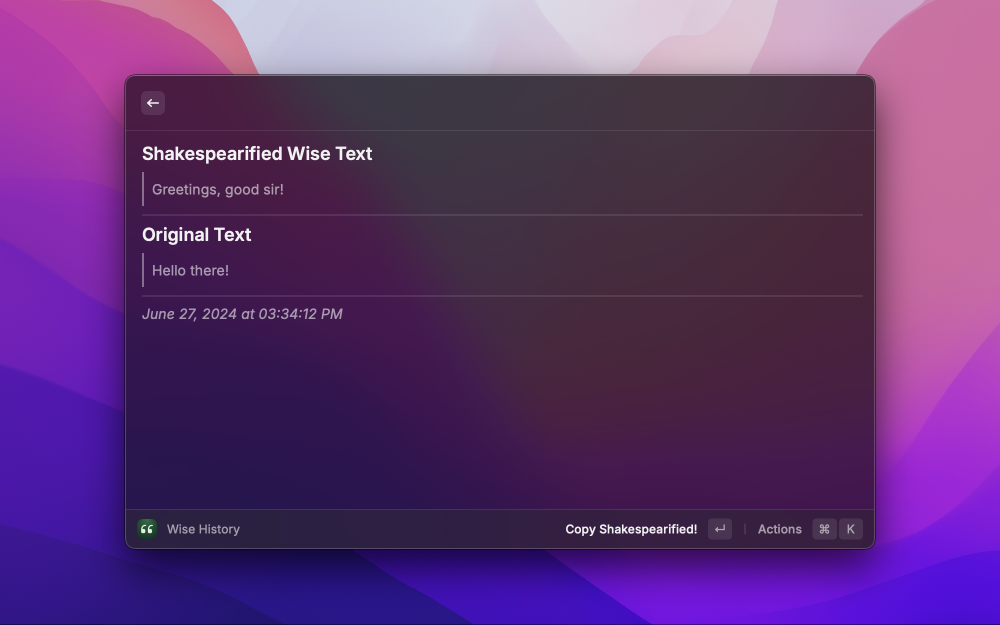

 

    

<h1 align="center">Shakespearify</h1>

Convert plain boring English text to something like Shakespeare would write!

## Setting up Shakespearify

When you first run the extension, you will be asked a few configuration options. This is required to ensure proper functioning of the extension.

#### Configuration Options

- ###### "Automatically Copy Converted Text"
    - **"Copy"**, the converted text will be copied to the clipboard automatically.
    - **"Don't Copy"**, the converted text will not be copied to the clipboard.

- ###### "Immediately Paste Converted Text"
    - **"Paste"**, the converted text will be immediately pasted to the fontmost application after conversion.
    - **"Don't Paste"**, the converted text will be displayed in a dialog box.

- ###### "Gemini API Key"
    - Enter the API key generated from Google AI studio in the input box.
    - It will be used to translate text.
    - Gemini API offers a free tier as opposed to most other APIs.
    - To learn how to obtain a key, refer to the section below.

#### Obtaining a Gemini API Key

1. Visit [Google AI Studio Website](https://aistudio.google.com/app/apikey) and create an API key.
2. Copy the API key after generating.
3. Paste the API key when asked during the setup process.

## Images

