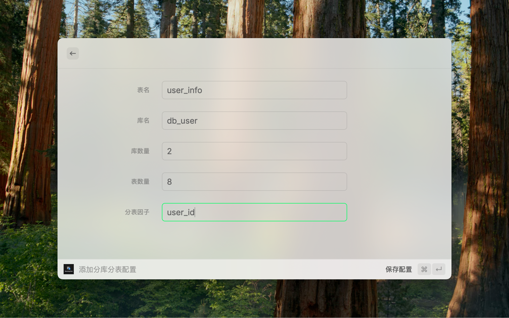
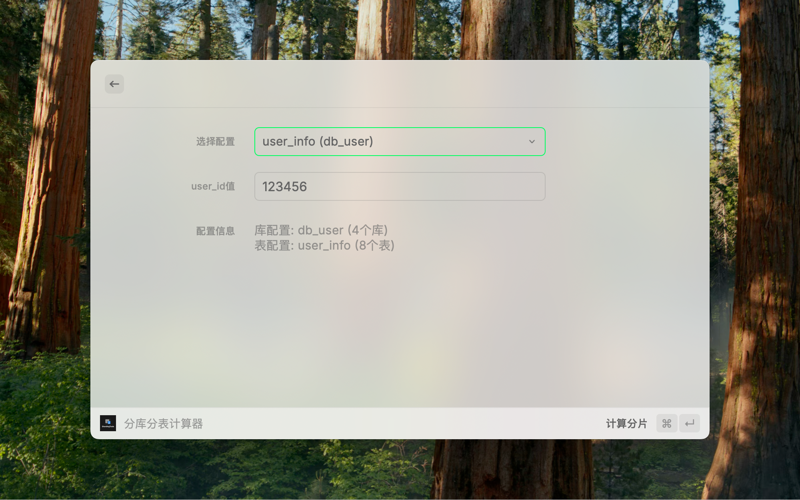

<p align="center">
  
</p>

<p align="center">
  <strong>ShardingTools - 一个专业的数据库分库分表管理和计算的 Raycast 扩展</strong>
</p>

## 📋 项目简介

ShardingTools 是一个专门为数据库分库分表场景设计的专业 Raycast 扩展工具。它提供了完整的分库分表配置管理、实时计算和 SQL 生成功能，大大提高开发者在分库分表场景下的工作效率。

## ✨ 功能特性

### 🗂️ 配置管理

- **多配置存储**：支持保存和管理多个分库分表配置
- **配置编辑**：随时修改已保存的配置参数
- **配置删除**：支持删除单个或全部配置
- **配置导入/导出**：支持配置文件的导入和导出，便于备份和分享

### 🧮 智能计算

- **分库分表计算器**：输入分表因子值，自动计算对应的库表位置
- **数字取模算法**：使用简单直观的取模运算进行分片计算
- **配置切换**：在计算器中快速切换不同的表配置

### 🔧 便捷功能

- **剪贴板自动读取**：进入计算器时自动读取剪贴板内容
- **SQL 语句生成**：自动生成对应的查询 SQL 语句
- **一键复制**：快速复制库名、表名、SQL 语句等信息
- **回车快捷键**：支持回车键快速计算
- **数据备份恢复**：通过导出/导入功能实现配置的备份和恢复

### ⚡ Raycast 深度集成

- **三个独立命令**：添加配置、查看列表、快速计算
- **流畅导航**：在不同功能间无缝切换
- **本地存储**：所有数据安全保存在本地
- **快捷键支持**：丰富的快捷键操作，提升使用效率

## 🛠️ 安装使用

### 前置要求

- [Raycast](https://raycast.com) 应用
- Node.js 18+
- npm 或 yarn

### 本地开发

1. 克隆项目：

```bash
git clone <repository-url>
cd shardingtools
```

2. 安装依赖：

```bash
npm install
```

3. 启动开发模式：

```bash
npm run dev
```

4. 在 Raycast 中使用 `Import Extension` 导入本地扩展

### 发布到 Raycast Store

```bash
npm run publish
```

## 📖 使用方法

### 🚀 快速开始

ShardingTools 提供三个独立的命令，覆盖分库分表的完整工作流：

#### 1. 添加分库分表配置

在 Raycast 中搜索 "添加分库分表配置"，填入以下信息：

- **表名**: 数据表名称（如：user_info）
- **库名**: 数据库名称（如：db_user）
- **库数量**: 分库数量（如：4）
- **表数量**: 每库分表数量（如：16）
- **分表因子**: 分片字段名称（如：user_id）

#### 2. 查看分库分表列表

在 Raycast 中搜索 "查看分库分表列表"：

- 查看所有已保存的配置
- 编辑现有配置
- 删除不需要的配置
- 快速进入计算器
- 导出配置文件（⌘⇧E）
- 导入配置文件（⌘⇧I）

#### 3. 分库分表计算器

在 Raycast 中搜索 "分库分表计算器"：

- 自动读取剪贴板内容作为分表因子值
- 选择要计算的配置（如有多个）
- 输入具体的分表因子值（如：123456）
- 按回车键或点击"计算分片"
- 查看计算结果和生成的 SQL 语句

#### 4. 配置导入/导出

**导出配置**：

- 在配置列表中按 `⌘⇧E` 或点击"导出所有配置"
- 配置数据将自动复制到剪贴板（JSON 格式）
- 可保存为 `.json` 文件进行备份

**导入配置**：

- 在配置列表中按 `⌘⇧I` 或点击"导入配置"
- 选择导入模式：
  - **合并模式**：将导入的配置添加到现有配置中
  - **替换模式**：用导入的配置替换所有现有配置
- 粘贴 JSON 数据或按 `⌘V` 从剪贴板读取
- 点击"导入配置"完成导入

### 💡 使用技巧

1. **批量计算**：复制用户 ID 到剪贴板，打开计算器即可自动填充
2. **SQL 生成**：计算结果页面可直接复制生成的查询 SQL
3. **多配置管理**：为不同项目创建不同的分库分表配置
4. **快速导航**：在列表页面按回车键可直接进入该配置的计算器
5. **配置备份**：定期导出配置文件，确保数据安全
6. **团队协作**：通过导出/导入功能在团队成员间共享配置
7. **环境迁移**：在不同设备间同步分库分表配置

### ⌨️ 快捷键

- `⌘⇧E` - 导出所有配置
- `⌘⇧I` - 导入配置
- `⌘V` - 从剪贴板读取数据（导入页面）
- `⏎` - 快速计算（计算器页面）
- `⏎` - 进入计算器（列表页面）

## 🎯 已实现功能

- [x] 分库分表配置管理（增删改查）
- [x] 多配置存储和切换
- [x] 分库分表计算器
- [x] 数字取模分片算法
- [x] SQL 语句自动生成
- [x] 剪贴板自动读取
- [x] 本地数据持久化
- [x] 三个独立 Raycast 命令
- [x] 配置导入/导出

## 📸 功能截图

### 添加配置

配置分库分表的基本参数，支持表名、库名、分片数量等设置。



### 配置列表

管理所有分库分表配置，支持编辑、删除和快速计算。


### 分库分表计算器

输入分表因子值，实时计算对应的库表位置，自动生成 SQL 语句。


## 🧮 计算示例

假设有以下配置：

- **表名**: `user_info`
- **库名**: `db_user`
- **库数量**: 4
- **表数量**: 8
- **分表因子**: `user_id`

当输入 `user_id = 123456` 时：

- **库索引**: `123456 % 4 = 0`
- **表索引**: `123456 % 8 = 0`
- **结果库名**: `db_user`
- **结果表名**: `user_info_0`
- **生成 SQL**: `SELECT * FROM user_info_0 WHERE user_id = 123456;`

数据将存储在 **db_user** 库的 **user_info_0** 表中。

## 🔧 开发说明

### 项目结构

```
shardingtools/
├── assets/
│   └── extension-icon.png    # 扩展图标
├── src/
│   ├── addtable.tsx         # 添加配置命令入口
│   ├── list.tsx             # 配置列表管理
│   ├── calculator.tsx       # 分库分表计算器
│   ├── shard-form.tsx       # 统一表单组件
│   └── import-form.tsx      # 配置导入表单
├── package.json             # 项目配置和命令定义
├── tsconfig.json           # TypeScript 配置
├── eslint.config.js        # ESLint 配置
└── README.md               # 项目说明
```

### 技术栈

- **框架**: React + TypeScript
- **平台**: Raycast Extension API
- **构建工具**: Raycast CLI

### 可用脚本

- `npm run dev` - 开发模式
- `npm run build` - 构建项目
- `npm run lint` - 代码检查
- `npm run fix-lint` - 自动修复代码问题

## 🤝 贡献指南

欢迎提交 Issues 和 Pull Requests 来帮助改进这个项目。

1. Fork 本仓库
2. 创建特性分支 (`git checkout -b feature/AmazingFeature`)
3. 提交更改 (`git commit -m 'Add some AmazingFeature'`)
4. 推送到分支 (`git push origin feature/AmazingFeature`)
5. 开启 Pull Request

## 📄 许可证

本项目采用 MIT 许可证 - 查看 [LICENSE](LICENSE) 文件了解详细信息。

## 👨‍💻 作者

- **KevinWang0224** - 项目维护者
