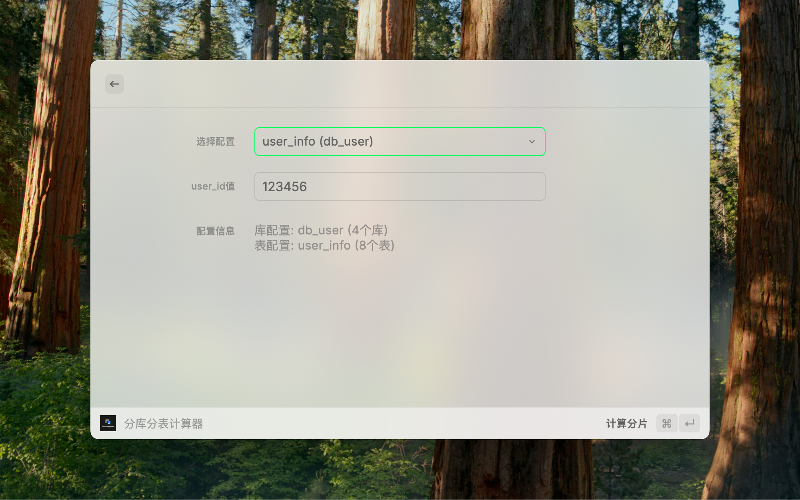

<p align="center">
  
</p>

<p align="center">
  <strong>ShardingTools - A Professional Database Sharding Management and Calculation Raycast Extension</strong>
</p>

## 📋 Project Overview

ShardingTools is a professional Raycast extension tool specifically designed for database sharding scenarios. It provides complete sharding configuration management, real-time calculation, and SQL generation functionality, greatly improving developers' efficiency in database sharding scenarios.

## ✨ Features

### 🗂️ Configuration Management

- **Multiple Configuration Storage**: Support saving and managing multiple sharding configurations
- **Configuration Editing**: Modify saved configuration parameters at any time
- **Configuration Deletion**: Support deleting individual or all configurations
- **Configuration Import/Export**: Support importing and exporting configuration files for backup and sharing

### 🧮 Smart Calculation

- **Sharding Calculator**: Input shard factor values to automatically calculate corresponding database and table locations
- **Numeric Modulo Algorithm**: Use simple and intuitive modulo operations for sharding calculations
- **Configuration Switching**: Quickly switch between different table configurations in the calculator

### 🔧 Convenient Features

- **Automatic Clipboard Reading**: Automatically read clipboard content when entering the calculator
- **SQL Statement Generation**: Automatically generate corresponding query SQL statements
- **One-Click Copy**: Quick copy of database names, table names, SQL statements, and other information
- **Enter Shortcut**: Support Enter key for quick calculations
- **Data Backup and Recovery**: Achieve configuration backup and recovery through export/import functionality

### ⚡ Deep Raycast Integration

- **Three Independent Commands**: Add configuration, view list, quick calculation
- **Smooth Navigation**: Seamless switching between different functions
- **Local Storage**: All data is safely saved locally
- **Shortcut Support**: Rich shortcut operations to improve usage efficiency

## 🛠️ Installation and Usage

### Prerequisites

- [Raycast](https://raycast.com) application
- Node.js 18+
- npm or yarn

### Local Development

1. Clone the project:

```bash
git clone <repository-url>
cd shardingtools
```

2. Install dependencies:

```bash
npm install
```

3. Start development mode:

```bash
npm run dev
```

4. Import the local extension in Raycast using `Import Extension`

### Publish to Raycast Store

```bash
npm run publish
```

## 📖 Usage Instructions

### 🚀 Quick Start

ShardingTools provides three independent commands covering the complete workflow of database sharding:

#### 1. Add Sharding Configuration

Search for "Add Shard Config" in Raycast and fill in the following information:

- **Table Name**: Data table name (e.g., user_info)
- **Database Name**: Database name (e.g., db_user)
- **Database Count**: Number of databases (e.g., 4)
- **Table Count**: Number of tables per database (e.g., 16)
- **Shard Factor**: Sharding field name (e.g., user_id)

#### 2. View Sharding Configuration List

Search for "List Shard Configs" in Raycast:

- View all saved configurations
- Edit existing configurations
- Delete unnecessary configurations
- Quick access to calculator
- Export configuration files (⌘⇧E)
- Import configuration files (⌘⇧I)

#### 3. Sharding Calculator

Search for "Shard Calculator" in Raycast:

- Automatically read clipboard content as shard factor value
- Select the configuration to calculate (if multiple exist)
- Input specific shard factor value (e.g., 123456)
- Press Enter or click "Calculate Shard"
- View calculation results and generated SQL statements

#### 4. Configuration Import/Export

**Export Configuration**:

- Press `⌘⇧E` or click "Export All Configs" in the configuration list
- Configuration data will be automatically copied to clipboard (JSON format)
- Can be saved as `.json` file for backup

**Import Configuration**:

- Press `⌘⇧I` or click "Import Config" in the configuration list
- Select import mode:
  - **Merge Mode**: Add imported configurations to existing ones
  - **Replace Mode**: Replace all existing configurations with imported ones
- Paste JSON data or press `⌘V` to read from clipboard
- Click "Import Config" to complete the import

### 💡 Usage Tips

1. **Batch Calculation**: Copy user ID to clipboard, open calculator for automatic filling
2. **SQL Generation**: Copy generated query SQL directly from the calculation results page
3. **Multiple Configuration Management**: Create different sharding configurations for different projects
4. **Quick Navigation**: Press Enter in the list page to directly access the calculator for that configuration
5. **Configuration Backup**: Regularly export configuration files to ensure data security
6. **Team Collaboration**: Share configurations among team members through export/import functionality
7. **Environment Migration**: Sync sharding configurations across different devices

### ⌨️ Shortcuts

- `⌘⇧E` - Export all configurations
- `⌘⇧I` - Import configurations
- `⌘V` - Read data from clipboard (import page)
- `⏎` - Quick calculation (calculator page)
- `⏎` - Enter calculator (list page)

## 🎯 Implemented Features

- [x] Sharding configuration management (CRUD)
- [x] Multiple configuration storage and switching
- [x] Sharding calculator
- [x] Numeric modulo sharding algorithm
- [x] Automatic SQL statement generation
- [x] Automatic clipboard reading
- [x] Local data persistence
- [x] Three independent Raycast commands
- [x] Configuration import/export

## 📸 Feature Screenshots

### Add Configuration

Configure basic parameters for database sharding, supporting table names, database names, shard counts, and other settings.


### Configuration List

Manage all sharding configurations with support for editing, deletion, and quick calculation.


### Sharding Calculator

Input shard factor values for real-time calculation of corresponding database and table locations, with automatic SQL statement generation.



## 🧮 Calculation Example

Assuming the following configuration:

- **Table Name**: `user_info`
- **Database Name**: `db_user`
- **Database Count**: 4
- **Table Count**: 8
- **Shard Factor**: `user_id`

When inputting `user_id = 123456`:

- **Database Index**: `123456 % 4 = 0`
- **Table Index**: `123456 % 8 = 0`
- **Result Database Name**: `db_user`
- **Result Table Name**: `user_info_0`
- **Generated SQL**: `SELECT * FROM user_info_0 WHERE user_id = 123456;`

Data will be stored in the **user_info_0** table of the **db_user** database.

## 🔧 Development Notes

### Project Structure

```
shardingtools/
├── assets/
│   └── extension-icon.png    # Extension icon
├── src/
│   ├── addtable.tsx         # Add configuration command entry
│   ├── list.tsx             # Configuration list management
│   ├── calculator.tsx       # Sharding calculator
│   ├── shard-form.tsx       # Unified form component
│   └── import-form.tsx      # Configuration import form
├── package.json             # Project configuration and command definitions
├── tsconfig.json           # TypeScript configuration
├── eslint.config.js        # ESLint configuration
└── README.md               # Project documentation
```

### Technology Stack

- **Framework**: React + TypeScript
- **Platform**: Raycast Extension API
- **Build Tool**: Raycast CLI

### Available Scripts

- `npm run dev` - Development mode
- `npm run build` - Build project
- `npm run lint` - Code linting
- `npm run fix-lint` - Auto-fix code issues

## 🤝 Contributing

Welcome to submit Issues and Pull Requests to help improve this project.

1. Fork this repository
2. Create a feature branch (`git checkout -b feature/AmazingFeature`)
3. Commit your changes (`git commit -m 'Add some AmazingFeature'`)
4. Push to the branch (`git push origin feature/AmazingFeature`)
5. Open a Pull Request

## 📄 License

This project is licensed under the MIT License - see the [LICENSE](LICENSE) file for details.

## 👨‍💻 Author

- **KevinWang0224** - Project Maintainer
