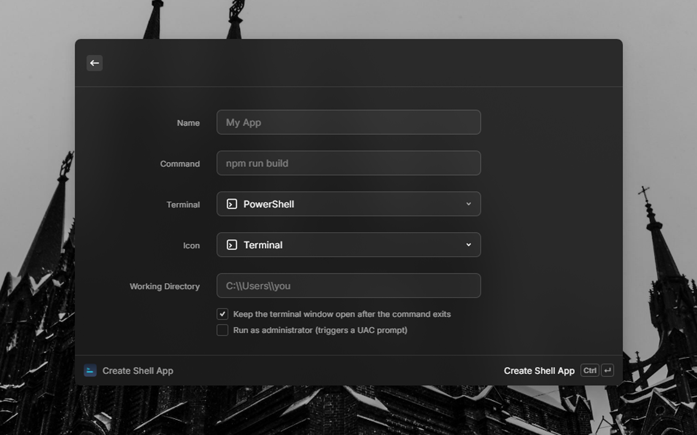
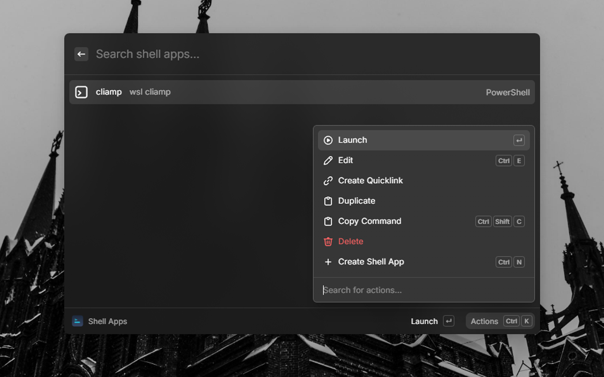
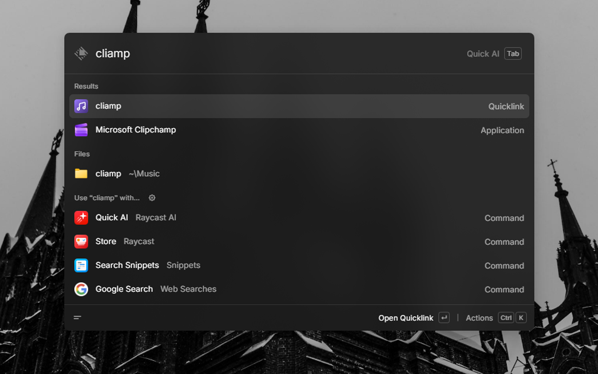

# Shell Apps

Turn any shell command into an app-like shortcut for Windows, right from Raycast. Give your most-used commands (`npm run build`, `git status`, `wsl`, custom scripts...) a name, launch them in a dedicated terminal window, and pin them to the root search like real apps.

## Features

- **Named shortcuts** — create a shortcut for any shell command, for example `npm run build`.
- **Your choice of terminal** — launch in PowerShell, PowerShell 7, Command Prompt, or Windows Terminal.
- **Launch options** — optional working directory, keep the window open after the command exits, or run elevated (UAC prompt).
- **App-like Quicklinks** — turn any shortcut into a pinned entry in the root search, with optional hotkey.
- **Private by design** — all data is stored locally in Raycast's local storage. Nothing is sent to the network.
- **Works in any environment** — commands run with your full user `PATH`, so tools like `wsl` and anything in your profile resolve correctly even when launched from Raycast's sandboxed extension host.

## Install

Install **Shell Apps** from the Raycast Store.

## Quick start

1. Open the **Shell Apps** command.
2. Press `⌘` `N` to create your first shortcut:
   - **Name** — the display name, for example `My App`.
   - **Command** — the shell command to run, for example `npm run build`.
   - **Terminal** — the terminal used to launch the command in a new window.
   - **Working Directory** — optional. The directory the command runs in.
   - **Keep the terminal window open** — keep the window open after the command exits.
   - **Run as administrator** — launch the terminal elevated (triggers a UAC prompt).
3. Select the shortcut and press `↵` to launch it in a terminal window.

### Make it feel like a real app

On any shortcut, use **Create Quicklink**. A named entry (for example `My App`) appears in the root
search and launches the command directly — no need to open the extension first. From the Quicklinks
preferences you can also assign it a hotkey, so `⌥ Space → My App` or a keyboard shortcut starts it.

## Screenshots

## Commands

| Command | Description |
| --- | --- |
| **Shell Apps** | List, search, launch, edit, duplicate, and delete your shortcuts. When launched with the `app` argument (via a Quicklink) it launches the shortcut directly. |
| **Create Shell App** | Add a new shortcut with name, command, terminal, and launch options. |

## Preferences

| Preference | Type | Default | Description |
| --- | --- | --- | --- |
| **Default Terminal** | Dropdown | PowerShell | Terminal used by default when creating a new shortcut. |
| **Keep Window Open** | Checkbox | Enabled | Keep the terminal window open after the command exits, by default. |

## Security

Shortcuts are arbitrary shell commands that run locally as your user, exactly as if you typed them in
a terminal. Only create shortcuts for commands you trust.

## Troubleshooting

- **The command is not found** — commands are resolved with your user `PATH`. Make sure the tool is installed and added to `PATH`, then launch again.
- **Windows Terminal unavailable** — the extension automatically falls back to PowerShell when `wt.exe` is not installed.
- **Run as administrator does nothing** — UAC is disabled for the command or the account; re-enable UAC or use a standard user account.
- **Quicklinks created during development** — quicklinks made while the extension is in development point to the development path. Re-create them after installing the extension from the Store.

## License

MIT