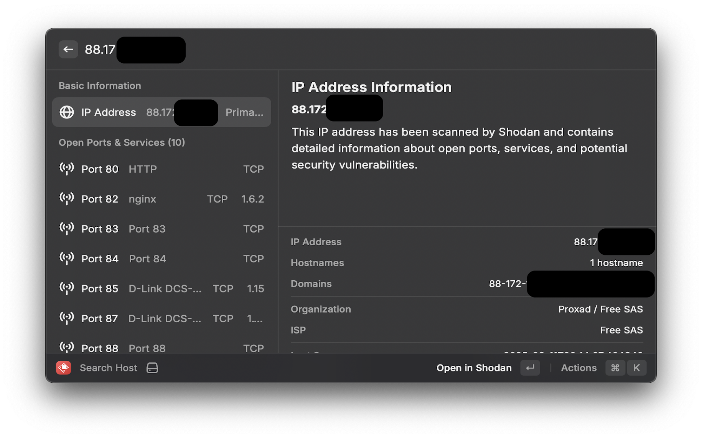
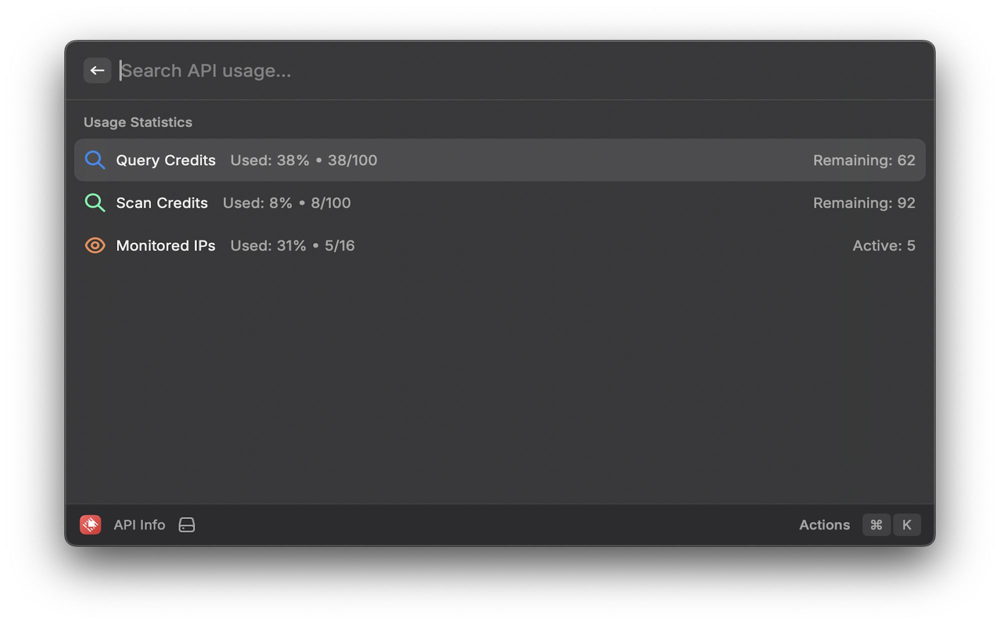
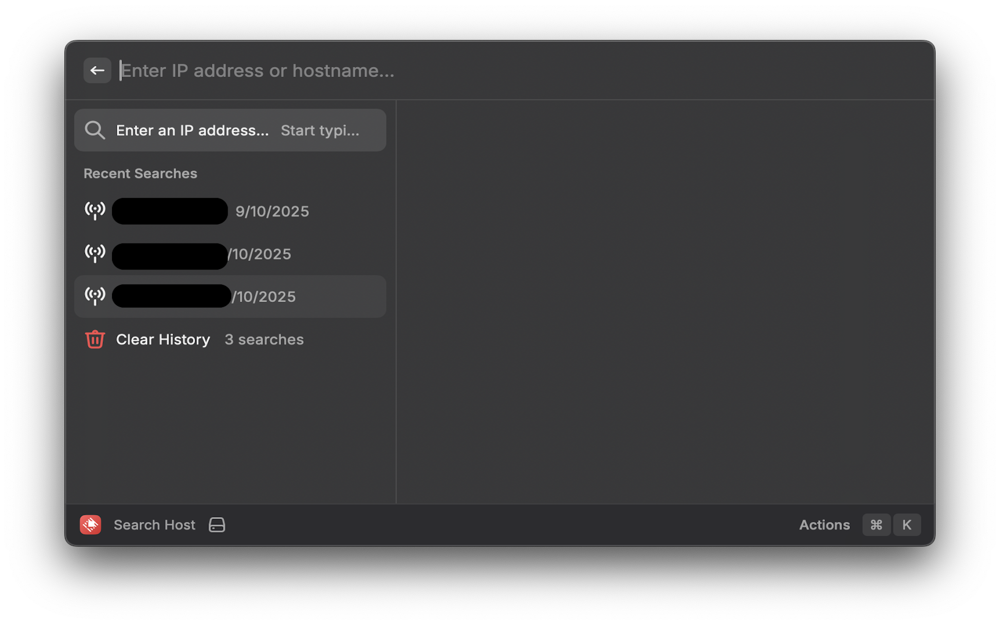
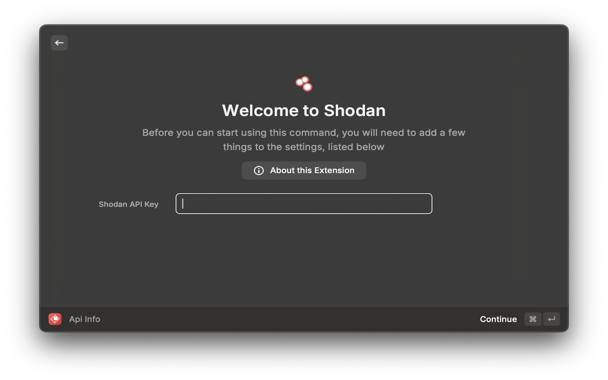
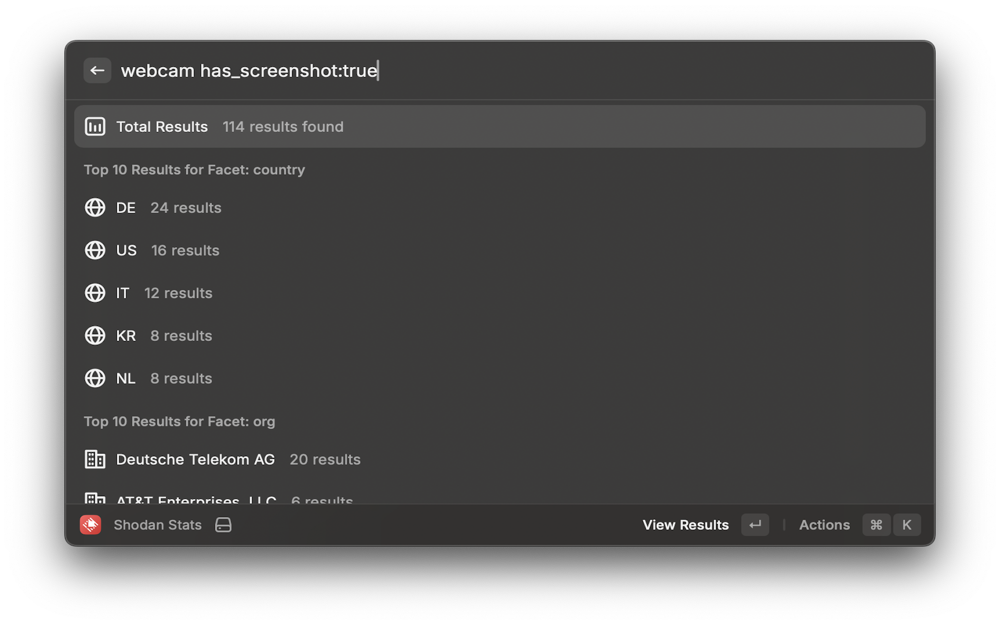

# Shodan Raycast Extension

A comprehensive Raycast extension that allows you to search and analyze hosts using Shodan's powerful network intelligence platform. Get detailed information about IP addresses, hostnames, and network infrastructure with just a few keystrokes.

## ✨ Features

### 🔍 **Search Host**
- Look up detailed information about any IP address or hostname
- View comprehensive host data including organization, location, and system information
- Access port information, services, and security vulnerabilities
- Search history with persistent storage for quick re-access

### 🌐 **Search Shodan**
- Advanced search with filters and criteria
- Browse search results with detailed metadata
- Filter by country, organization, port, and more

### 📊 **Shodan Stats**
- Get statistics about search results
- View country and organization breakdowns
- Analyze trends and patterns in network data

### 🏠 **My IP**
- Instantly look up your external IP address in Shodan
- See what information is publicly available about your network
- Quick security assessment of your public-facing services

### 📈 **API Info**
- View your Shodan API usage and account information
- Monitor query credits, scan credits, and monitored IPs
- Track your API consumption and limits

### 🔬 **On-Demand Scan**
- Request new scans of specific IPs and services
- Schedule scans for later analysis
- Monitor scan progress and results

### 👁️ **Monitored IPs**
- View your monitored IP alerts and notifications
- Track changes to specific IP addresses
- Stay informed about network security events

## 🚀 Quick Start

### 1. Install Extension

#### Option A: From Raycast Store (Recommended)
1. Open Raycast (⌘ + Space)
2. Type "Store" and press Enter
3. Search for "Shodan" in the store
4. Click "Install" on the Shodan extension
5. The extension will be automatically installed and ready to use

#### Option B: Manual Installation
1. Download or clone this repository
2. Open Raycast (⌘ + Space)
3. Go to Extensions → Import Extension
4. Select the `shodan` folder from your downloaded files
5. The extension will be imported and ready to use

### 2. Get Shodan API Key
- Visit [Shodan Account](https://account.shodan.io/)
- Sign up for a free account (includes 100 free queries per month)
- Get your API key from the account page

### 3. Configure API Key
- Open Raycast and search for "Shodan"
- Select any Shodan command
- Enter your API key when prompted
- Start searching!

## 📱 Screenshots

| Search Host | API Info | Search Results |
|-------------|----------|----------------|
|  |  |  |

| Extension Commands | API Token Input | Statistics |
|-------------------|-----------------|------------|
|  |  |  |

## 🎯 Usage Examples

### Search for a Host
1. Open Raycast (⌘ + Space)
2. Type "Search Host"
3. Enter an IP address like `8.8.8.8` or hostname like `google.com`
4. View detailed information including:
   - **Basic Info**: IP address, hostnames, organization, ISP
   - **Location**: Country, city, coordinates
   - **System**: Operating system, product, version
   - **Security**: Vulnerabilities, CPE entries
   - **Ports**: Open ports with services and banners
   - **Tags**: Security and service classifications

### Check Your IP
1. Open Raycast (⌘ + Space)
2. Type "My IP"
3. Instantly see what Shodan knows about your external IP
4. Review open ports and potential security issues

### View API Usage
1. Open Raycast (⌘ + Space)
2. Type "API Info"
3. Check your remaining query credits
4. Monitor your API consumption

## 🔑 API Key Requirements

This extension requires a Shodan API key:

- **Free Account**: 100 queries per month
- **Basic Plan**: $49/month for 10,000 queries
- **Professional Plan**: $899/month for 1,000,000 queries

Visit [Shodan Pricing](https://account.shodan.io/billing) for more information.

## 🔒 Privacy & Security

- **Local Storage**: Your API key is stored locally in Raycast's secure preferences
- **No Data Collection**: No usage data is collected or sent to third parties
- **Direct API Calls**: All requests go directly to Shodan's API
- **Secure Handling**: API keys are never logged or exposed in error messages

## 📋 Requirements

- **Raycast**: Latest version of Raycast app
- **macOS**: macOS 10.15 or later
- **Shodan Account**: Free or paid Shodan account
- **Internet Connection**: Required for API calls

## 🤝 Contributing

Contributions are welcome! Please feel free to submit a Pull Request.

## 📄 License

This project is licensed under the MIT License.

## 🙏 Acknowledgments

- [Shodan](https://www.shodan.io/) for providing the powerful network intelligence API
- [Raycast](https://raycast.com/) for the excellent extension platform

