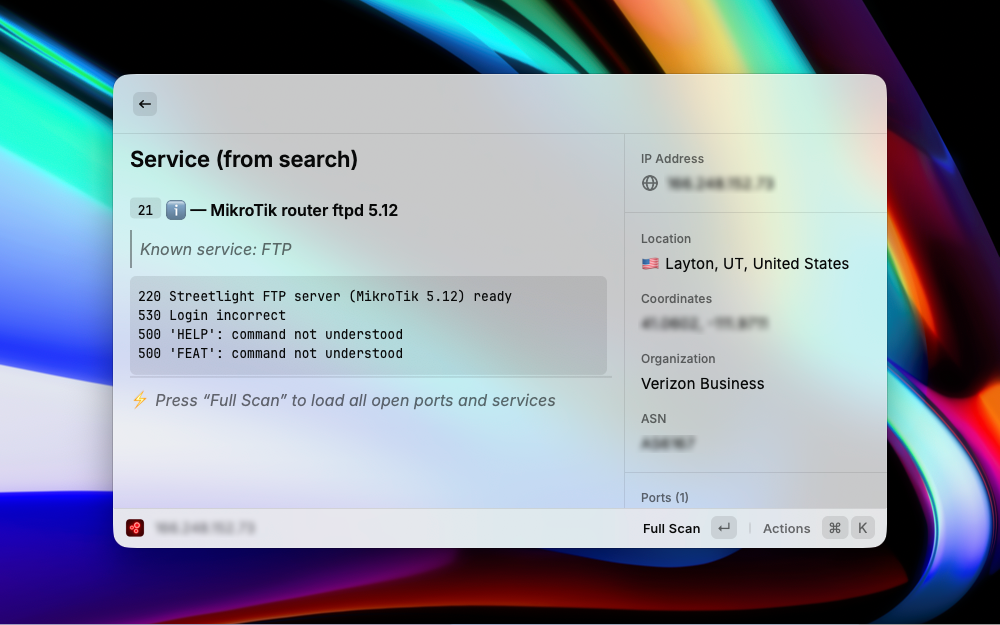
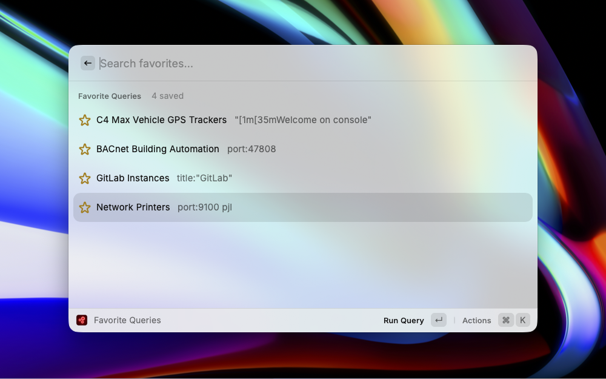

# Shodan extension for Raycast

Search the [Shodan](https://www.shodan.io/) database for internet-connected devices, view detailed host information, and manage saved queries directly from [Raycast](https://www.raycast.com/).


<!-- Screenshot placeholder: 2000x1250px recommended -->

## Features

- **Search Shodan** - Execute powerful Shodan queries with real-time results
- **Host Lookup** - Get detailed information for any IP address including open ports, services, and vulnerabilities
- **Preset Queries** - Browse 70+ pre-built query templates for webcams, industrial systems, databases, and more
- **Favorite Queries** - Save and organize your most-used search queries
- **DNS Lookup** - Resolve hostnames and perform reverse DNS lookups
- **Exploit Search** - Search the Shodan exploit database (requires paid membership)
- **Network Alerts** - Manage your Shodan network monitoring alerts
- **Account Info** - View API credits and account status

## Screenshots

### Search Results


### Host Details


### Preset Queries


### Favorite Queries

### Account details


## Setup

1. Install the extension from the Raycast Store
2. Get your Shodan API key from [account.shodan.io](https://account.shodan.io)
3. Enter your API key when prompted (stored securely)

## Commands

| Command | Description |
|---------|-------------|
| Search Shodan | Execute Shodan search queries and browse results |
| Host Lookup | Look up detailed information for an IP address |
| Preset Queries | Browse pre-built Shodan query templates |
| Favorite Queries | View and run saved Shodan queries |
| DNS Lookup | Resolve hostnames and perform reverse DNS lookups |
| Search Exploits | Search the Shodan exploit database |
| Network Alerts | Manage network monitoring alerts |
| Account Info | View API credits and account status |

## API Key Requirements

| Feature | API Plan |
|---------|----------|
| Search | Free (limited) |
| Host Lookup | Free (1 query credit per lookup) |
| DNS Lookup | Free |
| Preset Queries | Free |
| Exploit Search | Paid membership required |
| Network Alerts | Paid membership required |

## Query Examples

```
# Find Apache servers
apache

# Search by country
country:US port:22

# Find specific products
product:nginx

# Search by organization
org:"Google"

# Find vulnerable systems
vuln:CVE-2021-44228
```

## Preset Query Categories

- **Webcams** - Exposed IP cameras and video streams
- **Industrial** - SCADA/ICS systems and PLCs
- **Databases** - MongoDB, Elasticsearch, Redis instances
- **Network** - Routers, switches, and network devices
- **Remote Access** - RDP, VNC, and SSH services
- **Printers** - Network-connected printers
- **IoT** - Smart home devices and IoT systems
- **Game Servers** - Minecraft, Counter-Strike servers

## Credits

Preset queries sourced from [awesome-shodan-queries](https://github.com/jakejarvis/awesome-shodan-queries) by Jake Jarvis, licensed under CC0 1.0.

## License

MIT
