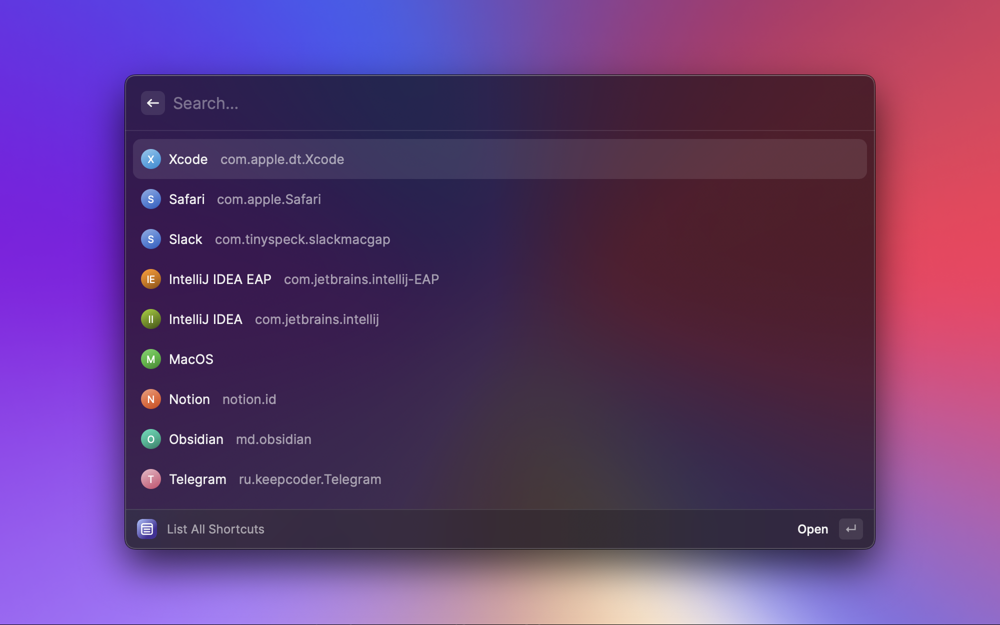
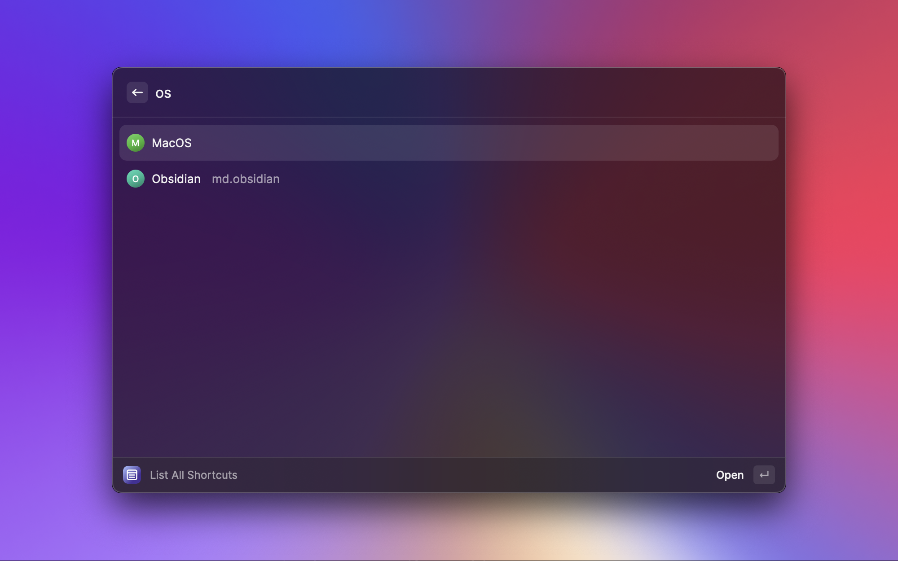
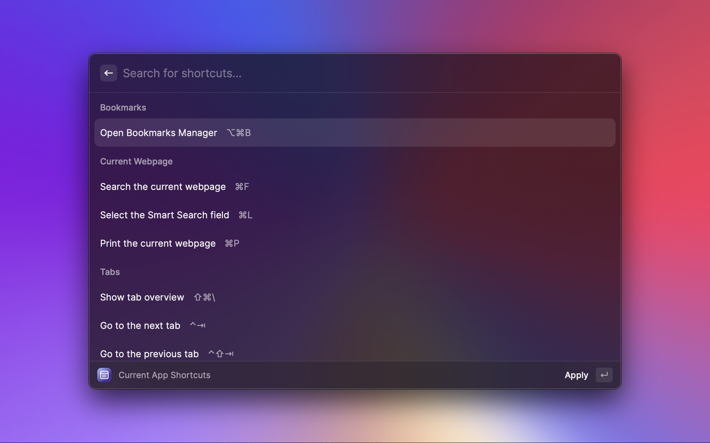
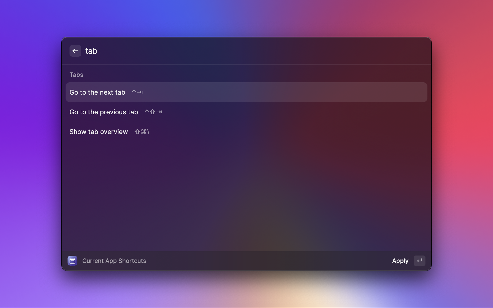

# Shortcuts Search RayCast extension

Allows to list, search and run shortcuts for different applications.

By selecting shortcut extension actually runs the shortcut using AppleScript.

Data is taken from: https://hotkys.com.

Please see contribution guide for adding new shortcuts [here](https://github.com/solomkinmv/hotkys/blob/main/README.md#shortcuts-contribution).

## Commands
### List All Shortcuts
Show shortcuts for all available desktop or web applications.

### List Current Shortcuts
Show shortcuts for the frontmost desktop application. Command will exit if no desktop application
is detected or if it is missing in the Hotkys database.

### List Current Web Shortcuts
Show shortcuts for the frontmost web application. Command will exit if no web application 
is detected or if it is missing in the Hotkys database.

- Supported browsers: Safari, Chrome, Arc.
- Not supported browsers: Firefox.

### Copy Current App's Bundle ID
Saves current app's bundle id in the clipboard. Useful for contributing new shortcuts.

## Screenshots

