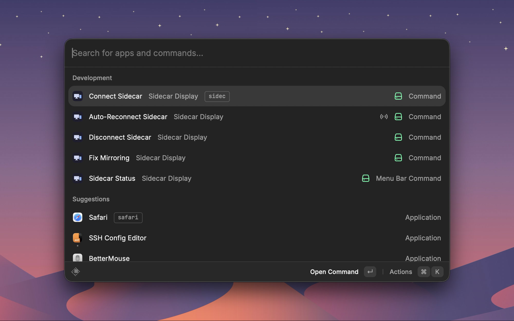
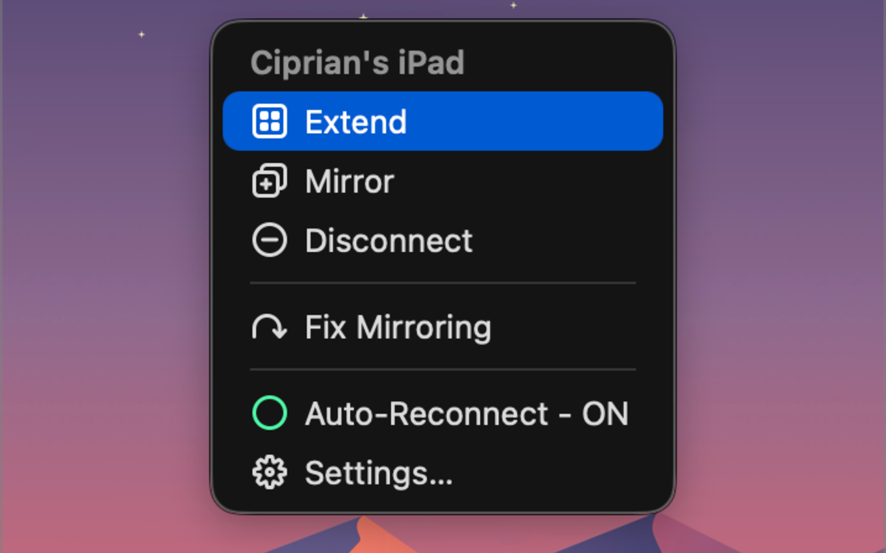

# Sidecar Display

Connect your iPad over Sidecar and force it to **extend** instead of mirror — from a hotkey or the menu bar — without ever writing or relocating your Mac's main display.

It drives Sidecar through a small Swift helper, so it needs nothing else installed. No AppleScript, no System Settings window, no UI-tree scraping.

**BetterDisplay is optional**, and only for one thing: if you run a BetterDisplay **virtual screen as your main display**, macOS tends to bring the iPad up _mirrored_. [Fix Mirroring](#commands) repairs that. Without virtual screens you never need BetterDisplay.

## Setup

You need macOS with Sidecar support, and an iPad signed in to the same Apple ID.

1. In Raycast Settings → Extensions → Sidecar Display, turn **Background Refresh** on for **Auto-Reconnect Sidecar**. That is what restores the link after sleep or a drop.
2. Optionally pin **Connect Sidecar** and **Disconnect Sidecar** to hotkeys, or drive everything from the **Sidecar Status** menu bar.

The menu-bar item also refreshes about once a minute. Turn Background Refresh off on **Sidecar Status** if you would rather it only update when opened — friendlier to menu-bar managers like Bartender or Ice, and easier on battery.

### Optional: Fix Mirroring

Only needed if you use a BetterDisplay virtual screen as your main display.

1. Install [BetterDisplay](https://github.com/waydabber/BetterDisplay) and keep it **running** (`brew install --cask betterdisplay`).
2. Leave CLI integration enabled (on by default).
3. Leave **Auto-Fix Mirroring** on, or run **Fix Mirroring** by hand when the iPad comes up showing a copy of your desktop.

Tested against BetterDisplay 4.3.5 with Pro; non-Pro is unverified.

## Commands

| Command                    | What it does                                                                                                                                                                      |
| -------------------------- | --------------------------------------------------------------------------------------------------------------------------------------------------------------------------------- |
| **Connect Sidecar**        | Attaches the iPad and applies the configured mode (extend by default). Safe to run when already connected.                                                                        |
| **Disconnect Sidecar**     | Detaches the iPad. Safe to run when already disconnected.                                                                                                                         |
| **Auto-Reconnect Sidecar** | Restores a link that dropped on its own (for example after sleep). Run it by hand to reconnect now, regardless of the auto-reconnect switch or the transport setting.             |
| **Fix Mirroring**          | Clears Sidecar's own mirror mode when the iPad is showing a copy of your main screen. Needs BetterDisplay running, with a virtual screen present. Briefly reshuffles the desktop. |
| **Sidecar Status**         | Menu-bar item: connection and nearby/away state, connect / disconnect / extend / mirror, an Auto-Reconnect toggle, and a device picker when more than one iPad is paired.         |

## Preferences

| Preference            | Default   | Purpose                                                                                                                                                                                                                                                                                   |
| --------------------- | --------- | ----------------------------------------------------------------------------------------------------------------------------------------------------------------------------------------------------------------------------------------------------------------------------------------- |
| Show iPad Name        | off       | Show the iPad's name beside the menu-bar icon while it is connected or nearby. Off keeps a constant-width icon.                                                                                                                                                                           |
| Auto-Fix Mirroring    | on        | Run Fix Mirroring automatically on each fresh connect. Needs BetterDisplay running and a virtual screen; skipped silently otherwise. Turn this off if your iPad only occasionally mirrors, and use the command by hand.                                                                   |
| Display Mode          | Extend    | What the iPad does once connected: extra desktop space, or a copy of your main display.                                                                                                                                                                                                   |
| iPad Name             | _(empty)_ | Leave empty to auto-detect. Set it only to pin one iPad when you have several. The name must match exactly as macOS shows it.                                                                                                                                                             |
| Auto-Reconnect        | on        | Reconnect automatically after a drop. Only chases links that dropped by themselves — a deliberate disconnect is never fought. The menu-bar toggle overrides this once you use it. Also needs Background Refresh on Auto-Reconnect Sidecar.                                                |
| Auto-Reconnect When   | Always    | Which connections count as "my iPad is here". **Cable Only** reconnects just when it is plugged in — the closest thing to "I am at my desk", so it will not grab your iPad from across the room. Connecting by hand always works.                                                         |
| Give Up After (hours) | 24        | How long to keep trying an iPad that looks present but will not connect, before stopping so macOS stops showing connection-failed notifications. Counts time actually spent trying — not while the iPad is away, your Mac sleeps, or the presence check cannot answer. `0` tries forever. |

## Notes

- Auto-reconnect and the menu-bar status are polled about once a minute, not event-driven. Changes you make through the extension refresh the icon immediately; a change made outside it (Control Center, unplugging) can take up to one interval to show.
- Connecting the iPad from Control Center or the AirPlay menu does not run the extend/mirror logic, and auto-reconnect will not treat that as an intent to keep the link alive.
- macOS itself decides which display is main when Sidecar attaches, and can put main on the iPad. The extension reports that and leaves the arrangement to you — it never writes the main display.
- Sidecar's own mirror mode is invisible to every display API, so Fix Mirroring cannot detect the mirrored state. It runs on a fresh connect (when opted in) or when you invoke it.
- Unplugging a USB-connected iPad while it is in Airplane Mode makes **macOS** show "Sidecar can't connect wirelessly…". That is macOS trying to continue the session over Wi-Fi, not this extension — it appears even with auto-reconnect off.
- Presence detection reads an undocumented macOS field, so it may change with a future release. A wrong reading cannot silently stop reconnects: connecting by hand always works, and a periodic recheck still fires.
