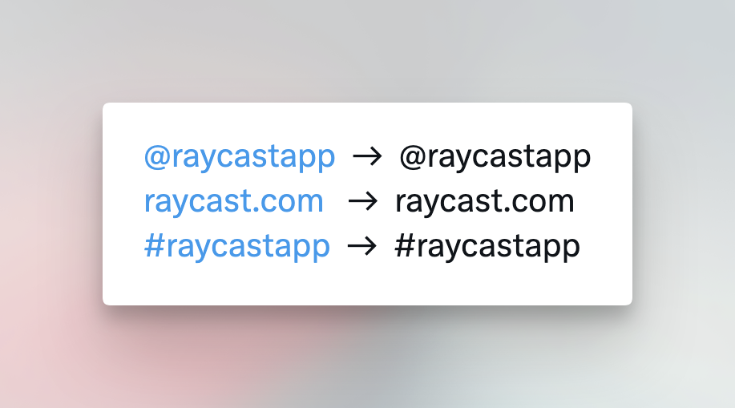

# Silent Mention

Silently mention a handle, a URL or a hashtag.

This extension will insert an invisible `U+2060` ([Zero width no-break space](https://en.wikipedia.org/wiki/Word_joiner)) next to the `@`, `.` or `#` characters, effectively making them silent.

Pro tip: Assign a Hotkey to it (eg:`⌥X`) to silent a handle in a flash.

Inspired by [this tweet](https://twitter.com/rauchg/status/1620928979317440512). Credit to [@markjaquith](https://twitter.com/markjaquith).
