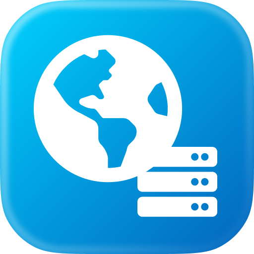

  
  <h1 align="center">Simple HTTP Extension</h1>

Simple HTTP is a Raycast extension to serve a directory with a local HTTP server.

## Installation 🛠️

To install the Simple HTTP extension, follow these steps:

1. Open Raycast.
2. Search for "Store" and navigate to the Raycast Store.
3. Search for "Simple HTTP" and click "Install."

> **Note:**  
> You need to have Python 3.7 or newer installed on your system to use this extension. On macOS, Python is
> bundled with the Command Line Tools. To install Command Line Tools, run `xcode-select --install` in the terminal.
> The extension expects `python3` to be available in your PATH.

## Usage 🚀

Once installed, simply trigger the Raycast command palette and search for the Simple HTTP commands.

  

## Features ✨

### 1. `Manage Simple Http`

This command will show a form which allows you to specify the port and directory to serve. You can also choose to open
the URL in your default browser once the server is started.

### 2. `Simple Http Status`

This command will show the current status of the HTTP server (Running or Not Running).

## Preferences ⚙️

### 1. `Default Port`

You can set the default port to use when serving a directory. The default port is `8000`.

### 2. `Default Directory`

You can set the default directory to serve. The default directory is `~/Downloads`.
