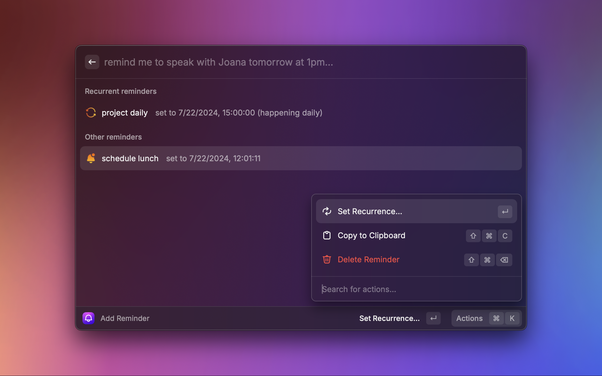
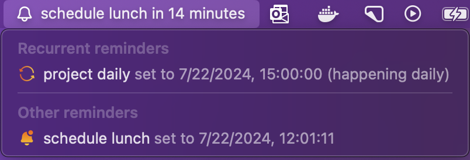
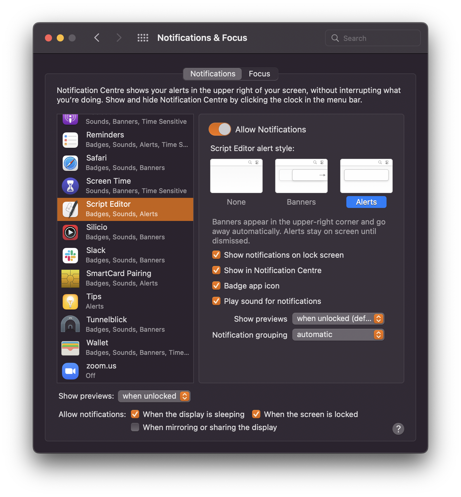

# Simple Reminder

Set your reminders in plain english without any 3rd party apps installed and be notified when the time is right!

## Example usage

> remind me to speak with Jane on May 18th at 6pm
> 
> remind me to buy lunch today at noon
> 
> remind me to schedule the hotel for the weekend this friday at 7pm

## Screenshots

## Main features

### Recurrent reminders

When setting your reminders, you have the possibility to set them with a recurrence:

- Daily
- Weekly
- Bi-weekly
- Monthly

Allowing the same reminder to trigger at those set intervals.

### Menu bar reminders

To help keep context of the next reminders, the extension will display the next reminder in the macos menu bar. This way you can always have a quick glance at what's coming up.

### Mobile notifications

Sometimes we're simply not near our mac when a reminder is up. Being able to receive these reminder notifications in the mobile is a blessing and really useful.

Simple Reminder offers this feature through a mobile application called [ntfy](https://docs.ntfy.sh/). This is a mobile application that lets you subscribe to topics and receive notifications of messages that are sent to those topics.
With the app installed, you simply need to go to the preferences panel of the Simple Reminder extension, check the `Mobile notifications with ntfy` and set the ntfy `topic` to send the notifications to.

#### Self-hosted ntfy server

If you value your privacy and want to use a self-hosted ntfy server, it's also possible (by default it uses the `ntfy.sh` one).
You simply have to set the URL for your self-hosted ntfy server and set an access token to authorize against that server.

The rest works exactly the same!

For information on how to configure a self-hosted ntfy server you can [check their documentation](https://docs.ntfy.sh/config/#access-tokens) or [this helpful blog post](https://medium.com/@williamdonze/ntfy-self-hosted-notification-service-0f3eada6e657).

This handles the extension side of things. The next step involves your mobile device.

Simply download ntfy from [Google Play](https://play.google.com/store/apps/details?id=io.heckel.ntfy) or from the [App Store](https://apps.apple.com/us/app/ntfy/id1625396347) and subscribe to the topic that you just defined in the extension. As simple as that.

If you are using a self-hosted version, then you'll need to enter your user and password, besides specifying the server url in the mobile application.

You're all set to receive your Simple Reminder's in your mobile device!

## Limitations

When you install the extension, notifications will by default be non-sticky. Which means that they will display on your system, and after a second or two, they will go away from the screen and only stay in the notification center.

To change the behaviour so that the system notification will remain in the screen until you dismiss it, you will need to do two things:

> 1. Open the system preferences and go to "Notifications & Focus"
> 2. Go to the "Script Editor" and change the notification type from "Banners" to "Alerts"

