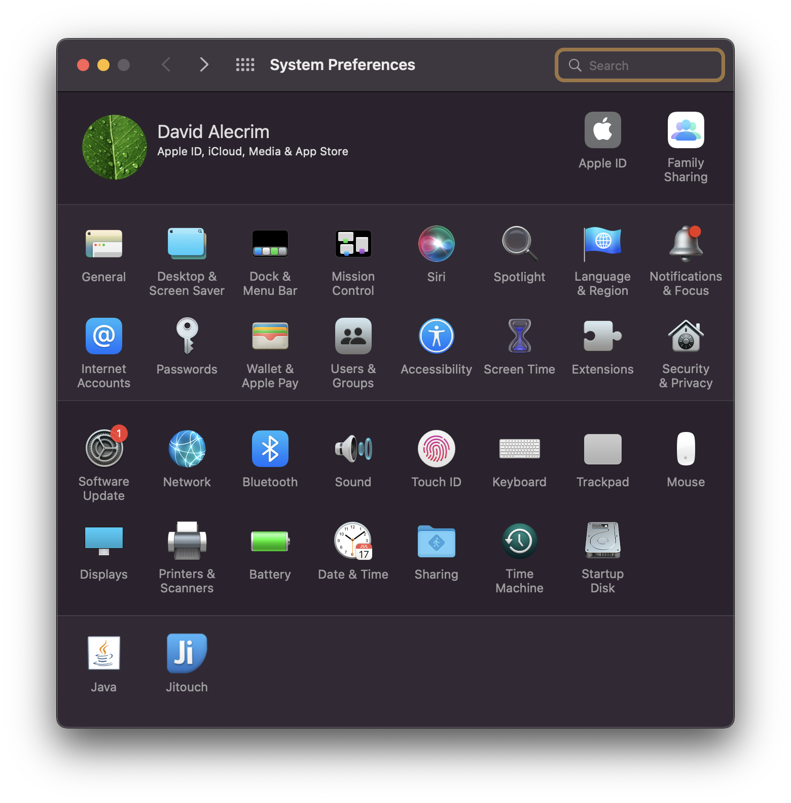

# Simple Reminder

Set your reminders in plain english without the need to have any application installed and be notified when the time is right!

## Example usage

> remind me to speak with Jane on May 18th at 6pm
> 
> remind me to buy lunch today at noon
> 
> remind me to schedule the hotel for the weekend this friday at 7pm

## Screenshots

## Limitations

When you install the extension, notifications will by default be non-sticky. Which means that they will display on your system, and after a second or two, they will go away from the screen and only stay in the notification center.

To change the behaviour so that the system notification will remain in the screen until you dismiss it, you will need to do two things:

> 1. Open the system preferences and go to "Notifications & Focus"
> 2. Go to the "Script Editor" and change the notification type from "Banners" to "Alerts"

