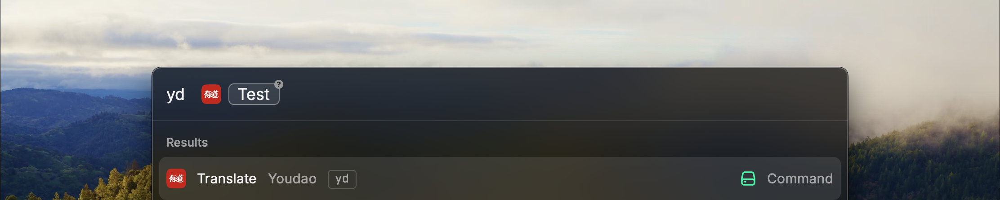
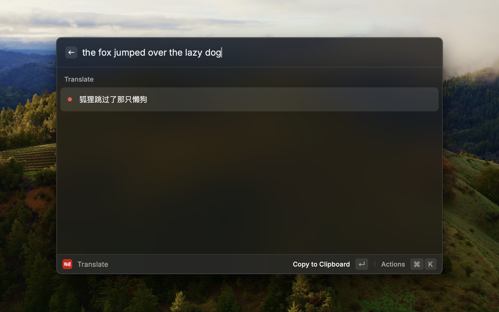
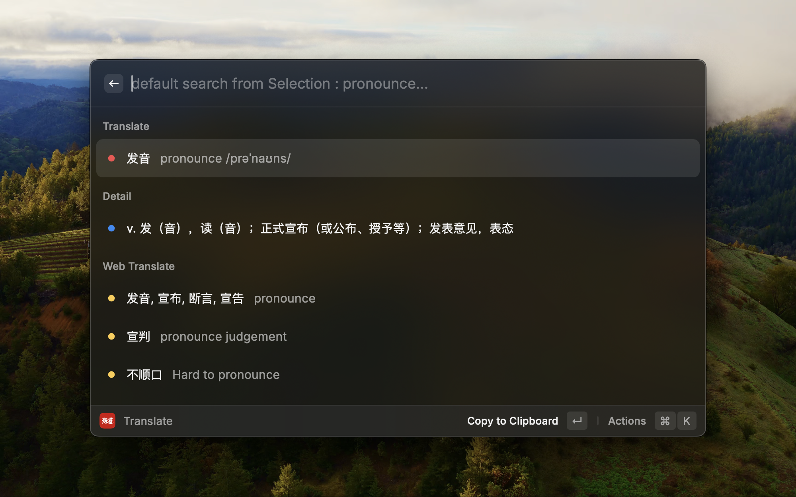

# Simple Youdao Translate

## Why you need yet another Youdao translate?

I moved my quick launcher on Mac OS from Alfred to Raycast, and second one is more powerful, non-commercial user friendly.

But compared with Alfred Youdao PowerPack workflow, the Raycast existing Youdao extension has more steps to execute to get translated content which is form based.

I expect a much more quicker solution than existing one, and you just need to run command, input something inline and automatically get translated result.

This extension is List based with single view and show result immediately after you input the context you want to translate.

Hope it can somehow improve your work efficiency.

Now by default, it will use auto-detecting language for translation.

If you want to specify the language, you need to define them in `Command Configuration`

## Some enhancements

* Support direct Argument input for translation

* the content to translate supports with below order:

  * Selection content in your most front window

  * Clipboard content

  * User input

* show phonetic on translated content

* Use `ctrl+Return` to pronounce the original words
* Use `shift+Return` to pronounce the translated words

## About YouDao AppKey and AppSecret
You can get Youdao Translate APP Key&Secret at https://ai.youdao.com/console/

When you create your own youdao app, please ensure you subscribe two services: `文本翻译, 语音合成`

## Future plan

~~Support Pronunciation with sound clip~~

# Issue self-check
1. if you see some translation does not work with no error, please consider if you specified your source language, choose source language to 'Auto' will help.
2. with an alias 'yd' can make your experience much more better
3. if you see some error code when using the extension, check the error list from Youdao official doc: [错误代码列表](https://ai.youdao.com/DOCSIRMA/html/dictionary/api/ydcd/index.html).
4. if you find some pronunciation does not work, please chekc if you subscribe the TTS service: [Issue-5366](https://github.com/raycast/extensions/issues/5366#issuecomment-1478072778)

# Special Thanks

This project is based on and inspired by Raycast extension [Youdao Translate](https://github.com/raycast/extensions/tree/main/extensions/youdao-translate)

Xeric Wei
